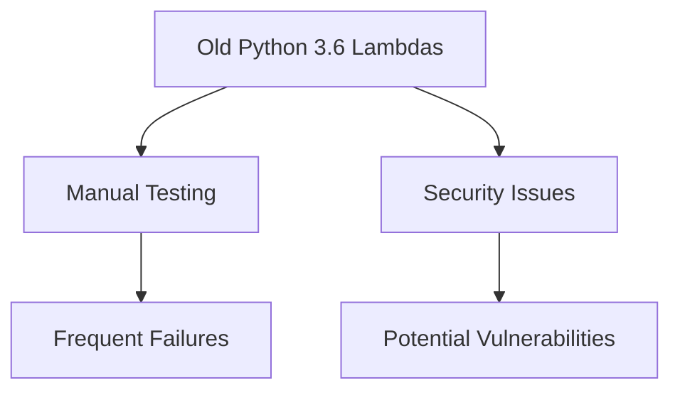
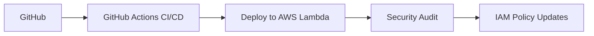
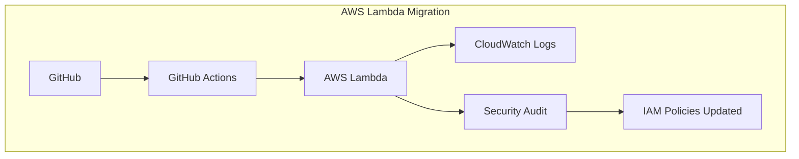

# AWS Lambda Migration & Security Enhancement

## Project Overview

### 🚩 Situation
When our team decided to upgrade Python versions for our AWS Lambda functions, I faced several challenges due to my limited experience at that time:
- Over 50 Lambda functions running outdated Python 3.6.
- Manual testing and deployments leading to frequent mistakes.
- No clear security practices or standards implemented.

I needed a structured approach to manage the migration and improve the security of these functions systematically.



### 🎯 Task
- Migrate AWS Lambda functions from Python 3.6 to Python 3.11.
- Automate deployment and testing processes.
- Enhance security through IAM policy reviews and implementation of best practices.

### 🛠️ Action

#### Project Implementation Overview


#### Implementation Steps
```bash
# Step 1: Update Python version locally
pyenv install 3.11.0
pyenv local 3.11.0

# Step 2: Automated testing setup (pytest)
pip install pytest
pytest tests/

# Step 3: Deploying using GitHub Actions
git push origin feature/python-upgrade
```

### 🚀 Results

#### Performance Metrics
| Metric                      | Before            | After             |
|-----------------------------|-------------------|-------------------|
| Python Version              | 3.6               | 3.11              |
| Deployment Automation       | Manual            | Fully Automated   |
| Deployment Success Rate     | ~75%              | ~99%              |
| Security Best Practices     | Minimal           | Fully Implemented |
| Time to Deploy All Lambdas  | ~2 weeks          | ~2 hours          |



## Technical Details

### Repository Structure
```
lambda-migration/
├── lambda_functions/
│   ├── function1/
│   │   ├── app.py
│   │   ├── requirements.txt
│   │   └── tests/
│   └── function2/
├── .github/workflows/
│   └── lambda-deploy.yml
└── security/
    ├── iam-policies.json
    └── audit-report.md
```

### Sample GitHub Actions Workflow (`lambda-deploy.yml`)
```yaml
name: Deploy AWS Lambda

on:
  push:
    branches:
      - main

jobs:
  deploy:
    runs-on: ubuntu-latest
    steps:
    - uses: actions/checkout@v3
    - uses: actions/setup-python@v4
      with:
        python-version: '3.11'

    - name: Install dependencies
      run: |
        pip install -r lambda_functions/function1/requirements.txt

    - name: Run Tests
      run: |
        pytest lambda_functions/function1/tests/

    - name: Deploy Lambda function
      uses: aws-actions/aws-lambda-deploy@v1
      with:
        function-name: function1
        zip-file: lambda_functions/function1/app.py.zip
```

### Security Enhancements
- Reviewed and updated IAM policies with least privilege principle.
- Implemented automated security scans within the CI/CD pipeline.

### Rollback Procedures
In case of issues:
```bash
# Redeploy previous Lambda version via AWS CLI
aws lambda update-function-code \
    --function-name function1 \
    --s3-bucket backup-lambda \
    --s3-key function1-old.zip
```

### Best Practices Implemented
- Regular dependency security audits.
- Automated deployments with GitHub Actions.
- Detailed logging and monitoring through CloudWatch.
