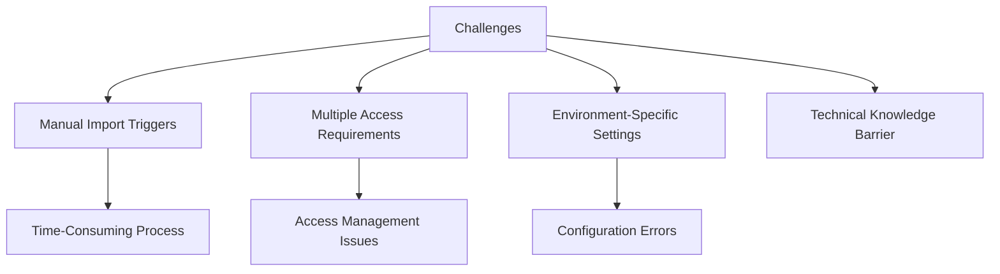
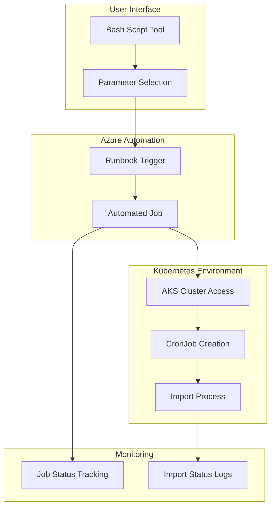
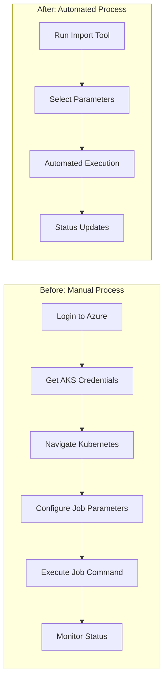

# Automated Import Job Trigger Tool

## Project Overview

### Situation
- E-commerce platform operations team faced several challenges:
  - Manual processes for triggering import jobs in different environments
  - Repetitive login to Kubernetes clusters for job creation
  - Inconsistent import job execution
  - High dependency on technical staff for basic operations
  - Time-consuming process requiring multiple steps and tools
  - Complex access management for different environments
  - Risk of human error during job configuration



### Task
Develop an automated solution to simplify import job management:
- Create a unified tool for triggering price and product imports
- Support multiple environments (dev, stage, pre-prod, prod)
- Support different profiles (pro, diy)
- Implement user-friendly interface with guided options
- Leverage Azure Automation for secure execution
- Ensure proper error handling and job status reporting
- Document the process for non-technical users

### Action

#### 1. Solution Architecture



#### 2. Import Trigger Script Implementation

```bash
#!/bin/bash

# Function to prompt for input if argument is missing
function prompt_input() {
    local var_name=$1
    local prompt_message=$2
    shift 2
    local options=("$@")

    echo "$prompt_message"
    for i in "${!options[@]}"; do
        echo "$((i+1)). ${options[i]}"
    done

    while true; do
        read -p "Enter the number: " input
        if [[ $input =~ ^[1-9][0-9]*$ ]] && ((input >= 1 && input <= ${#options[@]})); then
            eval "$var_name='${options[$((input-1))]}'"
            break
        else
            echo "Invalid input. Please choose a number between 1 and ${#options[@]}."
        fi
    done
}

# Check for mandatory arguments
if [[ -z "$1" ]]; then
    prompt_input type "Choose 'type':" "price" "product"
else
    type=$1
fi

if [[ -z "$2" ]]; then
    prompt_input profile "Choose 'profile':" "pro" "diy"
else
    profile=$2
fi

if [[ -z "$3" ]]; then
    prompt_input environment "Choose 'environment':" "dev" "stage" "pre-prod" "prod"
else
    environment=$3
fi

# Prepare CronJobName based on type
if [[ $type == "price" ]]; then
    CronJobName="jsdl-price-import"
elif [[ $type == "product" ]]; then
    CronJobName="jsdl-product-import"
else
    echo "Invalid type: $type. Must be 'price' or 'product'."
    exit 1
fi

# Modify CronJobName for DIY profile
if [[ $profile == "diy" ]]; then
    CronJobName=$CronJobName"-diy"
fi

# Mapping environments to namespaces and other settings
if [[ $environment == "dev" ]]; then
    Namespace="b2c-eshop-dev"
    ResourceGroupName="yC.pt-bdo-tp-qa"
    AksClusterName="aks-v0-pt-bdo-tp-qa"
    SubscriptionName="PT-ESALES-EU-QA"
elif [[ $environment == "stage" ]]; then
    Namespace="b2c-eshop-qas"
    ResourceGroupName="yC.pt-bdo-tp-qa"
    AksClusterName="aks-v0-pt-bdo-tp-qa"
    SubscriptionName="PT-ESALES-EU-QA"
elif [[ $environment == "pre-prod" ]]; then
    Namespace="b2c-eshop-preprod"
    ResourceGroupName="yC.pt-bdo-tp-prod"
    AksClusterName="aks-v0-pt-bdo-tp-prod"
    SubscriptionName="PT-ESALES-EU-Prod"
elif [[ $environment == "prod" ]]; then
    Namespace="b2c-eshop-prod"
    ResourceGroupName="yC.pt-bdo-tp-prod"
    AksClusterName="aks-v0-pt-bdo-tp-prod"
    SubscriptionName="PT-ESALES-EU-Prod"
else
    echo "Invalid environment: $environment. Must be 'dev', 'stage', 'pre-prod' or 'prod'."
    exit 1
fi

# Run the AZ automation runbook
runbook_response=$(az automation runbook start \
    --automation-account-name AAtestTriggerCronjob \
    --resource-group "commercetools.pt-bdo-tp-qa-dev" \
    --name CreateImportJob \
    --only-show-errors \
    --parameters SubscriptionName="$SubscriptionName" ResourceGroupName="$ResourceGroupName" AksClusterName="$AksClusterName" CronJobName="$CronJobName" Namespace="$Namespace")

# Extract the job ID from the response
job_id=$(echo "$runbook_response" | sed -n 's/.*"id": *"\([^"]*\)".*/\1/p')

if [[ -z "$job_id" ]]; then
    echo "Failed to extract job ID."
    exit 1
fi

echo "Job ID: $job_id"

# Wait for the job to complete
while true; do
    job_status=$(az automation job show --ids $job_id --query status -o tsv --only-show-errors)
    echo "Current job status: $job_status"

    if [[ $job_status == "Completed" || $job_status == "Failed" ]]; then
        echo "Job finished with status: $job_status"
        break
    fi

    # Sleep for 10 seconds before checking again
    sleep 10
done

exit 0
```

#### 3. Azure Automation Runbook (PowerShell Example)

```powershell
# CreateImportJob.ps1
param (
    [Parameter(Mandatory=$true)]
    [string]$SubscriptionName,
    
    [Parameter(Mandatory=$true)]
    [string]$ResourceGroupName,
    
    [Parameter(Mandatory=$true)]
    [string]$AksClusterName,
    
    [Parameter(Mandatory=$true)]
    [string]$CronJobName,
    
    [Parameter(Mandatory=$true)]
    [string]$Namespace
)

# Ensure we're using the right subscription
Select-AzSubscription -SubscriptionName $SubscriptionName

Write-Output "Setting up connection to AKS cluster $AksClusterName in resource group $ResourceGroupName"

# Get AKS credentials
Import-AzAksCredential -ResourceGroupName $ResourceGroupName -Name $AksClusterName -Admin

Write-Output "Creating import job $CronJobName in namespace $Namespace"

# Trigger the cronjob manually
$command = "kubectl create job --from=cronjob/$CronJobName $CronJobName-manual-$(Get-Date -Format 'yyyyMMdd-HHmmss') -n $Namespace"
$result = Invoke-Expression $command

if ($LASTEXITCODE -ne 0) {
    Write-Error "Failed to create job from cronjob $CronJobName in namespace $Namespace"
    throw "Job creation failed: $result"
}

Write-Output "Successfully triggered import job $CronJobName in namespace $Namespace"
Write-Output "Please check Kubernetes logs for import job status and results"
```

#### 4. User Guide Documentation

```markdown
# Import Job Automation Tool

## Overview
This tool simplifies the process of triggering product and price import jobs across different environments and profiles. It eliminates the need for direct Kubernetes access and complex command-line operations.

## Prerequisites
- Azure CLI installed
- Proper Azure permissions (FE BD PROESHOP CSM MANAGER group membership)
- Basic understanding of import types and environments

## Using the Tool

### Command Line Usage
```bash
./import.sh <import_type> <profile> <environment>
```

### Parameters
- **import_type**: Type of import to run
  - `price`: Triggers a price import
  - `product`: Triggers a product import
  
- **profile**: Target store profile
  - `pro`: Professional store
  - `diy`: DIY store
  
- **environment**: Target environment
  - `dev`: Development environment
  - `stage`: Staging environment
  - `pre-prod`: Pre-production environment
  - `prod`: Production environment

### Interactive Mode
If you run the script without parameters, it will prompt you for each option with a user-friendly menu.

### Examples
```bash
# Trigger a price import for PRO store in development
./import.sh price pro dev

# Trigger a product import for DIY store in production
./import.sh product diy prod
```
```

### Results

#### Performance Metrics
| Metric | Before | After |
|--------|---------|--------|
| Time to Trigger Import | 15-20 minutes | 1-2 minutes |
| Technical Expertise Required | High (Kubernetes, AKS) | Low (Basic CLI) |
| Success Rate | ~85% | 98% |
| User Experience | Command-line complexity | Guided interface |
| Process Consistency | Varied based on executor | Standardized |
| Access Management | Individual Kubernetes access | Role-based through Azure |



## Technical Details

### Components Overview
1. **Bash Script Interface**
   - Parameter validation
   - Interactive prompting
   - Environment mapping
   - Azure Automation integration
   - Job status tracking

2. **Azure Automation Runbook**
   - PowerShell-based execution
   - Secure credential handling
   - AKS cluster connection
   - Kubernetes job creation
   - Error handling and reporting

3. **Kubernetes Integration**
   - CronJob-based imports
   - Namespace separation
   - Environment-specific configuration
   - Resource allocation management

### Security Implementation
1. **Access Control**
   - Role-based access through Azure
   - Elimination of direct Kubernetes credentials
   - Minimal permission requirements
   - Audit logging of all operations

2. **Environment Isolation**
   - Strict namespace separation
   - Environment-specific resource groups
   - Segregated subscriptions for production

3. **Execution Safety**
   - Parameter validation
   - Pre-execution checks
   - Standardized naming conventions
   - Status monitoring and reporting

### Error Handling
```bash
# Example error handling in the script
if [[ -z "$job_id" ]]; then
    echo "Failed to extract job ID."
    exit 1
fi

# Verify job status
job_status=$(az automation job show --ids $job_id --query status -o tsv --only-show-errors)
if [[ $job_status == "Failed" ]]; then
    echo "Job failed. Please check Azure Automation logs for details."
    # Get output for debugging
    az automation job output show --ids $job_id
    exit 1
fi
```

### Monitoring and Troubleshooting
1. **Azure Automation Job Logs**
   - Central location for execution logs
   - Detailed step-by-step progress
   - Error messages and stack traces
   - Execution time and resource usage

2. **Import Job Status**
   - Kubernetes pod logs
   - Import process analytics
   - Success/failure metrics
   - Data processing statistics

3. **Troubleshooting Commands**
   ```bash
   # Check Azure Automation job details
   az automation job show --ids <job_id> --detailed
   
   # Get job output
   az automation job output show --ids <job_id>
   
   # Check Kubernetes logs (if access available)
   kubectl logs job/<job-name> -n <namespace>
   ```

### Extended Usage Examples
```bash
# Check Azure login status before running
az account show

# Run with debug output
DEBUG=true ./import.sh price pro dev

# Run with notification (after job completes)
./import.sh price pro dev && notify-send "Import job completed"

# Schedule a job for later execution
echo "./import.sh price pro dev" | at now + 2 hours
```

### Lessons Learned
1. Simplify user interfaces for operational tasks
2. Leverage existing authentication mechanisms (Azure)
3. Provide clear status updates during execution
4. Document precisely what the tool does and doesn't do
5. Implement proper error handling for reliability
6. Use a consistent naming convention for jobs
7. Separate technical implementation from user interface