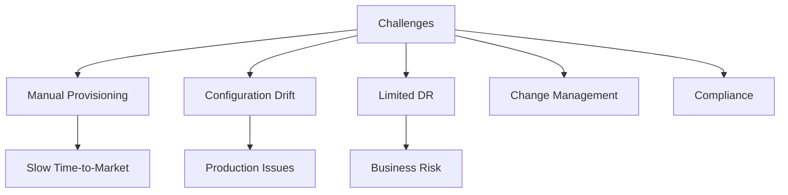
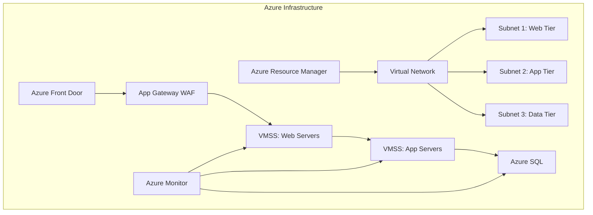
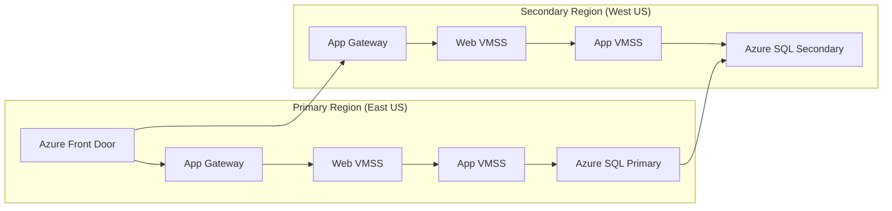

# Azure Infrastructure Deployment Project

## Project Overview

### Situation
- Company expanding digital services faced infrastructure challenges:
  - Manual environment provisioning taking weeks
  - Inconsistent configurations across environments
  - Limited disaster recovery capabilities
  - Difficulties tracking infrastructure changes
  - Growing compliance requirements



### Task
Design and implement scalable Azure infrastructure using IaC principles:
- Automate environment provisioning with Terraform
- Implement multi-region high availability architecture
- Set up proper networking and security controls
- Create disaster recovery capabilities
- Establish monitoring and alerting system
- Ensure compliance with industry standards

### Action

#### 1. Infrastructure Architecture



#### 2. Terraform Implementation

```bash
# Initialize Terraform
terraform init

# Create workspace for environments
terraform workspace new dev
terraform workspace new staging
terraform workspace new prod

# Deploy infrastructure using modular approach
terraform apply -var-file=env/$(terraform workspace show).tfvars
```

```hcl
# Example of main.tf
provider "azurerm" {
  features {}
}

module "resource_group" {
  source = "./modules/resource_group"
  name   = "${var.environment}-${var.project}-rg"
  location = var.location
}

module "network" {
  source         = "./modules/network"
  resource_group = module.resource_group.name
  location       = var.location
  vnet_name      = "${var.environment}-${var.project}-vnet"
  address_space  = var.address_space
  subnets        = var.subnets
}

module "app_service" {
  source               = "./modules/app_service"
  resource_group       = module.resource_group.name
  location             = var.location
  app_service_name     = "${var.environment}-${var.project}-app"
  app_service_plan_sku = var.app_service_plan_sku
  subnet_id            = module.network.subnet_ids["app"]
}

module "database" {
  source               = "./modules/database"
  resource_group       = module.resource_group.name
  location             = var.location
  server_name          = "${var.environment}-${var.project}-sql"
  administrator_login  = var.db_admin
  administrator_password = var.db_password
  subnet_id            = module.network.subnet_ids["data"]
}
```

#### 3. High Availability Setup

```hcl
# VMSS configuration for high availability
resource "azurerm_virtual_machine_scale_set" "app_vmss" {
  name                = "${var.environment}-app-vmss"
  location            = var.location
  resource_group_name = var.resource_group
  
  sku {
    name     = "Standard_DS2_v2"
    tier     = "Standard"
    capacity = var.instance_count
  }
  
  upgrade_policy_mode = "Rolling"
  health_probe_id     = azurerm_lb_probe.app_probe.id
  
  rolling_upgrade_policy {
    max_batch_instance_percent              = 20
    max_unhealthy_instance_percent          = 20
    max_unhealthy_upgraded_instance_percent = 20
    pause_time_between_batches              = "PT1M"
  }
  
  zones = ["1", "2", "3"]
  
  # VM configuration...
}
```

#### 4. Networking and Security

```hcl
# Network Security Group
resource "azurerm_network_security_group" "app_nsg" {
  name                = "${var.environment}-app-nsg"
  location            = var.location
  resource_group_name = var.resource_group

  security_rule {
    name                       = "Allow-HTTPS"
    priority                   = 100
    direction                  = "Inbound"
    access                     = "Allow"
    protocol                   = "Tcp"
    source_port_range          = "*"
    destination_port_range     = "443"
    source_address_prefix      = "*"
    destination_address_prefix = "*"
  }
  
  security_rule {
    name                       = "Deny-All"
    priority                   = 4096
    direction                  = "Inbound"
    access                     = "Deny"
    protocol                   = "*"
    source_port_range          = "*"
    destination_port_range     = "*"
    source_address_prefix      = "*"
    destination_address_prefix = "*"
  }
}
```

### Results

#### Performance Metrics
| Metric | Before | After |
|--------|---------|--------|
| Environment Provisioning | 2-3 weeks | 45 minutes |
| Configuration Consistency | ~70% | 100% |
| Recovery Time Objective | 24 hours | 1 hour |
| Recovery Point Objective | 24 hours | 15 minutes |
| Infrastructure Costs | Variable | 30% reduction |



## Technical Details

### Components Overview
1. **Networking**
   - Virtual Network with segregated subnets
   - Network Security Groups
   - Azure Front Door for global load balancing
   - Application Gateway with WAF

2. **Compute Resources**
   - Virtual Machine Scale Sets across multiple zones
   - Auto-scaling based on metrics
   - Managed identities for authentication

3. **Database**
   - Azure SQL with geo-replication
   - Point-in-time restore
   - Private endpoints for secure connectivity

### Disaster Recovery Strategy
```hcl
# Azure SQL geo-replication
resource "azurerm_mssql_database" "database" {
  name                = var.database_name
  server_id           = azurerm_mssql_server.primary.id
  sku_name            = "BC_Gen5_2"
  zone_redundant      = true
  
  threat_detection_policy {
    state                      = "Enabled"
    email_account_admins       = "Enabled"
    retention_days             = 30
    storage_endpoint           = azurerm_storage_account.security.primary_blob_endpoint
    storage_account_access_key = azurerm_storage_account.security.primary_access_key
  }
}

resource "azurerm_mssql_server" "secondary" {
  name                         = "${var.server_name}-secondary"
  resource_group_name          = var.resource_group
  location                     = var.secondary_location
  version                      = "12.0"
  administrator_login          = var.administrator_login
  administrator_login_password = var.administrator_password
}

resource "azurerm_mssql_failover_group" "failover" {
  name                = "${var.database_name}-failover-group"
  server_id           = azurerm_mssql_server.primary.id
  databases           = [azurerm_mssql_database.database.id]
  partner_server {
    id = azurerm_mssql_server.secondary.id
  }
  
  read_write_endpoint_failover_policy {
    mode          = "Automatic"
    grace_minutes = 60
  }
}
```

### Monitoring and Alerting
```hcl
# Azure Monitor Alert
resource "azurerm_monitor_metric_alert" "cpu_alert" {
  name                = "vm-cpu-alert"
  resource_group_name = var.resource_group
  scopes              = [azurerm_virtual_machine_scale_set.app_vmss.id]
  description         = "Action will be triggered when CPU utilization is greater than 80%"
  
  criteria {
    metric_namespace = "Microsoft.Compute/virtualMachineScaleSets"
    metric_name      = "Percentage CPU"
    aggregation      = "Average"
    operator         = "GreaterThan"
    threshold        = 80
  }
  
  action {
    action_group_id = azurerm_monitor_action_group.operations.id
  }
}
```

### Cost Optimization
1. **Reserved Instances** for predictable workloads
2. **Auto-shutdown** for dev/test environments
3. **Right-sizing** based on performance metrics
4. **Storage tiering** for infrequently accessed data

### Security Compliance
- Azure Policy implementation for governance
- Just-in-time VM access
- Key Vault for secret management
- RBAC for access control

### Lessons Learned
1. Importance of modular Terraform code
2. Benefits of immutable infrastructure approach
3. Need for comprehensive testing of DR procedures
4. Value of automated compliance checks