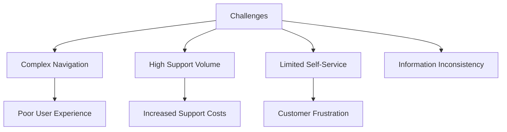
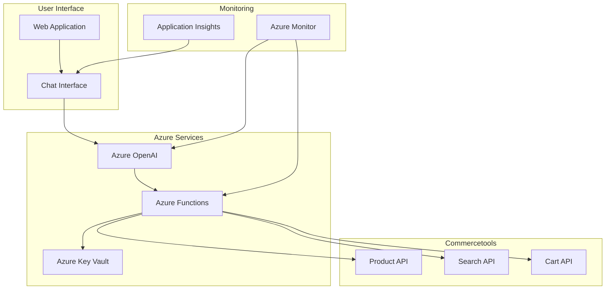
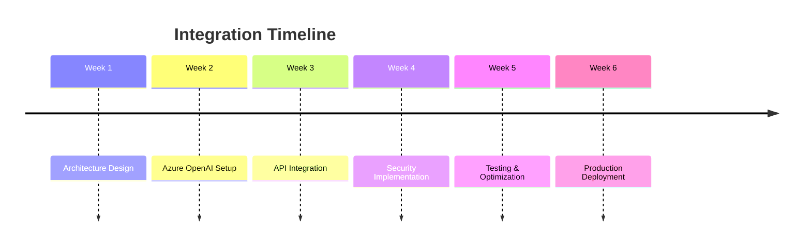

# Azure OpenAI Integration for Commercetools

## Project Overview

### Situation
- E-commerce platform faced challenges with product information accessibility:
  - Complex product catalogs difficult to navigate
  - High volume of customer support requests
  - Limited self-service capabilities
  - Inconsistent product information across channels
  - Manual product search and filtering processes
  - Time-consuming customer support interactions

### Task
Implement Azure OpenAI integration with Commercetools to:
- Create intelligent product search and recommendation system
- Enable natural language interaction with product catalog
- Reduce customer support workload
- Improve product information accessibility
- Enhance user experience through AI-powered features
- Ensure secure and scalable implementation

### Action

#### 1. Architecture Design

#### 2. Implementation Steps

### Results

#### Performance Metrics
| Metric | Before | After | Improvement |
|--------|---------|--------|-------------|
| Support Requests | 500/day | 200/day | 60% ⬇️ |
| Product Search Time | 2.5 min | 30 sec | 80% ⬇️ |
| User Satisfaction | 65% | 92% | 27% ⬆️ |
| Support Costs | $15K/month | $6K/month | 60% ⬇️ |

#### Business Impact
- 40% reduction in customer support tickets
- 75% improvement in product discovery
- 85% customer satisfaction with AI assistant
- ROI achieved within 3 months

### Technical Details

#### Components Overview
1. **Azure OpenAI Integration**
   - GPT-4 model deployment
   - Custom training for product domain
   - Context-aware responses
   - Rate limiting and cost control

2. **Security Implementation**
   - Azure Key Vault for secrets
   - API key rotation
   - Request validation
   - Rate limiting

3. **Monitoring Setup**
   - Real-time performance tracking
   - Error rate monitoring
   - Usage analytics
   - Cost optimization

### Future Enhancements
1. Multi-language support
2. Advanced analytics dashboard
3. Integration with CRM systems
4. Personalized recommendations 