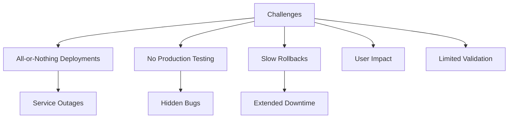
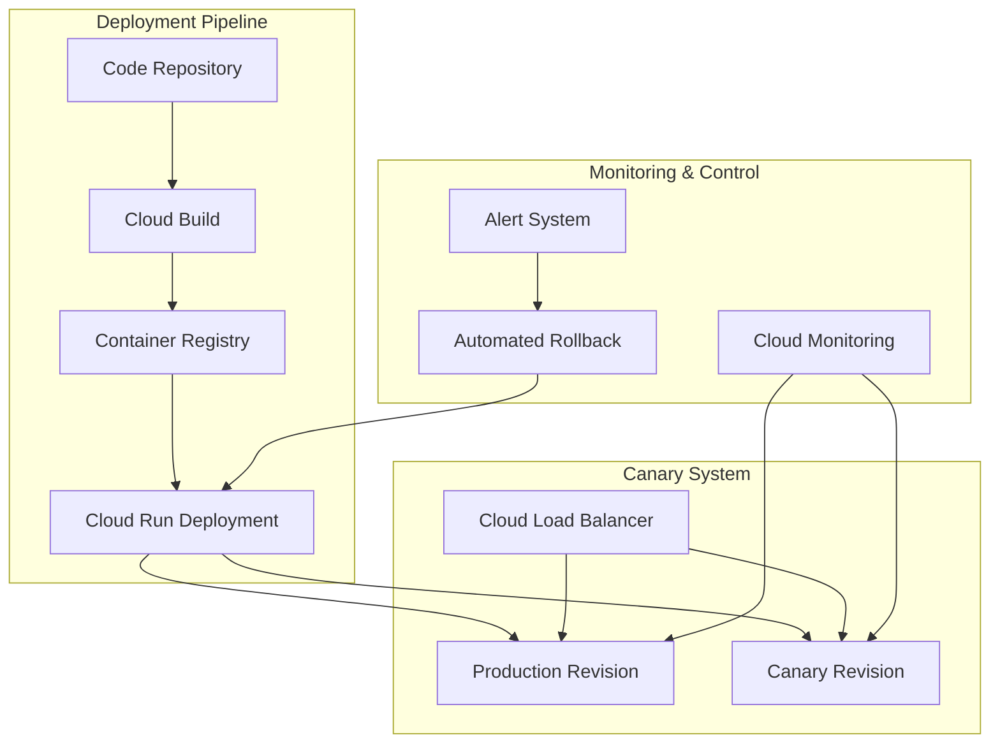
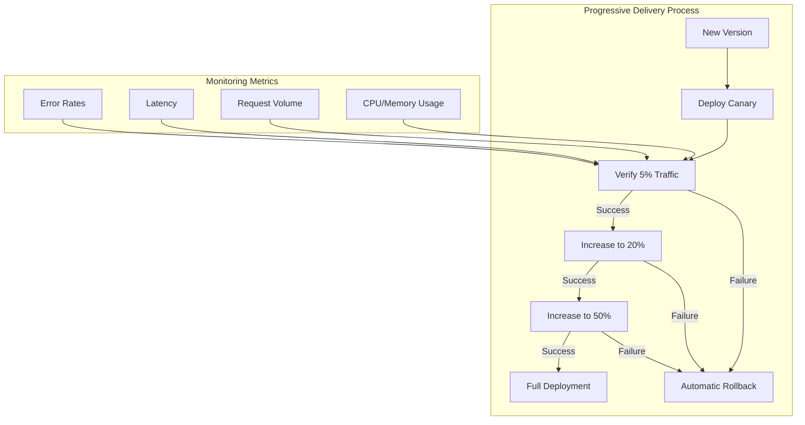

# Cloud Run Canary Deployment System

## Project Overview

### Situation
- Web services deployment faced significant reliability challenges:
  - All-or-nothing deployments resulting in potential service outages
  - No ability to test in production with real traffic
  - Difficult rollback procedures taking 15-30 minutes to complete
  - Customer impact during problematic deployments
  - Limited ability to validate new features with actual users
  - High risk when deploying critical services



### Task
Implement progressive delivery system with canary deployments:
- Design and configure Cloud Run services for traffic splitting
- Create automated deployment pipeline with canary stages
- Implement comprehensive monitoring for canary health
- Set up automated rollback mechanisms
- Establish clear verification criteria
- Document the implementation and operational procedures

### Action

#### 1. Architecture Design



#### 2. Cloud Run Configuration

```yaml
# cloudbuild.yaml for canary deployment
steps:
  # Build container image
  - name: 'gcr.io/cloud-builders/docker'
    args: ['build', '-t', 'gcr.io/$PROJECT_ID/service:$SHORT_SHA', '.']
    
  # Push the container image
  - name: 'gcr.io/cloud-builders/docker'
    args: ['push', 'gcr.io/$PROJECT_ID/service:$SHORT_SHA']
  
  # Deploy canary with 5% traffic
  - name: 'gcr.io/google.com/cloudsdktool/cloud-sdk'
    entrypoint: 'gcloud'
    args:
      - 'run'
      - 'deploy'
      - 'service-canary'
      - '--image=gcr.io/$PROJECT_ID/service:$SHORT_SHA'
      - '--region=us-central1'
      - '--platform=managed'
      - '--tag=canary'
      - '--no-traffic'
  
  # Migrate 5% traffic to canary
  - name: 'gcr.io/google.com/cloudsdktool/cloud-sdk'
    entrypoint: 'gcloud'
    args:
      - 'run'
      - 'services'
      - 'update-traffic'
      - 'service'
      - '--platform=managed'
      - '--region=us-central1'
      - '--to-tags=canary=5'
  
  # Wait for verification period
  - name: 'gcr.io/cloud-builders/curl'
    id: 'wait-for-verification'
    entrypoint: 'sleep'
    args: ['300']  # 5 minute verification period
    
  # Check metrics before proceeding
  - name: 'gcr.io/google.com/cloudsdktool/cloud-sdk'
    id: 'check-canary-health'
    entrypoint: 'bash'
    args:
      - '-c'
      - |
        ERROR_RATE=$(gcloud monitoring metrics list \
          --filter="metric.type=run.googleapis.com/request_count AND resource.labels.service_name=service-canary" \
          --format="value(metric.labels.response_code)")
        
        if [[ "$ERROR_RATE" -gt 1 ]]; then
          echo "Canary showing errors. Aborting deployment."
          exit 1
        fi
        
        echo "Canary health check passed."
    
  # Promote canary to production (100% traffic)
  - name: 'gcr.io/google.com/cloudsdktool/cloud-sdk'
    id: 'promote-to-production'
    entrypoint: 'gcloud'
    args:
      - 'run'
      - 'services'
      - 'update-traffic'
      - 'service'
      - '--platform=managed'
      - '--region=us-central1'
      - '--to-latest'
```

#### 3. Automated Rollback Script

```bash
#!/bin/bash
# rollback.sh - Automated rollback script for Cloud Run services

# Configuration variables
SERVICE_NAME="service"
REGION="us-central1"
PROJECT_ID="your-project-id"

# Get the previous stable revision
STABLE_REVISION=$(gcloud run revisions list \
  --platform=managed \
  --region=$REGION \
  --service=$SERVICE_NAME \
  --format="value(metadata.name)" \
  --filter="metadata.labels.status=stable" \
  --limit=1)

if [ -z "$STABLE_REVISION" ]; then
  echo "No stable revision found. Listing available revisions..."
  gcloud run revisions list \
    --platform=managed \
    --region=$REGION \
    --service=$SERVICE_NAME
  
  echo "Please specify a revision to rollback to:"
  read STABLE_REVISION
fi

echo "Rolling back to revision: $STABLE_REVISION"

# Perform the rollback
gcloud run services update-traffic $SERVICE_NAME \
  --platform=managed \
  --region=$REGION \
  --to-revisions=$STABLE_REVISION=100

# Verify traffic has been migrated
echo "Verifying rollback..."
TRAFFIC_STATUS=$(gcloud run services describe $SERVICE_NAME \
  --platform=managed \
  --region=$REGION \
  --format="value(status.traffic)")

echo "Traffic allocation: $TRAFFIC_STATUS"
echo "Rollback completed."
```

#### 4. Monitoring Configuration

```yaml
# Example monitoring configuration using Terraform
resource "google_monitoring_alert_policy" "canary_error_rate" {
  display_name = "Canary Error Rate"
  combiner     = "OR"
  conditions {
    display_name = "Error rate > 1%"
    condition_threshold {
      filter     = "resource.type = \"cloud_run_revision\" AND resource.labels.service_name = \"service\" AND resource.labels.revision_name = \"service-canary\" AND metric.type = \"run.googleapis.com/request_count\" AND metric.labels.response_code_class = \"4xx\""
      duration   = "60s"
      comparison = "COMPARISON_GT"
      threshold_value = 0.01
      aggregations {
        alignment_period   = "60s"
        per_series_aligner = "ALIGN_RATE"
      }
    }
  }

  notification_channels = [
    google_monitoring_notification_channel.email.name
  ]

  user_labels = {
    service = "service"
    environment = "canary"
  }
}

resource "google_monitoring_alert_policy" "canary_latency" {
  display_name = "Canary Latency"
  combiner     = "OR"
  conditions {
    display_name = "Latency > 500ms"
    condition_threshold {
      filter     = "resource.type = \"cloud_run_revision\" AND resource.labels.service_name = \"service\" AND resource.labels.revision_name = \"service-canary\" AND metric.type = \"run.googleapis.com/request_latencies\""
      duration   = "60s"
      comparison = "COMPARISON_GT"
      threshold_value = 500
      aggregations {
        alignment_period   = "60s"
        per_series_aligner = "ALIGN_PERCENTILE_99"
      }
    }
  }

  notification_channels = [
    google_monitoring_notification_channel.email.name
  ]

  user_labels = {
    service = "service"
    environment = "canary"
  }
}
```

### Results

#### Performance Metrics
| Metric | Before | After |
|--------|---------|--------|
| Deployment Risk | High | Significantly reduced |
| Production Testing | Not possible | Controlled testing with 5% traffic |
| Time to Detect Issues | 10-45 minutes | 3-5 minutes |
| Rollback Time | 15-30 minutes | 1-2 minutes |
| Deployment Success Rate | 92% | 99.5% |
| Customer Impact Events | 8 per quarter | <1 per quarter |



## Technical Details

### Components Overview
1. **Cloud Run Configuration**
   - Traffic splitting capabilities
   - Revision tagging and management
   - Scaling configuration per revision
   - Health check endpoints

2. **Monitoring Setup**
   - Error rate thresholds
   - Latency tracking
   - Request volume monitoring
   - Resource utilization metrics

3. **Deployment Pipeline**
   - Source code integration
   - Automated container builds
   - Progressive traffic shifting
   - Automatic verification gates

### Canary Deployment Workflow
1. **Initial Deployment (0% traffic)**
   - Deploy new revision with canary tag
   - Run initial health checks
   - Verify deployment success

2. **Traffic Migration Phases**
   - Phase 1: 5% traffic for 5 minutes
   - Phase 2: 20% traffic for 10 minutes
   - Phase 3: 50% traffic for 15 minutes
   - Phase 4: 100% traffic (full promotion)

3. **Automated Verification**
   - Monitor error rates at each phase
   - Check average and p95 latency
   - Verify resource utilization
   - Confirm user-facing functionality

### Rollback Mechanisms
- Automated rollbacks triggered by alert thresholds
- Manual emergency rollback option
- Audit logging of all traffic shifts
- Post-rollback incident analysis

### Configuration Management
```yaml
# Example automated canary analysis configuration
apiVersion: apps/v1
kind: Deployment
metadata:
  name: canary-analysis
spec:
  template:
    spec:
      containers:
      - name: analysis
        image: gcr.io/project-id/canary-analysis:latest
        env:
        - name: SERVICE_NAME
          value: "service"
        - name: PROJECT_ID
          value: "project-id"
        - name: REGION
          value: "us-central1"
        - name: ERROR_THRESHOLD
          value: "1"
        - name: LATENCY_THRESHOLD
          value: "500"
        - name: ANALYSIS_DURATION
          value: "300"
```

### Incident Response Procedures
1. **Automated Rollback Failure**
   - Manual intervention procedure
   - Emergency contact list
   - War room protocol

2. **Partial Outage Handling**
   - Traffic diversion strategies
   - Customer communication templates
   - Service degradation thresholds

### Lessons Learned
1. Start with small traffic percentages (5% or less)
2. Implement comprehensive monitoring before attempting canary deployments
3. Define clear rollback criteria to remove subjectivity
4. Document all deployment and rollback steps for emergency situations
5. Regularly test rollback procedures as part of release drills