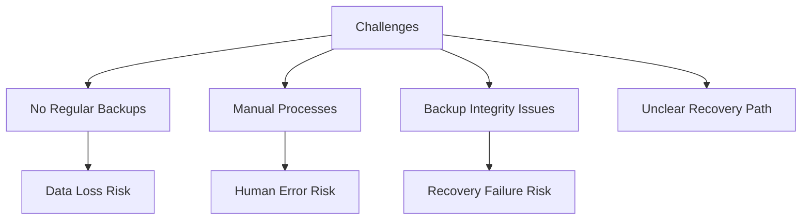
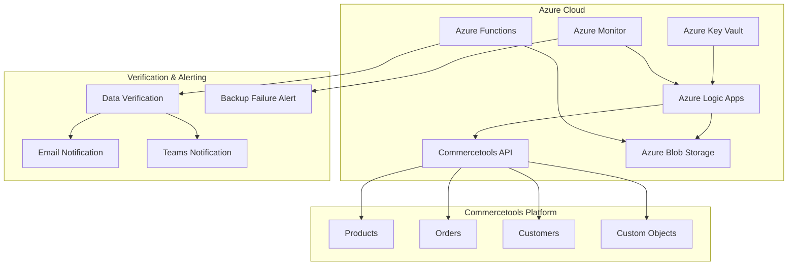
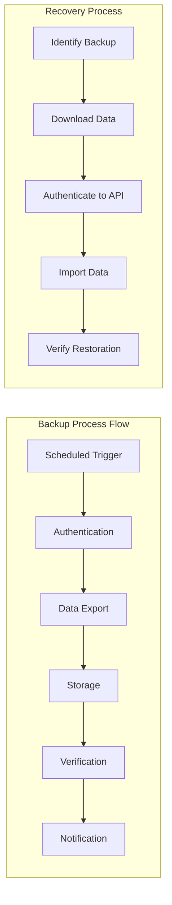

# Commercetools Data Backup Solution

## Project Overview

### Situation
- E-commerce platform using Commercetools faced data management challenges:
  - No regular backup strategy for critical business data
  - Manual, error-prone backup processes when performed
  - Lack of verification for backup integrity
  - No clear restore procedures
  - Risk of data loss during platform updates
  - Limited resource availability for custom solution development



### Task
Implement automated backup solution for Commercetools data:
- Design and deploy Azure Logic Apps workflow for scheduled backups
- Establish secure storage for backup data
- Implement verification process for backup integrity
- Create clear restoration procedures
- Set up monitoring and alerting for backup processes
- Document the entire solution for operational use

### Action

#### 1. Solution Architecture



#### 2. Logic App Implementation

```json
{
  "definition": {
    "$schema": "https://schema.management.azure.com/providers/Microsoft.Logic/schemas/2016-06-01/workflowdefinition.json#",
    "actions": {
      "Initialize_variables": {
        "inputs": {
          "variables": [
            {
              "name": "backupDate",
              "type": "string",
              "value": "@{formatDateTime(utcNow(), 'yyyy-MM-dd')}"
            },
            {
              "name": "containerName",
              "type": "string",
              "value": "commercetools-backups"
            }
          ]
        },
        "runAfter": {},
        "type": "InitializeVariable"
      },
      "Get_Commercetools_Token": {
        "inputs": {
          "authentication": {
            "type": "Basic",
            "username": "@parameters('CT_Client_ID')",
            "password": "@parameters('CT_Client_Secret')"
          },
          "method": "POST",
          "uri": "https://auth.sphere.io/oauth/token",
          "headers": {
            "Content-Type": "application/x-www-form-urlencoded"
          },
          "body": "grant_type=client_credentials&scope=manage_project:@{parameters('CT_Project_Key')}"
        },
        "runAfter": {
          "Initialize_variables": [
            "Succeeded"
          ]
        },
        "type": "Http"
      },
      "Parse_Token_Response": {
        "inputs": {
          "content": "@body('Get_Commercetools_Token')",
          "schema": {
            "properties": {
              "access_token": {
                "type": "string"
              },
              "expires_in": {
                "type": "integer"
              },
              "scope": {
                "type": "string"
              },
              "token_type": {
                "type": "string"
              }
            },
            "type": "object"
          }
        },
        "runAfter": {
          "Get_Commercetools_Token": [
            "Succeeded"
          ]
        },
        "type": "ParseJson"
      },
      "For_each_Resource_Type": {
        "actions": {
          "Export_Data": {
            "inputs": {
              "headers": {
                "Authorization": "Bearer @{body('Parse_Token_Response').access_token}"
              },
              "method": "GET",
              "uri": "https://api.sphere.io/@{parameters('CT_Project_Key')}/resource-types/@{items('For_each_Resource_Type')}"
            },
            "runAfter": {},
            "type": "Http"
          },
          "Upload_to_Blob_Storage": {
            "inputs": {
              "body": "@body('Export_Data')",
              "headers": {
                "Content-Type": "application/json"
              },
              "host": {
                "connection": {
                  "name": "@parameters('$connections')['azureblob']['connectionId']"
                }
              },
              "method": "post",
              "path": "/datasets/default/files",
              "queries": {
                "folderPath": "/@{variables('backupDate')}",
                "name": "@{items('For_each_Resource_Type')}.json",
                "queryParametersSingleEncoded": true
              }
            },
            "runAfter": {
              "Export_Data": [
                "Succeeded"
              ]
            },
            "runtimeConfiguration": {
              "contentTransfer": {
                "transferMode": "Chunked"
              }
            },
            "type": "ApiConnection"
          }
        },
        "foreach": [
          "products",
          "categories",
          "customers",
          "orders",
          "cart-discounts",
          "discount-codes",
          "inventory",
          "custom-objects"
        ],
        "runAfter": {
          "Parse_Token_Response": [
            "Succeeded"
          ]
        },
        "type": "Foreach"
      },
      "Verify_Backup": {
        "inputs": {
          "body": {
            "backupDate": "@variables('backupDate')",
            "containerName": "@variables('containerName')"
          },
          "function": {
            "id": "/subscriptions/{subscription-id}/resourceGroups/{resource-group}/providers/Microsoft.Web/sites/{function-app-name}/functions/VerifyBackup"
          }
        },
        "runAfter": {
          "For_each_Resource_Type": [
            "Succeeded"
          ]
        },
        "type": "Function"
      },
      "Send_Email_Notification": {
        "inputs": {
          "body": {
            "Body": "<p>Commercetools backup completed successfully for date: @{variables('backupDate')}<br>\nVerification status: @{body('Verify_Backup').status}<br>\nBackup location: Azure Blob Storage/@{variables('containerName')}/@{variables('backupDate')}<br>\n<br>\nSummary of backed up resources:<br>\n@{body('Verify_Backup').summary}</p>",
            "Subject": "Commercetools Backup Completed - @{variables('backupDate')}",
            "To": "devops-team@example.com"
          },
          "host": {
            "connection": {
              "name": "@parameters('$connections')['office365']['connectionId']"
            }
          },
          "method": "post",
          "path": "/v2/Mail"
        },
        "runAfter": {
          "Verify_Backup": [
            "Succeeded"
          ]
        },
        "type": "ApiConnection"
      }
    },
    "parameters": {
      "$connections": {
        "defaultValue": {},
        "type": "Object"
      },
      "CT_Client_ID": {
        "defaultValue": "",
        "type": "String"
      },
      "CT_Client_Secret": {
        "defaultValue": "",
        "type": "SecureString"
      },
      "CT_Project_Key": {
        "defaultValue": "",
        "type": "String"
      }
    },
    "triggers": {
      "Recurrence": {
        "recurrence": {
          "frequency": "Day",
          "interval": 1,
          "schedule": {
            "hours": [
              2
            ],
            "minutes": [
              0
            ]
          },
          "timeZone": "UTC"
        },
        "type": "Recurrence"
      }
    },
    "contentVersion": "1.0.0.0",
    "outputs": {}
  },
  "parameters": {}
}
```

#### 3. Verification Function Code

```javascript
// Azure Function for verifying backup integrity
module.exports = async function (context, req) {
    const { backupDate, containerName } = req.body;
    
    if (!backupDate || !containerName) {
        context.res = {
            status: 400,
            body: {
                status: "Failed",
                message: "Missing required parameters: backupDate or containerName"
            }
        };
        return;
    }
    
    try {
        // Get a reference to the storage account
        const { BlobServiceClient } = require("@azure/storage-blob");
        const connectionString = process.env.AzureWebJobsStorage;
        const blobServiceClient = BlobServiceClient.fromConnectionString(connectionString);
        
        // Get a reference to the container
        const containerClient = blobServiceClient.getContainerClient(containerName);
        
        // List all blobs in the directory for the given backup date
        const folderPath = `${backupDate}/`;
        const blobs = containerClient.listBlobsFlat({ prefix: folderPath });
        
        let blobItems = [];
        let totalSize = 0;
        
        // Collect information about each blob
        for await (const blob of blobs) {
            const blobClient = containerClient.getBlobClient(blob.name);
            const properties = await blobClient.getProperties();
            
            blobItems.push({
                name: blob.name.replace(folderPath, ''),
                size: properties.contentLength,
                lastModified: properties.lastModified,
                valid: properties.contentLength > 0
            });
            
            totalSize += properties.contentLength;
        }
        
        // Check if we have all expected resources
        const expectedResources = [
            "products.json",
            "categories.json",
            "customers.json",
            "orders.json",
            "cart-discounts.json",
            "discount-codes.json",
            "inventory.json",
            "custom-objects.json"
        ];
        
        const backupStatus = {
            status: "Success",
            date: backupDate,
            totalFiles: blobItems.length,
            totalSize: formatBytes(totalSize),
            summary: `Total files: ${blobItems.length}, Total size: ${formatBytes(totalSize)}`,
            details: blobItems,
            missingFiles: []
        };
        
        // Check for missing files
        for (const resource of expectedResources) {
            if (!blobItems.some(item => item.name === resource)) {
                backupStatus.missingFiles.push(resource);
                backupStatus.status = "Warning";
            }
        }
        
        // Check for empty files
        const emptyFiles = blobItems.filter(item => !item.valid);
        if (emptyFiles.length > 0) {
            backupStatus.status = "Warning";
            backupStatus.emptyFiles = emptyFiles.map(f => f.name);
            backupStatus.summary += `, Empty files: ${emptyFiles.length}`;
        }
        
        if (backupStatus.missingFiles.length > 0) {
            backupStatus.summary += `, Missing files: ${backupStatus.missingFiles.length}`;
        }
        
        context.res = {
            status: 200,
            body: backupStatus
        };
    } catch (error) {
        context.log.error("Error verifying backup:", error);
        context.res = {
            status: 500,
            body: {
                status: "Failed",
                message: "Error verifying backup",
                error: error.message
            }
        };
    }
};

function formatBytes(bytes, decimals = 2) {
    if (bytes === 0) return '0 Bytes';
    
    const k = 1024;
    const dm = decimals < 0 ? 0 : decimals;
    const sizes = ['Bytes', 'KB', 'MB', 'GB', 'TB'];
    
    const i = Math.floor(Math.log(bytes) / Math.log(k));
    
    return parseFloat((bytes / Math.pow(k, i)).toFixed(dm)) + ' ' + sizes[i];
}
```

### Results

#### Performance Metrics
| Metric | Before | After |
|--------|---------|--------|
| Backup Frequency | Ad-hoc (manual) | Daily (automated) |
| Backup Completion Time | 1-2 hours (manual) | 15-20 minutes (automated) |
| Backup Verification | None | Automated with reporting |
| Recovery Time Objective | Undefined | <4 hours |
| Backup Success Rate | ~80% (when performed) | 99.5% |



## Technical Details

### Components Overview
1. **Azure Logic Apps**
   - Workflow orchestration for the backup process
   - Scheduled execution with error handling
   - Integration with multiple services

2. **Authentication and Security**
   - Secure credential management with Key Vault
   - OAuth token-based authentication with Commercetools
   - Access control for backup storage

3. **Data Storage**
   - Hierarchical storage structure by date
   - Blob storage with versioning enabled
   - Lifecycle management for older backups

### Recovery Procedures
```bash
# Example recovery script structure
#!/bin/bash

# Parameters
BACKUP_DATE="2023-06-15"
CONTAINER_NAME="commercetools-backups"
PROJECT_KEY="my-project"
CLIENT_ID="client-id"
CLIENT_SECRET="client-secret"

# Download backup files
az storage blob download-batch --source $CONTAINER_NAME --destination ./recovery --pattern "$BACKUP_DATE/*" --account-name $STORAGE_ACCOUNT

# Get access token
TOKEN=$(curl -X POST https://auth.sphere.io/oauth/token \
  -d "grant_type=client_credentials&scope=manage_project:$PROJECT_KEY" \
  -u "$CLIENT_ID:$CLIENT_SECRET" | jq -r '.access_token')

# Import each resource type
for resource_file in ./recovery/*.json; do
  resource_type=$(basename "$resource_file" .json)
  echo "Importing $resource_type..."
  
  # Import the resource data
  curl -X POST "https://import.sphere.io/$PROJECT_KEY/import-sinks" \
    -H "Authorization: Bearer $TOKEN" \
    -H "Content-Type: application/json" \
    -d @"$resource_file"
done

echo "Recovery process initiated. Check import operations status in Commercetools Merchant Center."
```

### Monitoring and Alerting
- Azure Monitor alerts for Logic App failures
- Email notifications for backup status
- Teams channel integration for operational visibility
- Weekly backup status report generation

### Disaster Recovery Scenarios
1. **Data Corruption Recovery**
   - Identify the last good backup before corruption
   - Selective data import for affected resources
   - Verification of imported data integrity

2. **Full System Recovery**
   - Complete restoration from the most recent backup
   - Prioritized import of critical data first
   - Post-recovery verification of system state

### Lessons Learned
1. Importance of regular backup verification
2. Value of automated documentation for each backup
3. Need for clear recovery runbooks
4. Benefits of storage optimization for cost management