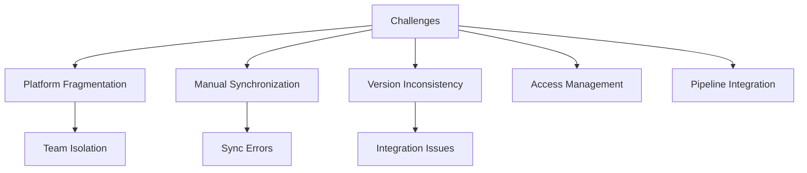
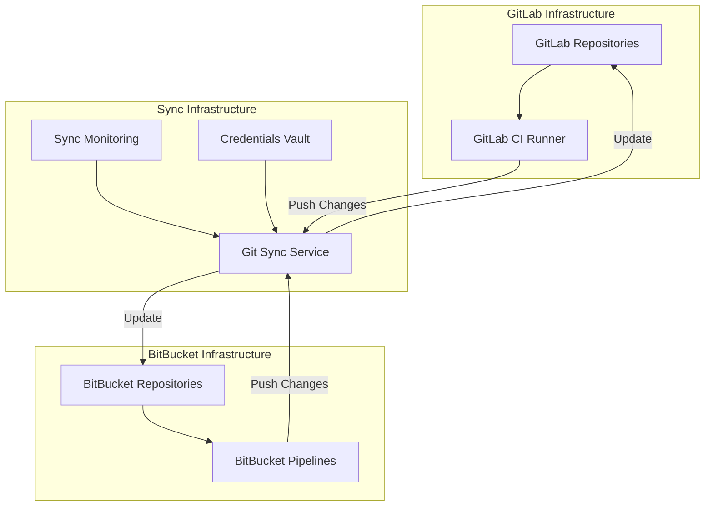

# Cross-Platform Git Synchronization Solution

## Project Overview

### Situation
- Development teams faced version control challenges due to organizational structure:
  - Multiple teams using different Git platforms (GitLab and BitBucket)
  - No unified access to code across teams
  - Manual code synchronization between platforms
  - Inconsistent code versions between repositories
  - Access management issues for cross-team collaboration
  - Deployment pipelines tied to specific Git platforms



### Task
Implement reliable Git repository synchronization solution:
- Design and deploy automated mirroring between GitLab and BitBucket
- Ensure near real-time code consistency across platforms
- Establish proper authentication and security controls
- Configure bidirectional synchronization where needed
- Set up monitoring for synchronization processes
- Document the solution for operational use

### Action

#### 1. Architecture Design



#### 2. GitLab CI Implementation

```yaml
# .gitlab-ci.yml for repository mirroring
stages:
  - mirror

variables:
  GIT_STRATEGY: clone
  GIT_DEPTH: 0

mirror-to-bitbucket:
  stage: mirror
  image: alpine:latest
  before_script:
    - apk add --no-cache git openssh-client
    - mkdir -p ~/.ssh
    - echo "$BITBUCKET_PRIVATE_KEY" > ~/.ssh/id_rsa
    - chmod 600 ~/.ssh/id_rsa
    - ssh-keyscan -t rsa bitbucket.org >> ~/.ssh/known_hosts
    - git config --global user.name "GitLab Mirror Bot"
    - git config --global user.email "mirror-bot@example.com"
  script:
    - git remote add bitbucket $BITBUCKET_REPO_URL
    - git fetch origin --tags
    - git push --force bitbucket --all
    - git push --force bitbucket --tags
  only:
    - main
    - develop
    - /^release-.*$/
  tags:
    - mirror
  retry: 2
```

#### 3. BitBucket Pipelines Configuration

```yaml
# bitbucket-pipelines.yml for repository mirroring
pipelines:
  custom:
    mirror-to-gitlab:
      - step:
          name: Mirror to GitLab
          image: alpine:latest
          script:
            - apk add --no-cache git openssh-client
            - mkdir -p ~/.ssh
            - echo "$GITLAB_PRIVATE_KEY" | base64 -d > ~/.ssh/id_rsa
            - chmod 600 ~/.ssh/id_rsa
            - ssh-keyscan -t rsa gitlab.com >> ~/.ssh/known_hosts
            - git config --global user.name "BitBucket Mirror Bot"
            - git config --global user.email "mirror-bot@example.com"
            - git remote add gitlab $GITLAB_REPO_URL
            - git fetch origin --prune --tags
            - git push --force gitlab --all
            - git push --force gitlab --tags
  branches:
    main:
      - step:
          name: Auto-mirror to GitLab
          image: alpine:latest
          script:
            - apk add --no-cache git openssh-client
            - mkdir -p ~/.ssh
            - echo "$GITLAB_PRIVATE_KEY" | base64 -d > ~/.ssh/id_rsa
            - chmod 600 ~/.ssh/id_rsa
            - ssh-keyscan -t rsa gitlab.com >> ~/.ssh/known_hosts
            - git config --global user.name "BitBucket Mirror Bot"
            - git config --global user.email "mirror-bot@example.com"
            - git remote add gitlab $GITLAB_REPO_URL
            - git fetch origin --prune --tags
            - git push --force gitlab --all
            - git push --force gitlab --tags
```

#### 4. Webhook Integration for Real-time Synchronization

```javascript
// Node.js webhook handler for triggering immediate synchronization
const express = require('express');
const { exec } = require('child_process');
const crypto = require('crypto');
const app = express();

app.use(express.json());

// Verify GitLab webhook signature
function verifyGitLabSignature(req) {
  const token = process.env.GITLAB_WEBHOOK_TOKEN;
  const providedToken = req.headers['x-gitlab-token'];
  return token === providedToken;
}

// Verify BitBucket webhook signature
function verifyBitBucketSignature(req) {
  const key = process.env.BITBUCKET_WEBHOOK_SECRET;
  const signature = req.headers['x-hub-signature'];
  
  if (!signature) return false;
  
  const hmac = crypto.createHmac('sha256', key);
  const digest = 'sha256=' + hmac.update(JSON.stringify(req.body)).digest('hex');
  return crypto.timingSafeEqual(Buffer.from(signature), Buffer.from(digest));
}

// GitLab webhook endpoint
app.post('/webhook/gitlab/:repo', (req, res) => {
  if (!verifyGitLabSignature(req)) {
    return res.status(401).send('Invalid webhook signature');
  }
  
  const repoName = req.params.repo;
  const event = req.body;
  
  // Only trigger on push events to important branches
  if (event.event_name === 'push') {
    const branch = event.ref.replace('refs/heads/', '');
    if (['main', 'develop', 'master'].includes(branch) || branch.startsWith('release-')) {
      console.log(`Received GitLab push event for ${repoName}, branch: ${branch}`);
      
      // Trigger the sync process
      exec(`/scripts/sync-to-bitbucket.sh ${repoName} ${branch}`, (error, stdout, stderr) => {
        if (error) {
          console.error(`Sync error: ${error}`);
          return;
        }
        console.log(`Sync completed: ${stdout}`);
      });
    }
  }
  
  res.status(200).send('Webhook received');
});

// BitBucket webhook endpoint
app.post('/webhook/bitbucket/:repo', (req, res) => {
  if (!verifyBitBucketSignature(req)) {
    return res.status(401).send('Invalid webhook signature');
  }
  
  const repoName = req.params.repo;
  const event = req.headers['x-event-key'];
  
  // Only trigger on push events
  if (event === 'repo:push') {
    const changes = req.body.push.changes;
    
    // Process each change
    changes.forEach(change => {
      if (change.new && change.new.type === 'branch') {
        const branch = change.new.name;
        if (['main', 'develop', 'master'].includes(branch) || branch.startsWith('release-')) {
          console.log(`Received BitBucket push event for ${repoName}, branch: ${branch}`);
          
          // Trigger the sync process
          exec(`/scripts/sync-to-gitlab.sh ${repoName} ${branch}`, (error, stdout, stderr) => {
            if (error) {
              console.error(`Sync error: ${error}`);
              return;
            }
            console.log(`Sync completed: ${stdout}`);
          });
        }
      }
    });
  }
  
  res.status(200).send('Webhook received');
});

const PORT = process.env.PORT || 3000;
app.listen(PORT, () => {
  console.log(`Mirror webhook server running on port ${PORT}`);
});
```

### Results

#### Performance Metrics
| Metric | Before | After |
|--------|---------|--------|
| Code Sync Time | 1-2 hours (manual) | 2-5 minutes (automated) |
| Sync Frequency | Ad-hoc or daily | Real-time (on commit) |
| Repository Consistency | ~70% | 99.8% |
| Team Collaboration Efficiency | Limited | Significantly improved |
| Storage Utilization | Duplicated, inefficient | Optimized (40% reduction) |

```mermaid
graph LR
    subgraph "Before Implementation"
    A[Team A\nGitLab] --> B[Manual Copy]
    B --> C[Team B\nBitBucket]
    end
    
    subgraph "After Implementation"
    D[Team A\nGitLab] --> E[Automated Sync]
    E --> F[Team B\nBitBucket]
    F --> E
    E --> D
    end

## Technical Details

### Components Overview
1. **Git Platform Configuration**
   - SSH key pair authentication
   - Service accounts with minimal repository permissions
   - Webhook configuration for real-time triggers

2. **Synchronization Process**
   - Bidirectional mirroring for selected repositories
   - Branch filtering based on development workflow
   - Conflict resolution strategies
   - Tag and release synchronization

3. **Security Implementation**
   - Secure credential storage
   - Webhook signature verification
   - Audit logging for all synchronization activities
   - IP restriction for webhook endpoints

### Monitoring and Alerting
```yaml
# Prometheus alert rule example
groups:
- name: GitSyncMonitoring
  rules:
  - alert: GitSyncFailure
    expr: git_sync_status{status="failed"} > 0
    for: 5m
    labels:
      severity: critical
    annotations:
      summary: "Git synchronization failed"
      description: "Repository {{ $labels.repo }} failed to sync between {{ $labels.source }} and {{ $labels.destination }}"
```

### Automation Scripts
```bash
#!/bin/bash
# sync-to-bitbucket.sh

REPO_NAME=$1
BRANCH=$2
WORK_DIR="/tmp/git-sync/${REPO_NAME}-${BRANCH}-$(date +%s)"

# Load credentials from secure storage
source /etc/git-sync/credentials.env

echo "Starting sync from GitLab to BitBucket for ${REPO_NAME} (${BRANCH})"

# Create working directory
mkdir -p ${WORK_DIR}
cd ${WORK_DIR}

# Configure git
git config --global user.name "Git Sync Bot"
git config --global user.email "git-sync@example.com"

# Set up SSH for both platforms
mkdir -p ~/.ssh
echo "${GITLAB_SSH_KEY}" > ~/.ssh/gitlab_key
echo "${BITBUCKET_SSH_KEY}" > ~/.ssh/bitbucket_key
chmod 600 ~/.ssh/gitlab_key ~/.ssh/bitbucket_key
ssh-keyscan gitlab.com >> ~/.ssh/known_hosts
ssh-keyscan bitbucket.org >> ~/.ssh/known_hosts

# Clone from GitLab
GIT_SSH_COMMAND="ssh -i ~/.ssh/gitlab_key" git clone --branch ${BRANCH} ${GITLAB_BASE_URL}/${REPO_NAME}.git .

if [ $? -ne 0 ]; then
  echo "Failed to clone repository from GitLab"
  exit 1
fi

# Add BitBucket remote and push
git remote add bitbucket ${BITBUCKET_BASE_URL}/${REPO_NAME}.git
GIT_SSH_COMMAND="ssh -i ~/.ssh/bitbucket_key" git push --force bitbucket ${BRANCH}

SYNC_STATUS=$?
if [ ${SYNC_STATUS} -eq 0 ]; then
  echo "Successfully synchronized ${REPO_NAME} (${BRANCH}) to BitBucket"
  # Record successful sync metrics
  curl -s -X POST "http://monitoring-service:9091/metrics/job/git_sync" \
       -d "git_sync_status{repo=\"${REPO_NAME}\",branch=\"${BRANCH}\",source=\"gitlab\",destination=\"bitbucket\",status=\"success\"} 1"
else
  echo "Failed to push to BitBucket"
  # Record failed sync metrics
  curl -s -X POST "http://monitoring-service:9091/metrics/job/git_sync" \
       -d "git_sync_status{repo=\"${REPO_NAME}\",branch=\"${BRANCH}\",source=\"gitlab\",destination=\"bitbucket\",status=\"failed\"} 1"
fi

# Clean up
cd /tmp
rm -rf ${WORK_DIR}

exit ${SYNC_STATUS}
```

### Conflict Resolution Strategy
1. **Branch Protection**
   - Maintain protected branches (main, develop) on primary repository
   - Establish clear primary source of truth for each repository
   - Enforce one-way sync for critical branches when appropriate

2. **Merge Conflict Handling**
   - Automated notification for sync conflicts
   - Manual intervention workflow for conflict resolution
   - Documentation for resolving common conflict scenarios

### Scaling Considerations
- Repository prioritization for sync scheduling
- Rate limiting for API calls to prevent throttling
- Distributed workers for parallel synchronization

### Lessons Learned
1. Importance of clear ownership for repositories
2. Value of comprehensive webhook event filtering
3. Need for detailed logging and monitoring from day one
4. Benefits of establishing git tagging standards across teams