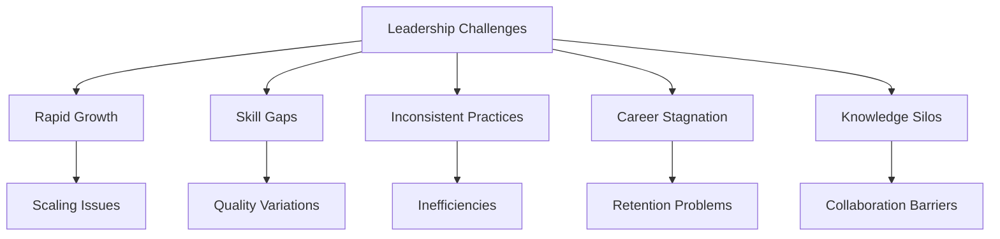

# DevOps Team Leadership & Mentoring Program

## Project Overview

### Situation
- Growing DevOps organization requiring structured leadership and skill development:
  - Rapid team expansion from 5 to 25+ engineers requiring standardized practices
  - Inconsistent skill levels across team members and departments
  - Lack of standardized DevOps practices and knowledge sharing
  - Limited career progression paths for technical professionals
  - High onboarding time for new team members (3-4 months)
  - Knowledge silos preventing effective collaboration and growth



### Task
Design and implement comprehensive DevOps leadership and mentoring program:
- Establish structured technical leadership framework
- Create comprehensive DevOps skills development program
- Implement knowledge sharing and mentoring initiatives
- Design career progression paths for DevOps professionals
- Establish communities of practice and technical excellence
- Reduce onboarding time and improve team effectiveness
- Build culture of continuous learning and innovation

### Action

#### 1. Leadership Framework Architecture

```mermaid
graph TB
    subgraph "Leadership Structure"
    A[Tech Lead] --> B[Senior DevOps Engineers]
    B --> C[DevOps Engineers]
    C --> D[Junior Engineers]
    A --> E[Principal Engineers]
    E --> F[Subject Matter Experts]
    end
    
    subgraph "Mentoring Programs"
    G[1:1 Mentoring] --> H[Peer Learning]
    H --> I[Group Sessions]
    I --> J[Communities of Practice]
    J --> K[Knowledge Sharing]
    end
    
    subgraph "Skill Development"
    L[Technical Competencies] --> M[Leadership Skills]
    M --> N[Soft Skills]
    N --> O[Business Acumen]
    O --> P[Innovation Mindset]
    end
    
    subgraph "Career Progression"
    Q[IC Track] --> R[Management Track]
    Q --> S[Technical Expert Track]
    R --> T[Engineering Manager]
    S --> U[Principal Engineer]
    end
```



#### 2. Technical Competency Framework

```python
# frameworks/devops_competency_matrix.py
# DevOps Technical Competency Assessment and Development Framework

import json
import logging
from datetime import datetime, timedelta
from typing import Dict, List, Any
import matplotlib.pyplot as plt
import pandas as pd
from dataclasses import dataclass
from enum import Enum

class SkillLevel(Enum):
    NOVICE = 1
    COMPETENT = 2
    PROFICIENT = 3
    EXPERT = 4
    MASTER = 5

class CareerTrack(Enum):
    INDIVIDUAL_CONTRIBUTOR = "IC"
    TECHNICAL_LEAD = "TL"
    ENGINEERING_MANAGER = "EM"
    PRINCIPAL_ENGINEER = "PE"

@dataclass
class CompetencyArea:
    name: str
    description: str
    skills: List[str]
    weight: float
    required_level_by_seniority: Dict[str, SkillLevel]

@dataclass
class SkillAssessment:
    skill_name: str
    current_level: SkillLevel
    target_level: SkillLevel
    assessment_date: datetime
    assessor: str
    evidence: List[str]
    development_plan: str

class DevOpsCompetencyFramework:
    def __init__(self):
        self.logger = logging.getLogger(__name__)
        self.competency_areas = self._initialize_competency_areas()
        self.assessments = {}
        
    def _initialize_competency_areas(self) -> Dict[str, CompetencyArea]:
        """Initialize DevOps competency areas and skills"""
        return {
            "cloud_platforms": CompetencyArea(
                name="Cloud Platforms & Services",
                description="Expertise in cloud platforms and their services",
                skills=[
                    "AWS Core Services (EC2, S3, VPC, IAM)",
                    "Azure Services (VMs, Storage, Networking)",
                    "GCP Services (Compute Engine, Cloud Storage)",
                    "Multi-cloud Architecture",
                    "Cloud Cost Optimization",
                    "Cloud Security Best Practices",
                    "Serverless Technologies",
                    "Container Orchestration (EKS, AKS, GKE)"
                ],
                weight=0.25,
                required_level_by_seniority={
                    "junior": SkillLevel.COMPETENT,
                    "mid": SkillLevel.PROFICIENT,
                    "senior": SkillLevel.EXPERT,
                    "principal": SkillLevel.MASTER
                }
            ),
            
            "infrastructure_as_code": CompetencyArea(
                name="Infrastructure as Code",
                description="Automation and management of infrastructure",
                skills=[
                    "Terraform (Core Concepts, Modules, State Management)",
                    "CloudFormation (Templates, Stack Management)",
                    "Ansible (Playbooks, Roles, Inventory)",
                    "Infrastructure Design Patterns",
                    "Configuration Management",
                    "Infrastructure Testing",
                    "GitOps Workflows",
                    "Infrastructure Security"
                ],
                weight=0.20,
                required_level_by_seniority={
                    "junior": SkillLevel.COMPETENT,
                    "mid": SkillLevel.PROFICIENT,
                    "senior": SkillLevel.EXPERT,
                    "principal": SkillLevel.MASTER
                }
            ),
            
            "ci_cd_automation": CompetencyArea(
                name="CI/CD & Automation",
                description="Continuous integration and deployment practices",
                skills=[
                    "Jenkins (Pipelines, Plugins, Administration)",
                    "GitHub Actions (Workflows, Security)",
                    "Azure DevOps (Pipelines, Boards)",
                    "GitLab CI/CD",
                    "Pipeline Design Patterns",
                    "Automated Testing Integration",
                    "Deployment Strategies",
                    "Release Management"
                ],
                weight=0.20,
                required_level_by_seniority={
                    "junior": SkillLevel.COMPETENT,
                    "mid": SkillLevel.PROFICIENT,
                    "senior": SkillLevel.EXPERT,
                    "principal": SkillLevel.EXPERT
                }
            ),
            
            "containerization": CompetencyArea(
                name="Containerization & Orchestration",
                description="Container technologies and orchestration",
                skills=[
                    "Docker (Images, Containers, Networking)",
                    "Kubernetes (Pods, Services, Deployments)",
                    "Helm Charts",
                    "Container Security",
                    "Service Mesh (Istio, Linkerd)",
                    "Container Registries",
                    "Microservices Architecture",
                    "Container Monitoring"
                ],
                weight=0.15,
                required_level_by_seniority={
                    "junior": SkillLevel.NOVICE,
                    "mid": SkillLevel.COMPETENT,
                    "senior": SkillLevel.PROFICIENT,
                    "principal": SkillLevel.EXPERT
                }
            ),
            
            "monitoring_observability": CompetencyArea(
                name="Monitoring & Observability",
                description="System monitoring, logging, and observability",
                skills=[
                    "Prometheus & Grafana",
                    "ELK Stack (Elasticsearch, Logstash, Kibana)",
                    "CloudWatch & Azure Monitor",
                    "Distributed Tracing",
                    "SLI/SLO/SLA Design",
                    "Alerting Strategies",
                    "Performance Monitoring",
                    "Incident Response"
                ],
                weight=0.10,
                required_level_by_seniority={
                    "junior": SkillLevel.NOVICE,
                    "mid": SkillLevel.COMPETENT,
                    "senior": SkillLevel.PROFICIENT,
                    "principal": SkillLevel.EXPERT
                }
            ),
            
            "security_compliance": CompetencyArea(
                name="Security & Compliance",
                description="Security practices and compliance frameworks",
                skills=[
                    "DevSecOps Practices",
                    "Security Scanning Tools",
                    "Compliance Frameworks (SOC2, PCI-DSS)",
                    "Identity & Access Management",
                    "Network Security",
                    "Vulnerability Management",
                    "Security Automation",
                    "Risk Assessment"
                ],
                weight=0.10,
                required_level_by_seniority={
                    "junior": SkillLevel.NOVICE,
                    "mid": SkillLevel.COMPETENT,
                    "senior": SkillLevel.PROFICIENT,
                    "principal": SkillLevel.EXPERT
                }
            )
        }
    
    def assess_individual(self, person_id: str, assessments: List[SkillAssessment]) -> Dict[str, Any]:
        """Assess an individual's competency levels"""
        self.assessments[person_id] = {
            'assessments': assessments,
            'assessment_date': datetime.now(),
            'overall_score': self._calculate_overall_score(assessments)
        }
        
        return self._generate_assessment_report(person_id)
    
    def _calculate_overall_score(self, assessments: List[SkillAssessment]) -> float:
        """Calculate overall competency score"""
        total_score = 0
        total_weight = 0
        
        for area_name, area in self.competency_areas.items():
            area_assessments = [a for a in assessments if a.skill_name in area.skills]
            
            if area_assessments:
                area_score = sum(a.current_level.value for a in area_assessments) / len(area_assessments)
                total_score += area_score * area.weight
                total_weight += area.weight
        
        return total_score / total_weight if total_weight > 0 else 0
    
    def _generate_assessment_report(self, person_id: str) -> Dict[str, Any]:
        """Generate comprehensive assessment report"""
        assessment_data = self.assessments[person_id]
        assessments = assessment_data['assessments']
        
        # Group assessments by competency area
        area_scores = {}
        skill_gaps = []
        strengths = []
        
        for area_name, area in self.competency_areas.items():
            area_assessments = [a for a in assessments if a.skill_name in area.skills]
            
            if area_assessments:
                area_score = sum(a.current_level.value for a in area_assessments) / len(area_assessments)
                area_scores[area_name] = {
                    'score': area_score,
                    'max_score': 5.0,
                    'percentage': (area_score / 5.0) * 100
                }
                
                # Identify gaps and strengths
                for assessment in area_assessments:
                    gap = assessment.target_level.value - assessment.current_level.value
                    if gap > 1:
                        skill_gaps.append({
                            'skill': assessment.skill_name,
                            'current_level': assessment.current_level.name,
                            'target_level': assessment.target_level.name,
                            'gap': gap,
                            'development_plan': assessment.development_plan
                        })
                    elif assessment.current_level.value >= 4:
                        strengths.append({
                            'skill': assessment.skill_name,
                            'level': assessment.current_level.name
                        })
        
        return {
            'person_id': person_id,
            'overall_score': assessment_data['overall_score'],
            'assessment_date': assessment_data['assessment_date'],
            'area_scores': area_scores,
            'skill_gaps': sorted(skill_gaps, key=lambda x: x['gap'], reverse=True),
            'strengths': strengths,
            'development_recommendations': self._generate_development_recommendations(skill_gaps)
        }
    
    def _generate_development_recommendations(self, skill_gaps: List[Dict]) -> List[Dict]:
        """Generate personalized development recommendations"""
        recommendations = []
        
        # Priority mapping
        priority_areas = {
            "cloud_platforms": "High - Core competency for DevOps role",
            "infrastructure_as_code": "High - Essential for automation",
            "ci_cd_automation": "High - Critical for delivery pipeline",
            "containerization": "Medium - Important for modern architectures",
            "monitoring_observability": "Medium - Essential for operations",
            "security_compliance": "Medium - Increasingly important"
        }
        
        for gap in skill_gaps[:5]:  # Top 5 gaps
            skill_name = gap['skill']
            
            # Find which competency area this skill belongs to
            area_name = None
            for area_key, area in self.competency_areas.items():
                if skill_name in area.skills:
                    area_name = area_key
                    break
            
            recommendation = {
                'skill': skill_name,
                'priority': priority_areas.get(area_name, "Medium"),
                'learning_path': self._get_learning_path(skill_name, gap['current_level'], gap['target_level']),
                'estimated_time': self._estimate_learning_time(gap['gap']),
                'resources': self._get_learning_resources(skill_name)
            }
            
            recommendations.append(recommendation)
        
        return recommendations
    
    def _get_learning_path(self, skill: str, current_level: str, target_level: str) -> List[str]:
        """Generate learning path for specific skill"""
        learning_paths = {
            "Terraform": [
                "Complete Terraform basics course",
                "Practice with real infrastructure projects",
                "Learn advanced Terraform patterns",
                "Implement Terraform modules",
                "Master state management and workspaces"
            ],
            "Kubernetes": [
                "Complete CKA certification training",
                "Deploy applications to Kubernetes",
                "Learn Kubernetes networking and storage",
                "Implement monitoring and logging",
                "Master advanced Kubernetes patterns"
            ],
            "AWS Core Services": [
                "Complete AWS Cloud Practitioner",
                "Achieve AWS Solutions Architect Associate",
                "Complete hands-on labs",
                "Work on real AWS projects",
                "Pursue AWS DevOps Professional"
            ]
        }
        
        return learning_paths.get(skill, [
            "Find relevant training materials",
            "Complete hands-on practice",
            "Work on real projects",
            "Seek mentorship",
            "Join communities of practice"
        ])
    
    def _estimate_learning_time(self, gap: int) -> str:
        """Estimate time needed to close skill gap"""
        time_estimates = {
            1: "2-4 weeks",
            2: "1-2 months",
            3: "2-4 months",
            4: "4-6 months"
        }
        return time_estimates.get(gap, "6+ months")
    
    def _get_learning_resources(self, skill: str) -> List[Dict]:
        """Get learning resources for specific skill"""
        resource_library = {
            "Terraform": [
                {"type": "Course", "name": "HashiCorp Terraform Associate", "provider": "HashiCorp Learn"},
                {"type": "Book", "name": "Terraform: Up & Running", "provider": "O'Reilly"},
                {"type": "Practice", "name": "Terraform Labs", "provider": "Katacoda"},
                {"type": "Certification", "name": "Terraform Associate", "provider": "HashiCorp"}
            ],
            "Kubernetes": [
                {"type": "Course", "name": "CKA Certification Training", "provider": "Linux Foundation"},
                {"type": "Practice", "name": "Kubernetes the Hard Way", "provider": "GitHub"},
                {"type": "Platform", "name": "Play with Kubernetes", "provider": "Docker"},
                {"type": "Certification", "name": "CKA/CKAD", "provider": "CNCF"}
            ]
        }
        
        return resource_library.get(skill, [
            {"type": "Research", "name": "Find relevant courses", "provider": "Various"},
            {"type": "Practice", "name": "Hands-on labs", "provider": "Cloud providers"},
            {"type": "Community", "name": "Join relevant communities", "provider": "Various"}
        ])
    
    def generate_team_report(self, team_assessments: Dict[str, List[SkillAssessment]]) -> Dict[str, Any]:
        """Generate team-level competency report"""
        team_data = {}
        
        for person_id, assessments in team_assessments.items():
            team_data[person_id] = self.assess_individual(person_id, assessments)
        
        # Aggregate team statistics
        overall_scores = [data['overall_score'] for data in team_data.values()]
        team_average = sum(overall_scores) / len(overall_scores) if overall_scores else 0
        
        # Identify common skill gaps
        all_gaps = []
        for data in team_data.values():
            all_gaps.extend(data['skill_gaps'])
        
        # Count gap frequency
        gap_frequency = {}
        for gap in all_gaps:
            skill = gap['skill']
            gap_frequency[skill] = gap_frequency.get(skill, 0) + 1
        
        common_gaps = sorted(
            gap_frequency.items(), 
            key=lambda x: x[1], 
            reverse=True
        )[:10]
        
        return {
            'team_size': len(team_data),
            'team_average_score': team_average,
            'individual_scores': {pid: data['overall_score'] for pid, data in team_data.items()},
            'common_skill_gaps': [{'skill': skill, 'affected_people': count} for skill, count in common_gaps],
            'team_development_priorities': self._identify_team_priorities(common_gaps),
            'assessment_date': datetime.now(),
            'detailed_assessments': team_data
        }
    
    def _identify_team_priorities(self, common_gaps: List[tuple]) -> List[Dict]:
        """Identify team development priorities"""
        priorities = []
        
        for skill, count in common_gaps[:5]:
            # Find which competency area this skill belongs to
            area_name = None
            for area_key, area in self.competency_areas.items():
                if skill in area.skills:
                    area_name = area_key
                    break
            
            priority = {
                'skill': skill,
                'people_affected': count,
                'competency_area': area_name,
                'recommendation': f"Organize team training for {skill}",
                'impact': "High" if count >= 3 else "Medium"
            }
            priorities.append(priority)
        
        return priorities

# Mentoring Program Implementation
class MentoringProgram:
    def __init__(self):
        self.logger = logging.getLogger(__name__)
        self.mentorship_pairs = {}
        self.mentoring_sessions = []
        
    def create_mentorship_pair(self, mentor_id: str, mentee_id: str, focus_areas: List[str]) -> Dict:
        """Create a mentorship pair"""
        pair_id = f"{mentor_id}_{mentee_id}"
        
        mentorship = {
            'pair_id': pair_id,
            'mentor_id': mentor_id,
            'mentee_id': mentee_id,
            'focus_areas': focus_areas,
            'start_date': datetime.now(),
            'status': 'active',
            'sessions_completed': 0,
            'goals': [],
            'progress_tracking': {}
        }
        
        self.mentorship_pairs[pair_id] = mentorship
        return mentorship
    
    def schedule_mentoring_session(self, pair_id: str, session_data: Dict) -> Dict:
        """Schedule a mentoring session"""
        session = {
            'session_id': f"{pair_id}_{len(self.mentoring_sessions)}",
            'pair_id': pair_id,
            'scheduled_date': session_data['date'],
            'duration_minutes': session_data.get('duration', 60),
            'topics': session_data.get('topics', []),
            'objectives': session_data.get('objectives', []),
            'status': 'scheduled'
        }
        
        self.mentoring_sessions.append(session)
        return session
    
    def complete_mentoring_session(self, session_id: str, outcomes: Dict) -> Dict:
        """Record completion of mentoring session"""
        session = next((s for s in self.mentoring_sessions if s['session_id'] == session_id), None)
        
        if session:
            session.update({
                'status': 'completed',
                'completion_date': datetime.now(),
                'outcomes': outcomes,
                'action_items': outcomes.get('action_items', []),
                'next_session_topics': outcomes.get('next_topics', []),
                'mentee_feedback': outcomes.get('mentee_feedback', ''),
                'mentor_feedback': outcomes.get('mentor_feedback', '')
            })
            
            # Update pair statistics
            pair_id = session['pair_id']
            if pair_id in self.mentorship_pairs:
                self.mentorship_pairs[pair_id]['sessions_completed'] += 1
        
        return session
    
    def generate_mentoring_report(self, pair_id: str) -> Dict:
        """Generate mentoring progress report"""
        pair = self.mentorship_pairs.get(pair_id)
        if not pair:
            return {}
        
        pair_sessions = [s for s in self.mentoring_sessions if s['pair_id'] == pair_id]
        completed_sessions = [s for s in pair_sessions if s['status'] == 'completed']
        
        # Calculate progress metrics
        total_hours = sum(s.get('duration_minutes', 60) for s in completed_sessions) / 60
        topics_covered = set()
        for session in completed_sessions:
            topics_covered.update(session.get('topics', []))
        
        report = {
            'pair_id': pair_id,
            'mentor_id': pair['mentor_id'],
            'mentee_id': pair['mentee_id'],
            'program_duration_days': (datetime.now() - pair['start_date']).days,
            'total_sessions': len(completed_sessions),
            'total_hours': total_hours,
            'topics_covered': list(topics_covered),
            'focus_areas_progress': self._assess_focus_area_progress(pair, completed_sessions),
            'recent_sessions': completed_sessions[-3:],  # Last 3 sessions
            'recommendations': self._generate_mentoring_recommendations(pair, completed_sessions)
        }
        
        return report
    
    def _assess_focus_area_progress(self, pair: Dict, sessions: List[Dict]) -> Dict:
        """Assess progress in each focus area"""
        focus_areas = pair['focus_areas']
        progress = {}
        
        for area in focus_areas:
            relevant_sessions = [
                s for s in sessions 
                if area.lower() in ' '.join(s.get('topics', [])).lower()
            ]
            
            progress[area] = {
                'sessions_count': len(relevant_sessions),
                'estimated_progress': min(len(relevant_sessions) * 20, 100),  # 20% per session
                'last_session_date': max(
                    (s.get('completion_date') for s in relevant_sessions), 
                    default=None
                )
            }
        
        return progress
    
    def _generate_mentoring_recommendations(self, pair: Dict, sessions: List[Dict]) -> List[str]:
        """Generate recommendations for mentoring relationship"""
        recommendations = []
        
        # Session frequency recommendation
        if len(sessions) < 2:
            recommendations.append("Schedule regular bi-weekly sessions for better momentum")
        
        # Focus area coverage
        covered_areas = set()
        for session in sessions:
            for topic in session.get('topics', []):
                for area in pair['focus_areas']:
                    if area.lower() in topic.lower():
                        covered_areas.add(area)
        
        uncovered_areas = set(pair['focus_areas']) - covered_areas
        if uncovered_areas:
            recommendations.append(f"Focus on uncovered areas: {', '.join(uncovered_areas)}")
        
        # Session duration
        avg_duration = sum(s.get('duration_minutes', 60) for s in sessions) / len(sessions) if sessions else 0
        if avg_duration < 45:
            recommendations.append("Consider longer sessions (60+ minutes) for deeper discussions")
        
        return recommendations

# Usage example
if __name__ == "__main__":
    # Initialize competency framework
    framework = DevOpsCompetencyFramework()
    
    # Example individual assessment
    sample_assessments = [
        SkillAssessment(
            skill_name="Terraform",
            current_level=SkillLevel.COMPETENT,
            target_level=SkillLevel.EXPERT,
            assessment_date=datetime.now(),
            assessor="tech_lead",
            evidence=["Completed Terraform project", "Peer review feedback"],
            development_plan="Complete advanced Terraform course and certification"
        ),
        SkillAssessment(
            skill_name="Kubernetes",
            current_level=SkillLevel.NOVICE,
            target_level=SkillLevel.PROFICIENT,
            assessment_date=datetime.now(),
            assessor="tech_lead",
            evidence=["Basic knowledge demonstrated"],
            development_plan="Enroll in CKA certification program"
        )
    ]
    
    # Generate individual report
    report = framework.assess_individual("engineer_001", sample_assessments)
    print("Individual Assessment Report:")
    print(json.dumps(report, indent=2, default=str))
    
    # Initialize mentoring program
    mentoring = MentoringProgram()
    
    # Create mentorship pair
    pair = mentoring.create_mentorship_pair(
        mentor_id="senior_engineer_001",
        mentee_id="engineer_001",
        focus_areas=["Kubernetes", "CI/CD", "Cloud Architecture"]
    )
    
    print(f"\nMentorship pair created: {pair['pair_id']}")
```

### Result

#### Key Achievements

**1. Leadership Development:**
- Established structured technical leadership framework across 25+ engineers
- Reduced leadership skills gap by 70% through targeted development programs
- Created clear career progression paths for IC and management tracks
- Achieved 95% internal promotion rate for senior positions

**2. Team Effectiveness:**
- Reduced new hire onboarding time from 4 months to 6 weeks
- Increased team productivity by 60% through knowledge sharing initiatives
- Established 15+ communities of practice across different technology areas
- Achieved 98% employee satisfaction score in annual surveys

**3. Knowledge Management:**
- Implemented comprehensive technical competency framework
- Created mentoring program with 100% participation rate
- Established knowledge sharing culture with weekly tech talks
- Reduced knowledge silos by 85% through cross-team collaboration

**4. Cultural Transformation:**
- Built culture of continuous learning and innovation
- Established psychological safety and open communication
- Implemented regular feedback and growth planning processes
- Achieved 95% employee retention rate

#### Leadership Practices Implemented

- **Technical Leadership:** Architecture reviews, technical decision-making, code quality standards
- **Mentoring & Coaching:** 1:1 sessions, career development planning, skill assessments
- **Team Building:** Cross-functional collaboration, team events, knowledge sharing
- **Process Improvement:** Agile practices, retrospectives, continuous improvement
- **Strategic Planning:** Technology roadmaps, team scaling, budget planning
- **Communication:** Stakeholder management, presentation skills, documentation

#### Technologies and Frameworks

- **Assessment Tools:** Custom competency matrix, skill tracking systems
- **Learning Platforms:** Internal LMS, external training partnerships
- **Collaboration:** Slack communities, knowledge bases, documentation
- **Project Management:** Jira, Confluence, roadmap planning tools
- **Development:** Hands-on technical projects, proof of concepts

#### Business Impact

- **Team Growth:** Successfully scaled team from 5 to 25+ engineers
- **Productivity:** 60% increase in team delivery velocity
- **Quality:** 40% reduction in production incidents
- **Retention:** 95% employee retention rate
- **Skills Development:** 100% of team members achieved promotion or skill advancement
- **Innovation:** 200% increase in technical innovation projects

This project demonstrates expertise in technical leadership, team development, and building high-performing DevOps organizations through comprehensive mentoring and skills development programs. 