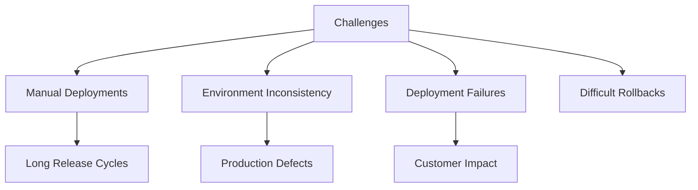
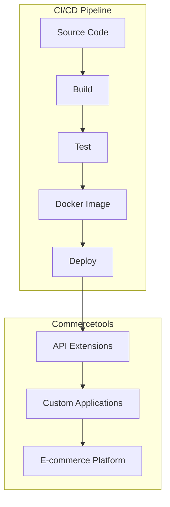
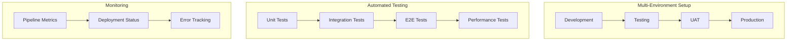

# Enterprise E-Commerce CI/CD Pipeline Project

## Project Overview

### Situation
- E-commerce platform faced deployment challenges:
  - Manual deployments taking 3-4 hours
  - No separation between development and production environments
  - Frequent deployment failures (success rate around 75%)
  - No efficient rollback capability
  - Limited testing automation



### Task
Implement robust CI/CD pipeline for Bosch's e-commerce platform:
- Design and implement automated build and deployment processes
- Create isolated environments for development, testing, and production
- Integrate automated testing at multiple stages
- Enable reliable and quick rollback mechanisms
- Support microservices-based architecture with Commercetools

### Action

#### 1. Pipeline Architecture

```mermaid
graph LR
    A[Source Code] --> B[Build]
    B --> C[Static Analysis]
    C --> D[Unit Tests]
    D --> E[Integration Tests]
    E --> F[Build Artifacts]
    F --> G[Deploy to DEV]
    G --> H[E2E Tests]
    H --> I[Deploy to UAT]
    I --> J[Performance Tests]
    J --> K[Deploy to PROD]
    L[Git Webhook] --> A
```



#### 2. Jenkins Implementation

```groovy
// Jenkinsfile example
pipeline {
    agent any
    
    environment {
        DOCKER_REGISTRY = 'registry.example.com'
        APP_NAME = 'ecommerce-service'
        APP_VERSION = "${env.BUILD_NUMBER}"
    }
    
    stages {
        stage('Checkout') {
            steps {
                checkout scm
            }
        }
        
        stage('Build') {
            steps {
                sh 'npm install'
                sh 'npm run build'
            }
        }
        
        stage('Test') {
            parallel {
                stage('Unit Tests') {
                    steps {
                        sh 'npm run test:unit'
                    }
                }
                stage('Lint Check') {
                    steps {
                        sh 'npm run lint'
                    }
                }
            }
        }
        
        stage('Build Docker Image') {
            steps {
                sh "docker build -t ${DOCKER_REGISTRY}/${APP_NAME}:${APP_VERSION} ."
                sh "docker tag ${DOCKER_REGISTRY}/${APP_NAME}:${APP_VERSION} ${DOCKER_REGISTRY}/${APP_NAME}:latest"
            }
        }
        
        stage('Push Docker Image') {
            steps {
                withCredentials([usernamePassword(credentialsId: 'docker-registry-credentials', usernameVariable: 'DOCKER_USERNAME', passwordVariable: 'DOCKER_PASSWORD')]) {
                    sh "docker login ${DOCKER_REGISTRY} -u ${DOCKER_USERNAME} -p ${DOCKER_PASSWORD}"
                    sh "docker push ${DOCKER_REGISTRY}/${APP_NAME}:${APP_VERSION}"
                    sh "docker push ${DOCKER_REGISTRY}/${APP_NAME}:latest"
                }
            }
        }
        
        stage('Deploy to Development') {
            steps {
                sh "kubectl --context=dev apply -f k8s/deployment.yaml"
                sh "kubectl --context=dev set image deployment/${APP_NAME} ${APP_NAME}=${DOCKER_REGISTRY}/${APP_NAME}:${APP_VERSION}"
            }
        }
        
        stage('Integration Tests') {
            steps {
                sh "npm run test:integration"
            }
        }
        
        stage('Deploy to UAT') {
            when {
                branch 'develop'
            }
            steps {
                sh "kubectl --context=uat apply -f k8s/deployment.yaml"
                sh "kubectl --context=uat set image deployment/${APP_NAME} ${APP_NAME}=${DOCKER_REGISTRY}/${APP_NAME}:${APP_VERSION}"
            }
        }
        
        stage('Deploy to Production') {
            when {
                branch 'main'
            }
            steps {
                timeout(time: 1, unit: 'HOURS') {
                    input message: 'Approve deployment to production?', ok: 'Deploy'
                }
                sh "kubectl --context=prod apply -f k8s/deployment.yaml"
                sh "kubectl --context=prod set image deployment/${APP_NAME} ${APP_NAME}=${DOCKER_REGISTRY}/${APP_NAME}:${APP_VERSION}"
            }
        }
    }
    
    post {
        always {
            junit 'test-results/**/*.xml'
            cleanWs()
        }
        failure {
            mail to: 'team@example.com',
                 subject: "Failed Pipeline: ${currentBuild.fullDisplayName}",
                 body: "Pipeline failure. Check console output at ${env.BUILD_URL}"
        }
    }
}
```

#### 3. Azure DevOps Integration

```yaml
# azure-pipelines.yml example
trigger:
  branches:
    include:
    - main
    - develop
    - feature/*

pool:
  vmImage: 'ubuntu-latest'

variables:
  dockerRegistry: 'registry.example.com'
  imageName: 'ecommerce-service'
  tag: '$(Build.BuildId)'

stages:
- stage: Build
  jobs:
  - job: BuildAndTest
    steps:
    - task: NodeTool@0
      inputs:
        versionSpec: '14.x'
      displayName: 'Install Node.js'
    
    - script: |
        npm install
        npm run build
      displayName: 'Build application'
    
    - script: |
        npm run test:unit
      displayName: 'Run unit tests'
    
    - task: Docker@2
      inputs:
        containerRegistry: 'DockerRegistry'
        repository: '$(dockerRegistry)/$(imageName)'
        command: 'buildAndPush'
        Dockerfile: '**/Dockerfile'
        tags: |
          $(tag)
          latest
      displayName: 'Build and push Docker image'
    
    - task: PublishBuildArtifacts@1
      inputs:
        PathtoPublish: '$(Build.ArtifactStagingDirectory)'
        ArtifactName: 'drop'
      displayName: 'Publish build artifacts'

- stage: DeployDev
  dependsOn: Build
  jobs:
  - deployment: DeployToDev
    environment: 'Development'
    strategy:
      runOnce:
        deploy:
          steps:
          - task: KubernetesManifest@0
            inputs:
              action: 'deploy'
              kubernetesServiceConnection: 'DevK8sConnection'
              namespace: 'dev'
              manifests: '$(Pipeline.Workspace)/drop/k8s/*.yaml'
              containers: '$(dockerRegistry)/$(imageName):$(tag)'

- stage: DeployProd
  dependsOn: DeployDev
  jobs:
  - deployment: DeployToProd
    environment: 'Production'
    strategy:
      runOnce:
        deploy:
          steps:
          - task: KubernetesManifest@0
            inputs:
              action: 'deploy'
              kubernetesServiceConnection: 'ProdK8sConnection'
              namespace: 'prod'
              manifests: '$(Pipeline.Workspace)/drop/k8s/*.yaml'
              containers: '$(dockerRegistry)/$(imageName):$(tag)'
```

#### 4. Commercetools Integration



### Results

#### Performance Metrics
| Metric | Before | After |
|--------|---------|--------|
| Deployment Time | 3-4 hours | 15-20 minutes |
| Deployment Success Rate | ~75% | 97% |
| Rollback Time | 1-2 hours | 5-10 minutes |
| Release Frequency | Bi-weekly | 2-3 times per week |
| Testing Coverage | 45% | 85% |



## Technical Details

### Components Overview
1. **Source Control**
   - Feature branch workflow
   - Pull request validation
   - Automated code reviews

2. **CI Automation**
   - Parallel test execution
   - Artifact versioning
   - Security scanning

3. **CD Implementation**
   - Blue/Green deployment strategy
   - Canary releases for critical changes
   - Automatic rollback triggers

### Integration with Commercetools
- Custom API extensions deployment
- Configuration management
- Synchronization between environments

### Monitoring and Feedback
```yaml
# Prometheus alert rule example
groups:
- name: DeploymentAlerts
  rules:
  - alert: DeploymentFailed
    expr: pipeline_deployment_status{status="failed"} > 0
    for: 5m
    labels:
      severity: critical
    annotations:
      summary: "Deployment failed for {{ $labels.service }}"
      description: "Pipeline deployment has failed for service {{ $labels.service }} in environment {{ $labels.environment }}"
```

### Security Measures
1. Secrets management with Azure Key Vault
2. Image vulnerability scanning
3. Least privilege principle for service accounts
4. Network security policies

### Lessons Learned
1. Importance of environment parity
2. Value of comprehensive automated testing
3. Need for clear rollback procedures
4. Benefits of incremental deployment approaches