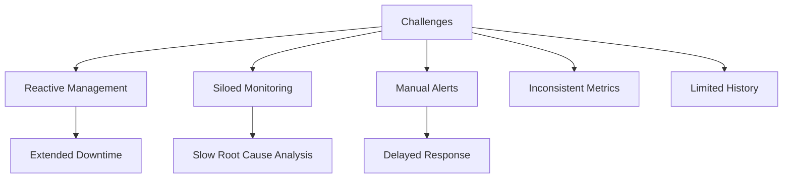
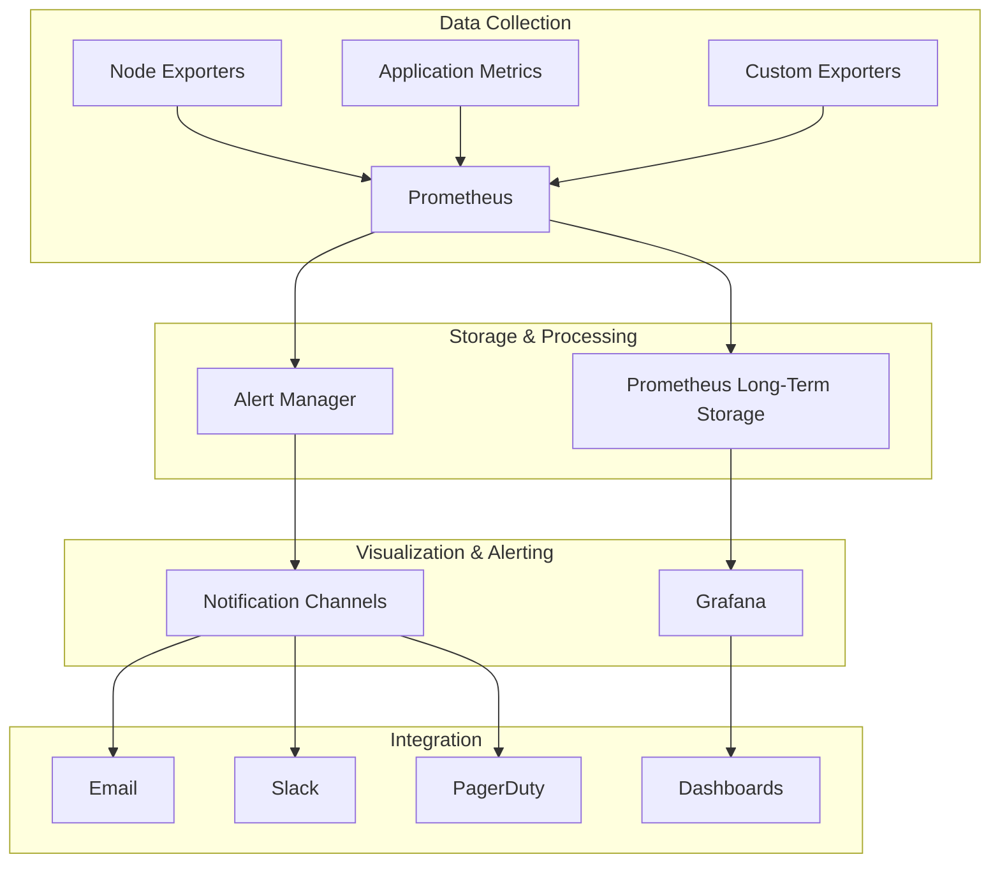
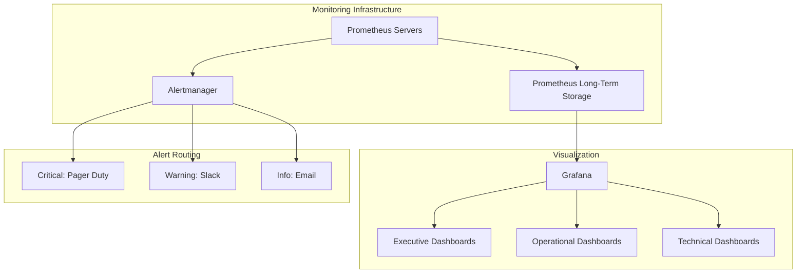

# Enterprise Monitoring Solution Project

## Project Overview

### Situation
- Organization faced operational visibility challenges:
  - Reactive approach to incident management
  - Siloed monitoring for different systems
  - Manual alerting processes
  - Inconsistent metrics collection
  - Limited historical data for analysis
  - No centralized observability dashboard



### Task
Implement comprehensive enterprise monitoring solution:
- Design and deploy Prometheus and Grafana stack
- Configure metrics collection from diverse systems
- Establish automated alerting with proper escalation
- Create standardized dashboards for different teams
- Enable historical data analysis
- Integrate with incident management processes

### Action

#### 1. Architecture Design



#### 2. Prometheus Implementation

```yaml
# prometheus.yml configuration
global:
  scrape_interval: 15s
  evaluation_interval: 15s

rule_files:
  - "alert_rules.yml"

alerting:
  alertmanagers:
  - static_configs:
    - targets:
      - alertmanager:9093

scrape_configs:
  - job_name: 'prometheus'
    static_configs:
      - targets: ['localhost:9090']

  - job_name: 'node_exporter'
    file_sd_configs:
      - files:
        - 'targets/nodes.json'
        refresh_interval: 5m

  - job_name: 'kubernetes'
    kubernetes_sd_configs:
      - role: pod
    relabel_configs:
      - source_labels: [__meta_kubernetes_pod_annotation_prometheus_io_scrape]
        action: keep
        regex: true
      - source_labels: [__meta_kubernetes_pod_annotation_prometheus_io_path]
        action: replace
        target_label: __metrics_path__
        regex: (.+)
      - source_labels: [__address__, __meta_kubernetes_pod_annotation_prometheus_io_port]
        action: replace
        regex: ([^:]+)(?::\d+)?;(\d+)
        replacement: $1:$2
        target_label: __address__
      - action: labelmap
        regex: __meta_kubernetes_pod_label_(.+)
      - source_labels: [__meta_kubernetes_namespace]
        action: replace
        target_label: kubernetes_namespace
      - source_labels: [__meta_kubernetes_pod_name]
        action: replace
        target_label: kubernetes_pod_name
```

#### 3. Alert Configuration

```yaml
# alert_rules.yml
groups:
- name: example
  rules:
  - alert: HighCPULoad
    expr: 100 - (avg by(instance) (irate(node_cpu_seconds_total{mode="idle"}[5m])) * 100) > 80
    for: 5m
    labels:
      severity: warning
    annotations:
      summary: "High CPU load (instance {{ $labels.instance }})"
      description: "CPU load is > 80%\n  VALUE = {{ $value }}\n  LABELS: {{ $labels }}"

  - alert: MemoryUsage
    expr: (node_memory_MemTotal_bytes - node_memory_MemAvailable_bytes) / node_memory_MemTotal_bytes * 100 > 90
    for: 5m
    labels:
      severity: warning
    annotations:
      summary: "High memory usage (instance {{ $labels.instance }})"
      description: "Memory usage is > 90%\n  VALUE = {{ $value }}\n  LABELS: {{ $labels }}"

  - alert: HostOutOfDiskSpace
    expr: (node_filesystem_avail_bytes / node_filesystem_size_bytes * 100) < 10
    for: 5m
    labels:
      severity: warning
    annotations:
      summary: "Host out of disk space (instance {{ $labels.instance }})"
      description: "Disk is almost full (< 10% left)\n  VALUE = {{ $value }}\n  LABELS: {{ $labels }}"

  - alert: HostHighDiskLoad
    expr: rate(node_disk_io_time_seconds_total[5m]) > 0.8
    for: 15m
    labels:
      severity: warning
    annotations:
      summary: "Host high disk load (instance {{ $labels.instance }})"
      description: "Disk I/O is high (> 80%)\n  VALUE = {{ $value }}\n  LABELS: {{ $labels }}"
```

#### 4. Grafana Dashboard Examples

```json
{
  "dashboard": {
    "id": null,
    "title": "System Overview",
    "tags": ["system", "performance"],
    "timezone": "browser",
    "editable": true,
    "panels": [
      {
        "title": "CPU Usage",
        "type": "graph",
        "gridPos": {
          "h": 8,
          "w": 12,
          "x": 0,
          "y": 0
        },
        "targets": [
          {
            "expr": "100 - (avg by(instance) (irate(node_cpu_seconds_total{mode=\"idle\"}[5m])) * 100)",
            "refId": "A"
          }
        ],
        "yaxes": [
          {
            "format": "percent",
            "min": 0,
            "max": 100
          }
        ],
        "tooltip": {
          "shared": true,
          "value_type": "individual"
        }
      },
      {
        "title": "Memory Usage",
        "type": "graph",
        "gridPos": {
          "h": 8,
          "w": 12,
          "x": 12,
          "y": 0
        },
        "targets": [
          {
            "expr": "(node_memory_MemTotal_bytes - node_memory_MemAvailable_bytes) / node_memory_MemTotal_bytes * 100",
            "refId": "A"
          }
        ],
        "yaxes": [
          {
            "format": "percent",
            "min": 0,
            "max": 100
          }
        ],
        "tooltip": {
          "shared": true,
          "value_type": "individual"
        }
      },
      {
        "title": "Disk Usage",
        "type": "gauge",
        "gridPos": {
          "h": 8,
          "w": 8,
          "x": 0,
          "y": 8
        },
        "targets": [
          {
            "expr": "100 - ((node_filesystem_avail_bytes{mountpoint=\"/\"} * 100) / node_filesystem_size_bytes{mountpoint=\"/\"})",
            "refId": "A"
          }
        ],
        "options": {
          "reduceOptions": {
            "values": false,
            "calcs": ["mean"],
            "fields": ""
          },
          "orientation": "auto",
          "showThresholdLabels": false,
          "showThresholdMarkers": true
        },
        "fieldConfig": {
          "defaults": {
            "color": {
              "mode": "thresholds"
            },
            "mappings": [],
            "thresholds": {
              "mode": "absolute",
              "steps": [
                { "color": "green", "value": null },
                { "color": "yellow", "value": 70 },
                { "color": "red", "value": 85 }
              ]
            },
            "unit": "percent"
          }
        }
      }
    ]
  }
}
```

### Results

#### Performance Metrics
| Metric | Before | After |
|--------|---------|--------|
| Mean Time to Detect (MTTD) | 25-40 minutes | 3-5 minutes |
| Mean Time to Resolve (MTTR) | 2-3 hours | 45-60 minutes |
| False Positive Alerts | ~30% | <8% |
| System Visibility | Limited, siloed | Comprehensive |
| Proactive Issue Detection | Rare | Common (70%+ issues) |



## Technical Details

### Components Overview
1. **Metrics Collection**
   - Node exporters for server metrics
   - Application instrumentation for service metrics
   - Custom exporters for specialized systems
   - Service discovery for dynamic environments

2. **Alerting System**
   - Multi-level alerting based on severity
   - Alert grouping and deduplication
   - Automated escalation paths
   - On-call rotation integration

3. **Visualization**
   - Role-based dashboards (Executive, Operational, Technical)
   - SLA/SLO tracking
   - Anomaly detection visualizations
   - Capacity planning views

### High Availability Implementation
```yaml
# Prometheus high availability setup
global:
  external_labels:
    cluster: 'main'
    replica: '${REPLICA}'

scrape_configs:
  - job_name: 'prometheus'
    static_configs:
      - targets: ['localhost:9090', 'prometheus-replica:9090']
      
  - job_name: 'node_exporter'
    file_sd_configs:
      - files:
        - 'targets/nodes.json'
        refresh_interval: 5m
```

### Data Retention Strategy
- Prometheus short-term storage: 15 days retention
- Thanos for long-term storage: 1 year retention
- Downsampling for efficient storage utilization
- Automated backup of critical dashboard configurations

### Alert Routing and Escalation
```yaml
# alertmanager.yml configuration
global:
  resolve_timeout: 5m
  slack_api_url: 'https://hooks.slack.com/services/TXXXXXXXX/BXXXXXXXX/XXXXXXXXXX'

route:
  group_by: ['alertname', 'job', 'severity']
  group_wait: 30s
  group_interval: 5m
  repeat_interval: 4h
  receiver: 'slack-notifications'
  routes:
  - match:
      severity: critical
    receiver: 'pagerduty-critical'
    continue: true
  - match:
      severity: warning
    receiver: 'slack-warnings'
    continue: true
  - match_re:
      service: ^(frontend|backend|database)$
    receiver: 'team-services'

inhibit_rules:
- source_match:
    severity: 'critical'
  target_match:
    severity: 'warning'
  equal: ['alertname', 'instance']

receivers:
- name: 'slack-notifications'
  slack_configs:
  - channel: '#monitoring'
    send_resolved: true
    title: '[{{ .Status | toUpper }}] {{ .GroupLabels.alertname }}'
    text: "{{ range .Alerts }}*Alert:* {{ .Annotations.summary }}\n*Description:* {{ .Annotations.description }}\n*Severity:* {{ .Labels.severity }}\n{{ end }}"

- name: 'pagerduty-critical'
  pagerduty_configs:
  - service_key: XXXXXXXXXX
    send_resolved: true
    description: '{{ .CommonAnnotations.summary }}'
    details:
      firing: '{{ .Alerts.Firing | len }}'
      resolved: '{{ .Alerts.Resolved | len }}'
      instances: '{{ range .Alerts }}{{ .Labels.instance }} {{ end }}'

- name: 'slack-warnings'
  slack_configs:
  - channel: '#alerts-warning'
    send_resolved: true
    title: '[{{ .Status | toUpper }}] {{ .GroupLabels.alertname }}'
    text: "{{ range .Alerts }}*Alert:* {{ .Annotations.summary }}\n*Description:* {{ .Annotations.description }}\n*Severity:* {{ .Labels.severity }}\n{{ end }}"

- name: 'team-services'
  email_configs:
  - to: 'services-team@example.com'
    send_resolved: true
    html: '{{ template "email.service.html" . }}'
    headers:
      subject: '[{{ .Status | toUpper }}] {{ .GroupLabels.alertname }}'
```

### Lessons Learned
1. Start with simpler dashboards and refine based on feedback
2. Define clear alert thresholds to avoid alert fatigue
3. Involve key stakeholders in dashboard design
4. Establish proper documentation for alert response procedures
5. Consider infrastructure overhead of monitoring at scale