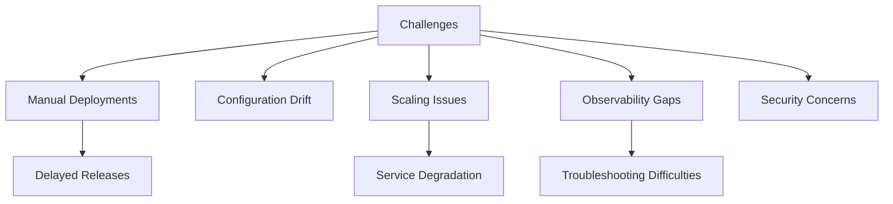
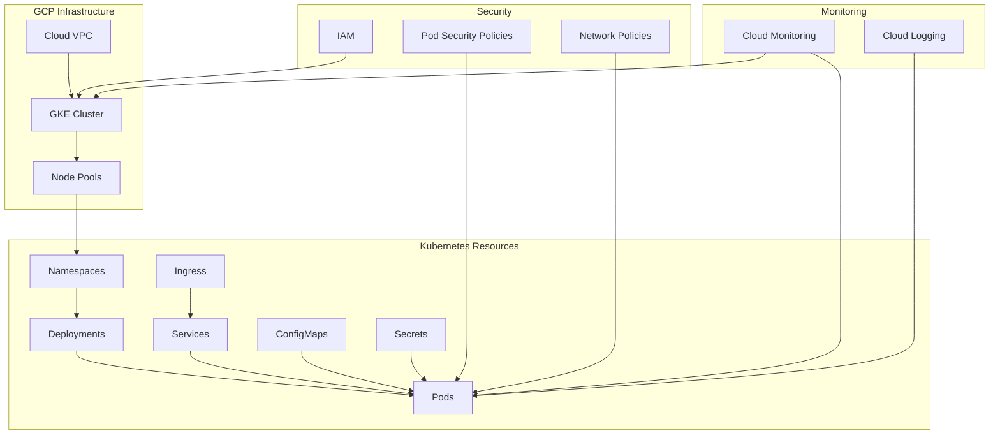
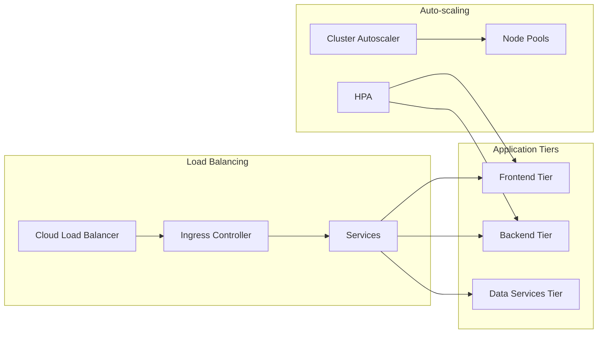

# GCP Kubernetes Infrastructure Project

## Project Overview

### Situation
- Growing microservices architecture facing operational challenges:
  - Manual container deployment processes
  - Inconsistent environment configurations
  - Scaling difficulties during traffic spikes
  - Limited visibility into application health
  - Security concerns with container deployments



### Task
Implement Kubernetes infrastructure on Google Cloud Platform:
- Design and deploy production-ready GKE clusters
- Establish secure networking and pod security policies
- Configure auto-scaling for applications and infrastructure
- Implement comprehensive monitoring and logging
- Create standardized deployment processes
- Set up proper access controls and security practices

### Action

#### 1. Infrastructure Design



#### 2. GKE Cluster Implementation

```bash
# Create a VPC for the GKE cluster
gcloud compute networks create k8s-network --subnet-mode=custom

# Create subnets for GKE nodes
gcloud compute networks subnets create k8s-subnet \
  --network=k8s-network \
  --region=us-central1 \
  --range=10.0.0.0/20 \
  --secondary-range=pods=10.4.0.0/14,services=10.0.32.0/20

# Create GKE cluster with security and monitoring enabled
gcloud container clusters create production-cluster \
  --network=k8s-network \
  --subnetwork=k8s-subnet \
  --region=us-central1 \
  --node-locations=us-central1-a,us-central1-b,us-central1-c \
  --num-nodes=2 \
  --enable-ip-alias \
  --enable-network-policy \
  --enable-private-nodes \
  --master-ipv4-cidr=172.16.0.0/28 \
  --enable-master-authorized-networks \
  --master-authorized-networks=123.123.123.123/32 \
  --enable-stackdriver-kubernetes \
  --enable-autoscaling \
  --min-nodes=1 \
  --max-nodes=5 \
  --no-enable-basic-auth \
  --no-issue-client-certificate \
  --enable-shielded-nodes

# Create separate node pool for workloads with specific requirements
gcloud container node-pools create memory-optimized \
  --cluster=production-cluster \
  --region=us-central1 \
  --machine-type=e2-highmem-4 \
  --num-nodes=2 \
  --enable-autoscaling \
  --min-nodes=1 \
  --max-nodes=5 \
  --node-taints=workload=memory:NoSchedule \
  --node-labels=workload=memory
```

#### 3. Kubernetes Configuration

```yaml
# Example namespace configuration with resource quotas
apiVersion: v1
kind: Namespace
metadata:
  name: application
  labels:
    name: application
---
apiVersion: v1
kind: ResourceQuota
metadata:
  name: application-quota
  namespace: application
spec:
  hard:
    requests.cpu: "10"
    requests.memory: 20Gi
    limits.cpu: "20"
    limits.memory: 40Gi
    pods: "50"
---
# Network policy example
apiVersion: networking.k8s.io/v1
kind: NetworkPolicy
metadata:
  name: default-deny
  namespace: application
spec:
  podSelector: {}
  policyTypes:
  - Ingress
  - Egress
---
apiVersion: networking.k8s.io/v1
kind: NetworkPolicy
metadata:
  name: allow-application-ingress
  namespace: application
spec:
  podSelector:
    matchLabels:
      app: web
  policyTypes:
  - Ingress
  ingress:
  - from:
    - namespaceSelector:
        matchLabels:
          name: ingress-controller
    ports:
    - protocol: TCP
      port: 80
```

#### 4. Deployment Automation

```yaml
# Deployment configuration with auto-scaling
apiVersion: apps/v1
kind: Deployment
metadata:
  name: application
  namespace: application
spec:
  replicas: 3
  selector:
    matchLabels:
      app: application
  template:
    metadata:
      labels:
        app: application
    spec:
      containers:
      - name: application
        image: gcr.io/project-id/application:1.0.0
        resources:
          requests:
            memory: "256Mi"
            cpu: "100m"
          limits:
            memory: "512Mi"
            cpu: "300m"
        ports:
        - containerPort: 8080
        livenessProbe:
          httpGet:
            path: /health
            port: 8080
          initialDelaySeconds: 30
          periodSeconds: 10
        readinessProbe:
          httpGet:
            path: /ready
            port: 8080
          initialDelaySeconds: 5
          periodSeconds: 10
        securityContext:
          allowPrivilegeEscalation: false
          readOnlyRootFilesystem: true
          runAsNonRoot: true
          runAsUser: 1000
---
apiVersion: autoscaling/v2
kind: HorizontalPodAutoscaler
metadata:
  name: application
  namespace: application
spec:
  scaleTargetRef:
    apiVersion: apps/v1
    kind: Deployment
    name: application
  minReplicas: 3
  maxReplicas: 10
  metrics:
  - type: Resource
    resource:
      name: cpu
      target:
        type: Utilization
        averageUtilization: 70
  - type: Resource
    resource:
      name: memory
      target:
        type: Utilization
        averageUtilization: 80
```

### Results

#### Performance Metrics
| Metric | Before | After |
|--------|---------|--------|
| Deployment Time | 30-45 minutes | 5-7 minutes |
| Configuration Consistency | ~60% | 98% |
| Scaling Response Time | Manual (hours) | Automatic (minutes) |
| Resource Utilization | 25-35% | 65-75% |
| Application Availability | 99.5% | 99.95% |



## Technical Details

### Components Overview
1. **Network Architecture**
   - VPC with custom subnets
   - Private GKE cluster
   - Network policies for microservices isolation
   - Cloud NAT for outbound traffic

2. **Security Implementation**
   - Pod security policies
   - Workload identity for GCP service access
   - Secret management
   - Container vulnerability scanning
   - Binary Authorization

3. **Load Balancing**
   - Global HTTP(S) load balancer
   - GKE Ingress controller
   - Service mesh for internal traffic management
   - Health checks and failover configurations

### Monitoring and Observability
```yaml
# Prometheus monitoring configuration
apiVersion: monitoring.coreos.com/v1
kind: ServiceMonitor
metadata:
  name: application-monitor
  namespace: monitoring
  labels:
    release: prometheus
spec:
  selector:
    matchLabels:
      app: application
  namespaceSelector:
    matchNames:
    - application
  endpoints:
  - port: metrics
    interval: 15s
    path: /metrics
```

- Cloud Monitoring dashboards for cluster metrics
- Custom metrics for application performance
- Log aggregation with Cloud Logging
- Alerting policies for critical services

### Disaster Recovery Strategy
1. Regular etcd backups
2. Multi-zone cluster deployment
3. Infrastructure as Code for quick recovery
4. Automated application deployment processes

### Cost Optimization
- Node auto-provisioning based on workload needs
- Preemptible VMs for non-critical workloads
- Resource request/limits optimization
- Cluster autoscaler configuration

### Lessons Learned
1. Importance of proper namespace organization
2. Value of comprehensive monitoring from day one
3. Benefits of proper resource allocation
4. Need for standardized deployment processes