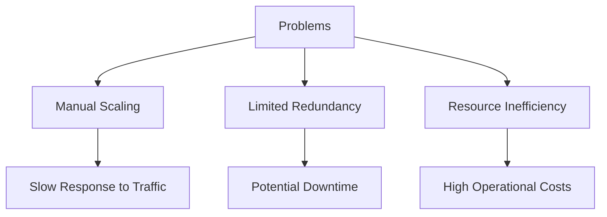
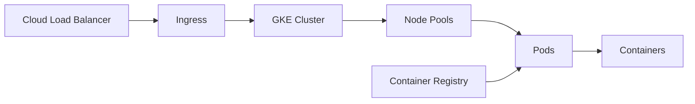
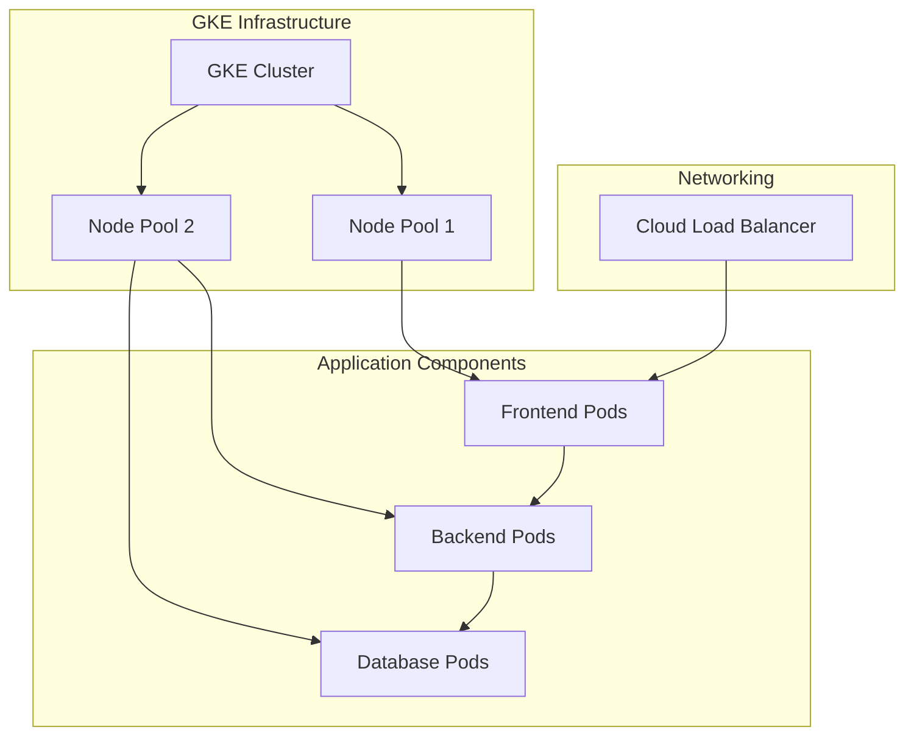

# GKE Migration Project

## Project Overview

### Situation
- Legacy infrastructure facing scalability challenges:
  - Manual scaling process
  - Limited redundancy
  - Inefficient resource utilization
  - Increasing infrastructure costs
  - Complex deployment procedures



### Task
Migrate existing application infrastructure to Google Kubernetes Engine (GKE):
- Design and implement Kubernetes architecture
- Create containerized microservices
- Establish CI/CD pipelines for automated deployment
- Configure auto-scaling based on workload
- Implement robust security policies
- Optimize costs while maintaining performance

### Action

#### 1. Infrastructure Setup



#### 2. Implementation Steps

```bash
# Create GKE cluster with production-ready settings
gcloud container clusters create production-cluster \
    --num-nodes=3 \
    --zone=us-central1-a \
    --machine-type=e2-standard-4 \
    --enable-autoscaling \
    --min-nodes=3 \
    --max-nodes=10 \
    --enable-network-policy \
    --enable-ip-alias

# Configure node auto-provisioning
gcloud container clusters update production-cluster \
    --enable-autoprovisioning \
    --min-cpu=1 \
    --max-cpu=20 \
    --min-memory=1 \
    --max-memory=40

# Set up Container Registry for storing images
gcloud artifacts repositories create app-images \
    --repository-format=docker \
    --location=us-central1

# Apply network policies for security
kubectl apply -f network-policies.yaml

# Deploy application workloads
kubectl apply -f app-deployments/
kubectl apply -f app-services/
```

#### 3. Containerization Strategy

```yaml
# Example Dockerfile for one microservice
FROM node:14-alpine
WORKDIR /usr/src/app
COPY package*.json ./
RUN npm install
COPY . .
EXPOSE 8080
CMD ["node", "server.js"]
```

#### 4. Kubernetes Configuration

```yaml
# Example deployment.yaml
apiVersion: apps/v1
kind: Deployment
metadata:
  name: app-backend
spec:
  replicas: 3
  selector:
    matchLabels:
      app: backend
  template:
    metadata:
      labels:
        app: backend
    spec:
      containers:
      - name: backend-api
        image: gcr.io/project-id/backend-api:v1.2
        resources:
          requests:
            memory: "256Mi"
            cpu: "100m"
          limits:
            memory: "512Mi"
            cpu: "500m"
        ports:
        - containerPort: 8080
        readinessProbe:
          httpGet:
            path: /health
            port: 8080
          initialDelaySeconds: 5
          periodSeconds: 10
```

### Results

#### Performance Metrics
| Metric | Before | After |
|--------|---------|--------|
| Deployment Time | 45 minutes | 8 minutes |
| Resource Utilization | 35% | 78% |
| Auto-scaling Response | Manual (hours) | Automatic (minutes) |
| Monthly Infrastructure Cost | $12,500 | $7,200 |
| System Availability | 99.5% | 99.99% |



## Technical Details

### Components Overview
1. **GKE Cluster**
   - Regional deployment for high availability
   - Node auto-provisioning
   - Separate node pools for workload types

2. **Containerization**
   - Multi-stage Docker builds for optimization
   - Container vulnerability scanning
   - Image versioning strategy

3. **Security Implementation**
   - Network policies for pod-to-pod communication
   - Workload identity for GCP service access
   - Secret management with Secret Manager

### Auto-scaling Configuration
```bash
# Horizontal Pod Autoscaler setup
kubectl autoscale deployment app-backend --min=3 --max=10 --cpu-percent=70

# Vertical Pod Autoscaler for optimizing resource requests
kubectl apply -f - <<EOF
apiVersion: autoscaling.k8s.io/v1
kind: VerticalPodAutoscaler
metadata:
  name: backend-vpa
spec:
  targetRef:
    apiVersion: "apps/v1"
    kind: Deployment
    name: app-backend
  updatePolicy:
    updateMode: "Auto"
EOF
```

### Monitoring Setup
- Cloud Monitoring dashboards for cluster metrics
- Custom metrics for application performance
- Alert policies for potential issues
- Log-based metrics for error tracking

### Cost Optimization Strategies
1. Spot VMs for non-critical workloads
2. Autoscaling based on actual demand
3. Resource request/limits optimization
4. Scheduled scaling for predictable workloads

### Lessons Learned
1. Importance of proper resource allocation
2. Benefits of infrastructure as code
3. Value of canary deployments for risk mitigation
4. Need for comprehensive monitoring