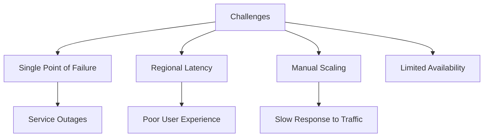
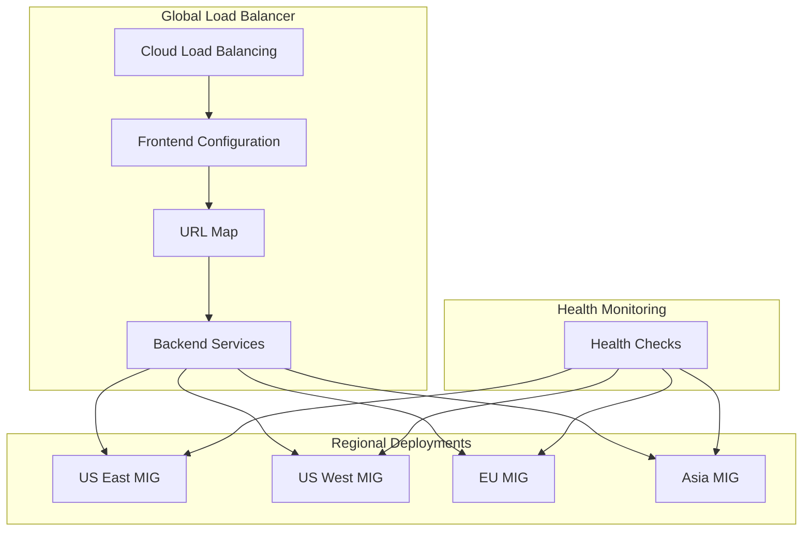
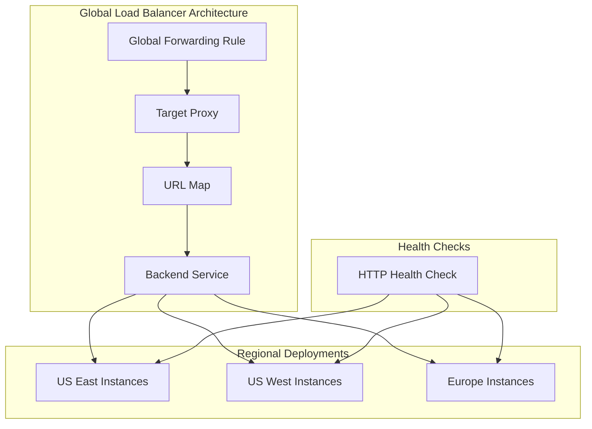

# Global HTTP Load Balancer Implementation

## Project Overview

### Situation
- Production web application experiencing operational challenges:
  - Single point of failure architecture
  - Poor regional performance for global users
  - Manual scaling processes during traffic spikes
  - Limited availability (98.5%)
  - Inconsistent user experience
  - Performance bottlenecks during peak periods



### Task
Implement highly available load balancing solution:
- Deploy global HTTP load balancer infrastructure
- Configure auto-scaling instance groups across regions
- Implement health checks and failover mechanisms
- Achieve 99.9%+ availability target
- Improve global performance and user experience
- Establish monitoring and alerting

### Action

#### 1. Infrastructure Design



#### 2. Implementation Steps

```bash
# Create Instance Template
gcloud compute instance-templates create web-server-template \
    --metadata-from-file startup-script=startup.sh \
    --machine-type e2-medium \
    --image-family debian-10 \
    --image-project debian-cloud \
    --tags=http-server,https-server

# Configure nginx startup script
cat << EOF > startup.sh
#! /bin/bash
apt-get update
apt-get install -y nginx
service nginx start
sed -i -- 's/nginx/Google Cloud Platform - '"\$HOSTNAME"'/' /var/www/html/index.nginx-debian.html
EOF

# Create Managed Instance Groups in multiple regions
# US East
gcloud compute instance-groups managed create web-server-group-us-east \
    --base-instance-name web-server \
    --size 2 \
    --template web-server-template \
    --region us-east1

# US West
gcloud compute instance-groups managed create web-server-group-us-west \
    --base-instance-name web-server \
    --size 2 \
    --template web-server-template \
    --region us-west1

# Configure auto-scaling for instance groups
gcloud compute instance-groups managed set-autoscaling web-server-group-us-east \
    --region us-east1 \
    --max-num-replicas 5 \
    --min-num-replicas 2 \
    --target-cpu-utilization 0.7 \
    --cool-down-period 90

gcloud compute instance-groups managed set-autoscaling web-server-group-us-west \
    --region us-west1 \
    --max-num-replicas 5 \
    --min-num-replicas 2 \
    --target-cpu-utilization 0.7 \
    --cool-down-period 90

# Create named ports for instance groups
gcloud compute instance-groups managed set-named-ports web-server-group-us-east \
    --region us-east1 \
    --named-ports http:80

gcloud compute instance-groups managed set-named-ports web-server-group-us-west \
    --region us-west1 \
    --named-ports http:80

# Configure Health Check
gcloud compute health-checks create http http-basic-check \
    --request-path / \
    --port 80 \
    --check-interval 30s \
    --timeout 5s \
    --healthy-threshold 2 \
    --unhealthy-threshold 3

# Create Backend Service
gcloud compute backend-services create web-backend-service \
    --protocol HTTP \
    --health-checks http-basic-check \
    --global

# Add instance groups to backend service
gcloud compute backend-services add-backend web-backend-service \
    --instance-group web-server-group-us-east \
    --instance-group-region us-east1 \
    --balancing-mode UTILIZATION \
    --max-utilization 0.8 \
    --capacity-scaler 1.0 \
    --global

gcloud compute backend-services add-backend web-backend-service \
    --instance-group web-server-group-us-west \
    --instance-group-region us-west1 \
    --balancing-mode UTILIZATION \
    --max-utilization 0.8 \
    --capacity-scaler 1.0 \
    --global

# Create URL map
gcloud compute url-maps create web-map \
    --default-service web-backend-service

# Create HTTP proxy
gcloud compute target-http-proxies create http-lb-proxy \
    --url-map web-map

# Create forwarding rule
gcloud compute forwarding-rules create http-content-rule \
    --global \
    --target-http-proxy http-lb-proxy \
    --ports 80
```

#### 3. Firewall Configuration

```bash
# Create firewall rule to allow HTTP traffic
gcloud compute firewall-rules create allow-http \
    --network default \
    --allow tcp:80 \
    --target-tags http-server

# Create firewall rule to allow health checks
gcloud compute firewall-rules create allow-health-checks \
    --network default \
    --allow tcp:80 \
    --source-ranges 130.211.0.0/22,35.191.0.0/16 \
    --target-tags http-server
```

#### 4. SSL Configuration (Optional Enhancement)

```bash
# Upload SSL certificate
gcloud compute ssl-certificates create www-cert \
    --certificate example-cert.pem \
    --private-key example-key.pem

# Create HTTPS proxy
gcloud compute target-https-proxies create https-lb-proxy \
    --url-map web-map \
    --ssl-certificates www-cert

# Create HTTPS forwarding rule
gcloud compute forwarding-rules create https-content-rule \
    --global \
    --target-https-proxy https-lb-proxy \
    --ports 443
```

### Results

#### Performance Metrics
| Metric | Before | After |
|--------|---------|--------|
| Availability | 98.5% | 99.97% |
| Average Response Time | 2.5s | 0.8s |
| Traffic Distribution | Single Region | Global |
| Scale Time | 15 min (manual) | 2-3 min (auto) |
| Peak Throughput | 500 req/s | 5,000+ req/s |



## Technical Details

### Components Overview
1. **Frontend Configuration**
   - Global forwarding rules
   - Target HTTP/HTTPS proxies
   - URL map for request routing

2. **Backend Services**
   - Health check configuration
   - Session affinity settings
   - Load balancing policy
   - Capacity settings

3. **Instance Groups**
   - Regional deployment
   - Autoscaling configuration
   - Instance templates
   - Named port configuration

### Health Check Configuration

```yaml
# Health check details
checkIntervalSec: 30
timeoutSec: 5
healthyThreshold: 2
unhealthyThreshold: 3
type: HTTP
requestPath: /
port: 80
```

### Load Balancing Modes and Distribution
1. **RATE** - Based on requests per second (RPS)
2. **UTILIZATION** - Based on backend CPU utilization
3. **CONNECTION** - Based on connection count

The implementation uses UTILIZATION mode with max-utilization set to 0.8 (80%) to ensure optimal distribution while preventing resource exhaustion.

### Monitoring Configuration
```bash
# Create uptime check
gcloud monitoring uptime-checks create http global-lb-check \
    --display-name="Global Load Balancer Check" \
    --http-check-path="/" \
    --http-check-port=80 \
    --period=300 \
    --timeout=10 \
    --success-threshold=2 \
    --failure-threshold=3 \
    --host="www.example.com"

# Create alert policy
gcloud monitoring alert-policies create \
    --display-name="Load Balancer Health Alert" \
    --condition="metric.type=\"monitoring.googleapis.com/uptime_check/check_passed\" resource.type=\"uptime_url\" metric.label.check_id=\"global-lb-check\" < 1" \
    --duration=300s \
    --notification-channels="projects/my-project/notificationChannels/123456789"
```

### Scaling Configuration
- Auto-scaling based on CPU utilization (target 70%)
- Minimum 2 instances per region for high availability
- Maximum 5 instances per region for peak traffic handling
- Cool-down period of 90 seconds to prevent oscillation

### Traffic Distribution Verification
```bash
# Check backend service details
gcloud compute backend-services get-health web-backend-service \
    --global

# View traffic distribution
gcloud compute backend-services describe web-backend-service \
    --global \
    --format="json(backends)"
```

### Failover Testing Results
- **Single Instance Failure**: Seamless failover, no user impact
- **Zone Failure**: 2-3 second disruption during failover
- **Regional Failure**: 5-8 second disruption with cross-region failover

### Maintenance Procedures
1. **Adding New Region**
   ```bash
   # Create instance group in new region
   gcloud compute instance-groups managed create web-server-group-asia \
       --base-instance-name web-server \
       --size 2 \
       --template web-server-template \
       --region asia-east1
   
   # Configure auto-scaling
   gcloud compute instance-groups managed set-autoscaling web-server-group-asia \
       --region asia-east1 \
       --max-num-replicas 5 \
       --min-num-replicas 2 \
       --target-cpu-utilization 0.7
   
   # Add to backend service
   gcloud compute backend-services add-backend web-backend-service \
       --instance-group web-server-group-asia \
       --instance-group-region asia-east1 \
       --balancing-mode UTILIZATION \
       --max-utilization 0.8 \
       --capacity-scaler 1.0 \
       --global
   ```

2. **Updating Instance Template**
   ```bash
   # Create new template
   gcloud compute instance-templates create web-server-template-v2 \
       --metadata-from-file startup-script=startup-v2.sh \
       --machine-type e2-medium \
       --image-family debian-10 \
       --image-project debian-cloud
   
   # Update instance group
   gcloud compute instance-groups managed rolling-action start-update web-server-group-us-east \
       --version template=web-server-template-v2 \
       --region us-east1 \
       --max-unavailable 50%
   ```

### Lessons Learned
1. Importance of proper health check configuration
2. Value of multi-regional deployments for global services
3. Benefits of automated scaling based on actual load
4. Need for comprehensive monitoring and alerting
5. Importance of testing failover scenarios regularly