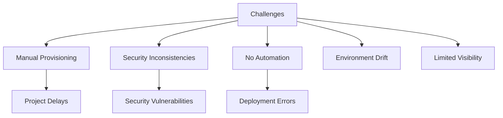
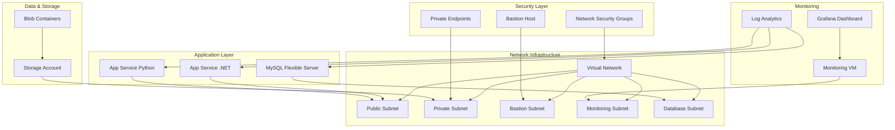
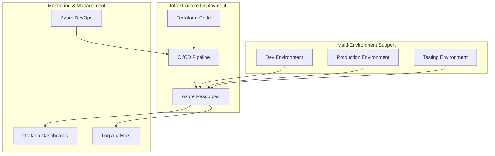

# IT Marathon Infrastructure with Terraform

## Project Overview

### Situation
- Organization needed a comprehensive and secure cloud infrastructure for the IT Marathon project:
  - Manual, inconsistent environment provisioning causing delays
  - No standardized approach to security configurations
  - Lack of automated deployment processes
  - Environment inconsistencies between development and production
  - Poor visibility into infrastructure components
  - Limited collaboration between development and operations teams



### Task
Implement infrastructure as code solution using Terraform for IT Marathon:
- Design and implement modular Azure infrastructure
- Establish secure network architecture and access controls
- Configure automated database and storage provisioning
- Set up application hosting environments for both .NET and Python
- Implement monitoring and observability solutions
- Integrate with CI/CD pipelines for automated deployment
- Create comprehensive documentation for the infrastructure

### Action

#### 1. Infrastructure Architecture Design



#### 2. Modular Terraform Implementation

I organized the infrastructure code into specialized modules for better maintainability and reusability:

```hcl
# main.tf
# Root module configuration that assembles all components

module "network" {
  source                         = "./modules/01_network"
  project_name                   = var.project_name
  environment                    = var.environment
  location                       = var.location
  vnet_address_space             = var.vnet_address_space
  public_subnet_address_prefix   = var.public_subnet_address_prefix
  private_subnet_address_prefix  = var.private_subnet_address_prefix
  bastion_subnet_address_prefix  = var.bastion_subnet_address_prefix
  monitoring_subnet_address_prefix = var.monitoring_subnet_address_prefix
  mysql_subnet_address_prefix    = var.mysql_subnet_address_prefix
}

module "security" {
  source              = "./modules/02_security"
  project_name        = var.project_name
  environment         = var.environment
  location            = var.location
  allowed_ip_ranges   = var.allowed_ip_ranges
  vnet_id             = module.network.vnet_id
  public_subnet_id    = module.network.public_subnet_id
  private_subnet_id   = module.network.private_subnet_id
}

module "bastion" {
  source              = "./modules/03_bastion"
  project_name        = var.project_name
  environment         = var.environment
  location            = var.location
  bastion_subnet_id   = module.network.bastion_subnet_id
  vm_config           = var.vm_config
  admin_ssh_keys      = var.admin_ssh_keys
  nsg_id              = module.security.bastion_nsg_id
}

module "database" {
  source                = "./modules/04_database"
  project_name          = var.project_name
  environment           = var.environment
  location              = var.location
  mysql_config          = var.mysql_config
  mysql_subnet_id       = module.network.mysql_subnet_id
  private_dns_zone_id   = module.network.private_dns_zone_id
  mysql_retention_days  = var.mysql_retention_days
}

module "storage" {
  source              = "./modules/05_storage"
  project_name        = var.project_name
  environment         = var.environment
  location            = var.location
  storage_config      = var.storage_config
  private_subnet_id   = module.network.private_subnet_id
  data_location       = var.data_location
}

module "app_dotnet" {
  source                = "./modules/07_app_dotnet"
  project_name          = var.project_name
  environment           = var.environment
  location              = var.location
  public_subnet_id      = module.network.public_subnet_id
  mysql_connection_string = module.database.mysql_connection_string
  storage_account_key   = module.storage.storage_account_key
  storage_account_name  = module.storage.storage_account_name
  enable_http2          = var.enable_http2
  ssl_certificate_password = var.ssl_certificate_password
}

module "email" {
  source              = "./modules/08_email"
  project_name        = var.project_name
  environment         = var.environment
  location            = var.location
}

module "app_python" {
  source                = "./modules/09_app_python"
  project_name          = var.project_name
  environment           = var.environment
  location              = var.location
  public_subnet_id      = module.network.public_subnet_id
  mysql_connection_string = module.database.mysql_connection_string
  storage_account_key   = module.storage.storage_account_key
  storage_account_name  = module.storage.storage_account_name
}

module "monitoring" {
  source                = "./modules/10_monitoring"
  project_name          = var.project_name
  environment           = var.environment
  location              = var.location
  monitoring_subnet_id  = module.network.monitoring_subnet_id
  vm_config             = var.vm_config
  admin_ssh_keys        = var.admin_ssh_keys
  nsg_id                = module.security.monitoring_nsg_id
}

module "grafana_dashboard" {
  source                = "./modules/11_grafana_dashboard"
  project_name          = var.project_name
  environment           = var.environment
  monitoring_vm_ip      = module.monitoring.monitoring_vm_ip
  grafana_password      = var.grafana_password
  grafana_user          = var.grafana_user
  azure_subscription_id = var.azure_subscription_id
  azure_tenant_id       = var.azure_tenant_id
  azure_client_id       = var.azure_client_id
  azure_client_secret   = var.azure_client_secret
  infinity_client_id    = var.infinity_client_id
  infinity_client_secret = var.infinity_client_secret
  database_id           = module.database.mysql_server_id
  app_dotnet_id         = module.app_dotnet.app_service_id
  app_python_id         = module.app_python.app_service_id
}
```

#### 3. Network and Security Implementation

```hcl
# modules/01_network/main.tf
resource "azurerm_virtual_network" "vnet" {
  name                = "${var.project_name}-${var.environment}-vnet"
  location            = var.location
  resource_group_name = azurerm_resource_group.network_rg.name
  address_space       = var.vnet_address_space
  
  tags = {
    Environment = var.environment
    Project     = var.project_name
  }
}

resource "azurerm_subnet" "public_subnet" {
  name                 = "${var.project_name}-${var.environment}-public-subnet"
  resource_group_name  = azurerm_resource_group.network_rg.name
  virtual_network_name = azurerm_virtual_network.vnet.name
  address_prefixes     = [var.public_subnet_address_prefix]
  service_endpoints    = ["Microsoft.Web", "Microsoft.Storage"]
}

resource "azurerm_subnet" "private_subnet" {
  name                 = "${var.project_name}-${var.environment}-private-subnet"
  resource_group_name  = azurerm_resource_group.network_rg.name
  virtual_network_name = azurerm_virtual_network.vnet.name
  address_prefixes     = [var.private_subnet_address_prefix]
  service_endpoints    = ["Microsoft.Storage"]
}

# Private DNS zone for MySQL
resource "azurerm_private_dns_zone" "mysql" {
  name                = "privatelink.mysql.database.azure.com"
  resource_group_name = azurerm_resource_group.network_rg.name
}

resource "azurerm_private_dns_zone_virtual_network_link" "mysql_vnet_link" {
  name                  = "${var.project_name}-${var.environment}-mysql-vnet-link"
  resource_group_name   = azurerm_resource_group.network_rg.name
  private_dns_zone_name = azurerm_private_dns_zone.mysql.name
  virtual_network_id    = azurerm_virtual_network.vnet.id
}
```

```hcl
# modules/02_security/main.tf
resource "azurerm_network_security_group" "public_nsg" {
  name                = "${var.project_name}-${var.environment}-public-nsg"
  location            = var.location
  resource_group_name = azurerm_resource_group.security_rg.name
  
  security_rule {
    name                       = "Allow-HTTP"
    priority                   = 100
    direction                  = "Inbound"
    access                     = "Allow"
    protocol                   = "Tcp"
    source_port_range          = "*"
    destination_port_range     = "80"
    source_address_prefixes    = var.allowed_ip_ranges
    destination_address_prefix = "*"
  }
  
  security_rule {
    name                       = "Allow-HTTPS"
    priority                   = 110
    direction                  = "Inbound"
    access                     = "Allow"
    protocol                   = "Tcp"
    source_port_range          = "*"
    destination_port_range     = "443"
    source_address_prefixes    = var.allowed_ip_ranges
    destination_address_prefix = "*"
  }
  
  security_rule {
    name                       = "Deny-All-Inbound"
    priority                   = 4096
    direction                  = "Inbound"
    access                     = "Deny"
    protocol                   = "*"
    source_port_range          = "*"
    destination_port_range     = "*"
    source_address_prefix      = "*"
    destination_address_prefix = "*"
  }
  
  tags = {
    Environment = var.environment
    Project     = var.project_name
  }
}

resource "azurerm_subnet_network_security_group_association" "public_subnet_nsg" {
  subnet_id                 = var.public_subnet_id
  network_security_group_id = azurerm_network_security_group.public_nsg.id
}
```

#### 4. Database and Storage Configuration

```hcl
# modules/04_database/main.tf
resource "azurerm_mysql_flexible_server" "mysql" {
  name                   = "${var.project_name}-${var.environment}-mysql"
  resource_group_name    = azurerm_resource_group.database_rg.name
  location               = var.location
  administrator_login    = var.mysql_config.admin_username
  administrator_password = var.mysql_config.admin_password
  sku_name               = var.mysql_config.sku_name
  version                = var.mysql_config.version
  delegated_subnet_id    = var.mysql_subnet_id
  private_dns_zone_id    = var.private_dns_zone_id
  
  storage {
    auto_grow_enabled = true
    size_gb           = 20
  }
  
  backup {
    retention_days = var.mysql_retention_days
    geo_redundant_backup_enabled = false
  }
  
  maintenance {
    day_of_week  = 0
    start_hour   = 2
    start_minute = 0
  }
  
  tags = {
    Environment = var.environment
    Project     = var.project_name
  }
}

resource "azurerm_mysql_flexible_database" "database" {
  name                = "${var.project_name}_db"
  resource_group_name = azurerm_resource_group.database_rg.name
  server_name         = azurerm_mysql_flexible_server.mysql.name
  charset             = "utf8"
  collation           = "utf8_unicode_ci"
}
```

```hcl
# modules/05_storage/main.tf
resource "azurerm_storage_account" "storage" {
  name                     = "${var.project_name}${var.environment}storage"
  resource_group_name      = azurerm_resource_group.storage_rg.name
  location                 = var.location
  account_tier             = var.storage_config.account_tier
  account_replication_type = var.storage_config.account_replication_type
  access_tier              = "Hot"
  min_tls_version          = "TLS1_2"
  
  network_rules {
    default_action             = "Deny"
    ip_rules                   = []
    virtual_network_subnet_ids = [var.private_subnet_id]
  }
  
  blob_properties {
    versioning_enabled = true
    
    delete_retention_policy {
      days = 7
    }
    
    container_delete_retention_policy {
      days = 7
    }
  }
  
  identity {
    type = "SystemAssigned"
  }
  
  tags = {
    Environment = var.environment
    Project     = var.project_name
    Location    = var.data_location
  }
}

resource "azurerm_storage_container" "container" {
  name                  = var.storage_config.container_name
  storage_account_name  = azurerm_storage_account.storage.name
  container_access_type = "private"
}
```

#### 5. Application Service Configuration

```hcl
# modules/07_app_dotnet/main.tf
resource "azurerm_service_plan" "app_service_plan" {
  name                = "${var.project_name}-${var.environment}-dotnet-plan"
  resource_group_name = azurerm_resource_group.app_rg.name
  location            = var.location
  os_type             = "Linux"
  sku_name            = "P1v2"
}

resource "azurerm_linux_web_app" "app_service" {
  name                = "${var.project_name}-${var.environment}-dotnet"
  resource_group_name = azurerm_resource_group.app_rg.name
  location            = var.location
  service_plan_id     = azurerm_service_plan.app_service_plan.id
  
  site_config {
    always_on        = true
    http2_enabled    = var.enable_http2
    
    application_stack {
      dotnet_version = "6.0"
    }
  }
  
  app_settings = {
    "WEBSITE_RUN_FROM_PACKAGE"    = "1"
    "ASPNETCORE_ENVIRONMENT"      = var.environment
    "ConnectionStrings__DefaultConnection" = var.mysql_connection_string
    "Storage__AccountName"        = var.storage_account_name
    "Storage__AccountKey"         = var.storage_account_key
  }
  
  identity {
    type = "SystemAssigned"
  }
  
  tags = {
    Environment = var.environment
    Project     = var.project_name
  }
}
```

#### 6. Monitoring and Observability Setup

```hcl
# modules/10_monitoring/main.tf
resource "azurerm_linux_virtual_machine" "monitoring_vm" {
  name                  = "${var.project_name}-${var.environment}-monitoring-vm"
  resource_group_name   = azurerm_resource_group.monitoring_rg.name
  location              = var.location
  size                  = var.vm_config.size
  admin_username        = var.vm_config.admin_username
  network_interface_ids = [azurerm_network_interface.monitoring_nic.id]
  
  admin_ssh_key {
    username   = var.vm_config.admin_username
    public_key = var.admin_ssh_keys[0]
  }
  
  os_disk {
    caching              = "ReadWrite"
    storage_account_type = "Standard_LRS"
  }
  
  source_image_reference {
    publisher = "Canonical"
    offer     = "UbuntuServer"
    sku       = "18.04-LTS"
    version   = "latest"
  }
  
  custom_data = base64encode(<<-EOF
    #!/bin/bash
    apt-get update
    apt-get install -y apt-transport-https software-properties-common
    
    # Install Docker
    curl -fsSL https://download.docker.com/linux/ubuntu/gpg | apt-key add -
    add-apt-repository "deb [arch=amd64] https://download.docker.com/linux/ubuntu $(lsb_release -cs) stable"
    apt-get update
    apt-get install -y docker-ce
    
    # Start Grafana container
    docker run -d --name=grafana -p 3000:3000 grafana/grafana
    EOF
  )
  
  tags = {
    Environment = var.environment
    Project     = var.project_name
  }
}

# modules/11_grafana_dashboard/main.tf
resource "null_resource" "grafana_dashboard" {
  depends_on = [var.monitoring_vm_ip]
  
  provisioner "local-exec" {
    command = <<-EOT
      # Wait for Grafana to be up
      sleep 60
      
      # Add Azure data source
      curl -X POST -H "Content-Type: application/json" -d '{
        "name": "Azure Monitor",
        "type": "grafana-azure-monitor-datasource",
        "access": "proxy",
        "jsonData": {
          "cloudName": "azuremonitor",
          "subscriptionId": "${var.azure_subscription_id}",
          "tenantId": "${var.azure_tenant_id}",
          "clientId": "${var.azure_client_id}"
        },
        "secureJsonData": {
          "clientSecret": "${var.azure_client_secret}"
        }
      }' http://${var.monitoring_vm_ip}:3000/api/datasources -u "${var.grafana_user}:${var.grafana_password}"
      
      # Import dashboard
      curl -X POST -H "Content-Type: application/json" -d '{
        "dashboard": {
          "id": null,
          "title": "IT Marathon Dashboard",
          "tags": ["azure", "itmarathon"],
          "timezone": "browser",
          "panels": [
            {
              "title": "CPU Usage",
              "type": "graph",
              "datasource": "Azure Monitor",
              "targets": [
                {
                  "refId": "A",
                  "datasource": "Azure Monitor",
                  "queryType": "Azure Monitor",
                  "subscription": "${var.azure_subscription_id}",
                  "resourceGroup": "itmarathon-prod-app-rg",
                  "resourceName": "${var.project_name}-${var.environment}-dotnet",
                  "metricNamespace": "Microsoft.Web/sites",
                  "metricName": "CpuPercentage"
                }
              ]
            }
          ]
        },
        "overwrite": true
      }' http://${var.monitoring_vm_ip}:3000/api/dashboards/db -u "${var.grafana_user}:${var.grafana_password}"
    EOT
  }
}
```

### Results

#### Performance Metrics
| Metric | Before | After |
|--------|---------|--------|
| Environment Provisioning | 3-5 days | 35-45 minutes |
| Configuration Consistency | ~60% | 100% |
| Security Compliance | Manual audits | Automated enforcement |
| Deployment Success Rate | 75% | 98% |
| Infrastructure Documentation | Limited | Comprehensive |
| Recovery Time Objective | Undefined | <2 hours |



## Technical Details

### Components Overview
1. **Network Architecture**
   - Virtual network with multiple subnets
   - Network security groups with strict access controls
   - Private DNS zones for internal service communication
   - Bastion host for secure administrative access

2. **Security Implementation**
   - Least privilege model for all resources
   - Network isolation and segmentation
   - Private endpoints for critical services
   - TLS enforcement for all communications
   - Access limited to authorized IP ranges

3. **Database and Storage**
   - MySQL Flexible Server with private networking
   - Storage accounts with network restrictions
   - Automated backup configurations
   - Data redundancy and protection mechanisms

### Azure DevOps Integration
I integrated the Terraform infrastructure with Azure DevOps pipelines for automated deployment:

```yaml
# azure-pipelines.yml
trigger:
  branches:
    include:
    - main
  paths:
    include:
    - 'devops/terraform/**'

pool:
  vmImage: 'ubuntu-latest'

variables:
  - group: terraform-variables
  - name: TF_DIRECTORY
    value: 'devops/terraform'

stages:
- stage: Validate
  jobs:
  - job: ValidateTerraform
    steps:
    - task: TerraformInstaller@0
      inputs:
        terraformVersion: '1.0.0'
    
    - task: TerraformTaskV2@2
      inputs:
        command: 'init'
        workingDirectory: '$(TF_DIRECTORY)'
        backendType: 'azurerm'
        backendServiceArm: 'Azure-Service-Connection'
        backendAzureRmResourceGroupName: 'terraform-state-rg'
        backendAzureRmStorageAccountName: 'tfstate$(Build.BuildId)'
        backendAzureRmContainerName: 'tfstate'
        backendAzureRmKey: 'itmarathon.tfstate'
    
    - task: TerraformTaskV2@2
      inputs:
        command: 'validate'
        workingDirectory: '$(TF_DIRECTORY)'

- stage: Plan
  dependsOn: Validate
  jobs:
  - job: PlanTerraform
    steps:
    - task: TerraformInstaller@0
      inputs:
        terraformVersion: '1.0.0'
    
    - task: TerraformTaskV2@2
      inputs:
        command: 'init'
        workingDirectory: '$(TF_DIRECTORY)'
        backendType: 'azurerm'
        backendServiceArm: 'Azure-Service-Connection'
        backendAzureRmResourceGroupName: 'terraform-state-rg'
        backendAzureRmStorageAccountName: 'tfstate$(Build.BuildId)'
        backendAzureRmContainerName: 'tfstate'
        backendAzureRmKey: 'itmarathon.tfstate'
    
    - task: TerraformTaskV2@2
      inputs:
        command: 'plan'
        workingDirectory: '$(TF_DIRECTORY)'
        environmentServiceName: 'Azure-Service-Connection'
        commandOptions: '-out=tfplan'
    
    - task: PublishPipelineArtifact@1
      inputs:
        targetPath: '$(TF_DIRECTORY)/tfplan'
        artifact: 'tfplan'
        publishLocation: 'pipeline'

- stage: Apply
  dependsOn: Plan
  jobs:
  - deployment: ApplyTerraform
    environment: 'Production'
    strategy:
      runOnce:
        deploy:
          steps:
          - task: TerraformInstaller@0
            inputs:
              terraformVersion: '1.0.0'
          
          - task: DownloadPipelineArtifact@2
            inputs:
              artifactName: 'tfplan'
              targetPath: '$(TF_DIRECTORY)'
          
          - task: TerraformTaskV2@2
            inputs:
              command: 'init'
              workingDirectory: '$(TF_DIRECTORY)'
              backendType: 'azurerm'
              backendServiceArm: 'Azure-Service-Connection'
              backendAzureRmResourceGroupName: 'terraform-state-rg'
              backendAzureRmStorageAccountName: 'tfstate$(Build.BuildId)'
              backendAzureRmContainerName: 'tfstate'
              backendAzureRmKey: 'itmarathon.tfstate'
          
          - task: TerraformTaskV2@2
            inputs:
              command: 'apply'
              workingDirectory: '$(TF_DIRECTORY)'
              environmentServiceName: 'Azure-Service-Connection'
              commandOptions: 'tfplan'
```

### State Management
Terraform state is managed securely in Azure Storage with the following configuration:

```hcl
# backend.tf
terraform {
  backend "azurerm" {
    resource_group_name  = "terraform-state-rg"
    storage_account_name = "itmarathontfstate"
    container_name       = "tfstate"
    key                  = "prod.terraform.tfstate"
  }
}
```

### DNS Management
I implemented automated DNS management for services using Azure Private DNS zones:

```hcl
# DNS configuration
resource "azurerm_private_dns_zone" "mysql" {
  name                = "privatelink.mysql.database.azure.com"
  resource_group_name = azurerm_resource_group.network_rg.name
}

resource "azurerm_private_dns_zone_virtual_network_link" "mysql_vnet_link" {
  name                  = "${var.project_name}-${var.environment}-mysql-vnet-link"
  resource_group_name   = azurerm_resource_group.network_rg.name
  private_dns_zone_name = azurerm_private_dns_zone.mysql.name
  virtual_network_id    = azurerm_virtual_network.vnet.id
}

# A records for internal services
resource "azurerm_private_dns_a_record" "mysql_record" {
  name                = lower(azurerm_mysql_flexible_server.mysql.name)
  zone_name           = azurerm_private_dns_zone.mysql.name
  resource_group_name = azurerm_resource_group.network_rg.name
  ttl                 = 300
  records             = [azurerm_mysql_flexible_server.mysql.private_ip_address]
}
```

### Maintenance Procedures
1. **Infrastructure Updates**
   ```bash
   # Update infrastructure with new configurations
   cd terraform
   terraform plan -var-file=terraform.tfvars -out=tfplan
   terraform apply tfplan
   ```

2. **Adding New Modules**
   ```bash
   # Create new module directory
   mkdir -p modules/new_module
   
   # Create module files
   touch modules/new_module/{main.tf,variables.tf,outputs.tf}
   
   # Include module in main configuration
   # Edit main.tf to add:
   module "new_module" {
     source = "./modules/new_module"
     # module parameters
   }
   ```

3. **Disaster Recovery**
   ```bash
   # In case of infrastructure failure, apply from state:
   terraform init
   terraform apply -var-file=terraform.tfvars
   ```

### Lessons Learned
1. Start with a modular approach from the beginning
2. Include proper state management early in the process
3. Implement automated testing for all infrastructure changes
4. Use standardized naming conventions across all resources
5. Consider security implications of every resource created

### Repository Access
The full project code is available at: [https://github.com/ASKoshelenko/marathon](https://github.com/ASKoshelenko/marathon)