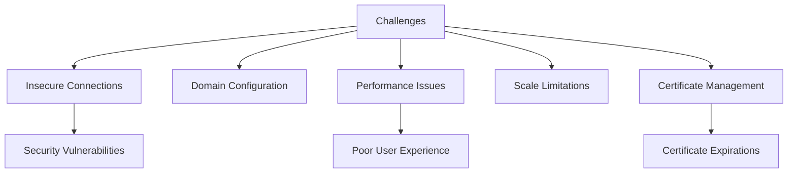
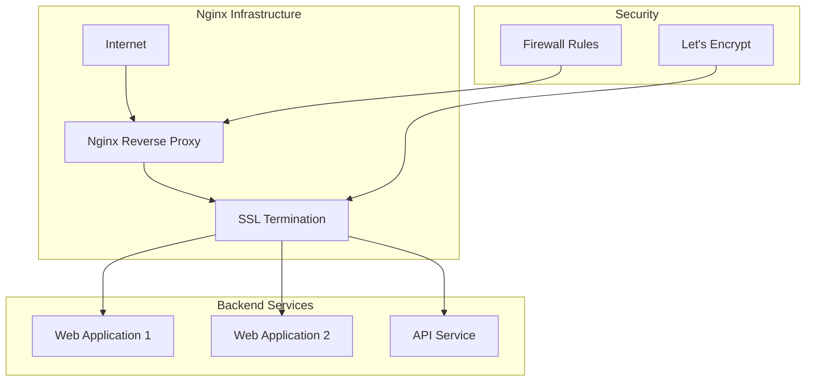
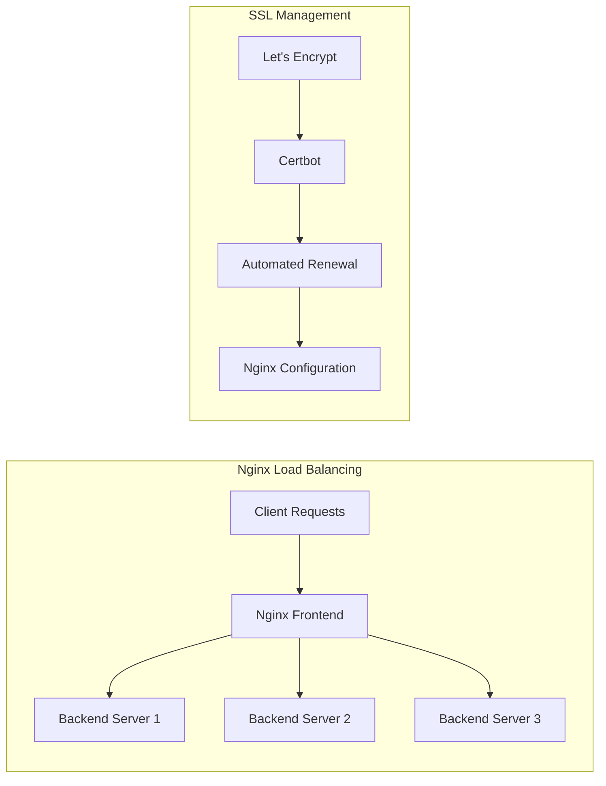

# Nginx Configuration and SSL Implementation

## Project Overview

### Situation
- Web services infrastructure faced several challenges:
  - Insecure HTTP connections for multiple websites
  - No proper domain connectivity for applications
  - Performance bottlenecks during peak traffic
  - Limited ability to scale web services
  - Manual certificate management
  - No consistent reverse proxy solution



### Task
Implement robust Nginx configuration for web services:
- Configure domain connections for multiple applications
- Implement SSL/TLS encryption for all services
- Set up efficient reverse proxying and load balancing
- Optimize server blocks for better performance
- Establish automated certificate renewal
- Document the configuration for future maintenance

### Action

#### 1. Nginx Architecture Design



#### 2. Base Nginx Configuration

```nginx
# /etc/nginx/nginx.conf

user nginx;
worker_processes auto;
pid /var/run/nginx.pid;

# Load modules
include /etc/nginx/modules-enabled/*.conf;

events {
    worker_connections 1024;
    multi_accept on;
}

http {
    # Basic Settings
    sendfile on;
    tcp_nopush on;
    tcp_nodelay on;
    keepalive_timeout 65;
    types_hash_max_size 2048;
    server_tokens off;

    # MIME types
    include /etc/nginx/mime.types;
    default_type application/octet-stream;

    # SSL Settings
    ssl_protocols TLSv1.2 TLSv1.3;
    ssl_prefer_server_ciphers on;
    ssl_ciphers 'ECDHE-ECDSA-AES128-GCM-SHA256:ECDHE-RSA-AES128-GCM-SHA256:ECDHE-ECDSA-AES256-GCM-SHA384:ECDHE-RSA-AES256-GCM-SHA384';
    ssl_session_cache shared:SSL:10m;
    ssl_session_timeout 10m;
    ssl_session_tickets off;
    ssl_dhparam /etc/nginx/dhparam.pem;

    # Logging Settings
    access_log /var/log/nginx/access.log;
    error_log /var/log/nginx/error.log;

    # Gzip Settings
    gzip on;
    gzip_vary on;
    gzip_proxied any;
    gzip_comp_level 6;
    gzip_buffers 16 8k;
    gzip_http_version 1.1;
    gzip_types text/plain text/css application/json application/javascript text/xml application/xml application/xml+rss text/javascript;

    # Security headers
    add_header X-Frame-Options SAMEORIGIN;
    add_header X-Content-Type-Options nosniff;
    add_header X-XSS-Protection "1; mode=block";
    add_header Strict-Transport-Security "max-age=31536000; includeSubDomains" always;

    # Virtual Host Configs
    include /etc/nginx/conf.d/*.conf;
    include /etc/nginx/sites-enabled/*;
}
```

#### 3. Domain and SSL Configuration

```nginx
# /etc/nginx/sites-available/example.com.conf

# HTTP -> HTTPS redirect
server {
    listen 80;
    listen [::]:80;
    server_name example.com www.example.com;

    location / {
        return 301 https://$host$request_uri;
    }

    # For Let's Encrypt certificate validation
    location /.well-known/acme-challenge/ {
        root /var/www/letsencrypt;
    }
}

# HTTPS server
server {
    listen 443 ssl http2;
    listen [::]:443 ssl http2;
    server_name example.com www.example.com;

    # SSL certificates
    ssl_certificate /etc/letsencrypt/live/example.com/fullchain.pem;
    ssl_certificate_key /etc/letsencrypt/live/example.com/privkey.pem;

    # Root directory and index files
    root /var/www/example.com/public;
    index index.html index.htm index.php;

    # Logging
    access_log /var/log/nginx/example.com.access.log;
    error_log /var/log/nginx/example.com.error.log;

    # Handle static files directly
    location ~* \.(jpg|jpeg|png|gif|ico|css|js|pdf|txt)$ {
        expires 30d;
        add_header Cache-Control "public, no-transform";
    }

    # Primary app location
    location / {
        try_files $uri $uri/ /index.php?$query_string;
    }

    # PHP-FPM Configuration
    location ~ \.php$ {
        include snippets/fastcgi-php.conf;
        fastcgi_pass unix:/var/run/php/php7.4-fpm.sock;
        fastcgi_param SCRIPT_FILENAME $document_root$fastcgi_script_name;
        include fastcgi_params;
    }

    # Deny access to hidden files
    location ~ /\.(?!well-known) {
        deny all;
    }
}
```

#### 4. Reverse Proxy Configuration

```nginx
# /etc/nginx/sites-available/api.example.com.conf

server {
    listen 80;
    server_name api.example.com;
    return 301 https://$host$request_uri;
}

server {
    listen 443 ssl http2;
    server_name api.example.com;

    # SSL configuration
    ssl_certificate /etc/letsencrypt/live/api.example.com/fullchain.pem;
    ssl_certificate_key /etc/letsencrypt/live/api.example.com/privkey.pem;

    # Logging
    access_log /var/log/nginx/api.example.com.access.log;
    error_log /var/log/nginx/api.example.com.error.log;

    # Proxy headers
    proxy_set_header Host $host;
    proxy_set_header X-Real-IP $remote_addr;
    proxy_set_header X-Forwarded-For $proxy_add_x_forwarded_for;
    proxy_set_header X-Forwarded-Proto $scheme;

    # WebSocket support
    proxy_http_version 1.1;
    proxy_set_header Upgrade $http_upgrade;
    proxy_set_header Connection "upgrade";

    # Timeouts
    proxy_connect_timeout 60s;
    proxy_send_timeout 60s;
    proxy_read_timeout 60s;

    # Main application proxy
    location / {
        proxy_pass http://backend_app:3000;
    }

    # API Endpoint with rate limiting
    location /api/ {
        # Rate limiting
        limit_req zone=apilimit burst=20 nodelay;
        
        # Proxy to backend
        proxy_pass http://api_service:8080/;
    }

    # Health check
    location /health {
        access_log off;
        return 200 "healthy\n";
    }
}
```

#### 5. Let's Encrypt SSL Certificate Implementation

```bash
# Install Certbot
apt-get update
apt-get install certbot python3-certbot-nginx

# Create web root for ACME challenges
mkdir -p /var/www/letsencrypt/.well-known/acme-challenge
chmod -R 755 /var/www/letsencrypt

# Obtain SSL certificate
certbot --nginx -d example.com -d www.example.com -d api.example.com

# Set up auto-renewal cron job
echo "0 3 * * * certbot renew --quiet --post-hook 'systemctl reload nginx'" > /etc/cron.d/certbot-renew
```

### Results

#### Performance Metrics
| Metric | Before | After |
|--------|---------|--------|
| Connection Security | HTTP only | HTTPS with TLS 1.3 |
| SSL Rating (Qualys) | N/A | A+ |
| Page Load Time | 2.7s | 1.9s |
| Request Handling | 200 req/s | 800 req/s |
| Certificate Management | Manual | Automated renewal |



## Technical Details

### Components Overview
1. **Domain Configuration**
   - DNS A records for all subdomains
   - CNAME records for www redirects
   - CAA records for certificate authority restriction

2. **SSL Implementation**
   - Let's Encrypt certificates with auto-renewal
   - Strong cipher suites configuration
   - HTTP/2 support for improved performance
   - HSTS implementation for enhanced security

3. **Performance Optimization**
   - Static file caching
   - Gzip compression
   - Browser caching headers
   - Connection keepalive settings

### Load Balancing Configuration
```nginx
# /etc/nginx/conf.d/upstream.conf

# Define backend server groups
upstream web_backend {
    server backend1.internal:8080 weight=3;
    server backend2.internal:8080 weight=3;
    server backend3.internal:8080 backup;
    
    keepalive 16;
}

upstream api_service {
    # Least connections balancing algorithm
    least_conn;
    
    server api1.internal:3000;
    server api2.internal:3000;
    
    keepalive 32;
}
```

### Security Hardening
1. **Firewall Rules**
   - Allow only necessary ports (80, 443)
   - Rate limiting for sensitive endpoints
   - Connection limiting for DoS protection

2. **Security Headers**
   - HTTP Strict Transport Security (HSTS)
   - Content Security Policy (CSP)
   - X-Frame-Options and X-XSS-Protection
   - Referrer-Policy

### Monitoring Setup
- Regular SSL certificate validity checks
- HTTP status code monitoring
- Response time tracking
- Real-time log monitoring

### Common Maintenance Tasks
```bash
# Test Nginx configuration
nginx -t

# Graceful reload of configuration
systemctl reload nginx

# Check SSL certificate expiry
certbot certificates

# Force certificate renewal (if needed)
certbot renew --force-renewal

# View access logs in real-time
tail -f /var/log/nginx/access.log | grep --line-buffered -v 'health'
```

### Lessons Learned
1. Importance of testing configuration changes before deployment
2. Value of comprehensive logging for troubleshooting
3. Benefits of automated certificate management
4. Need for regular security audits of web server configuration