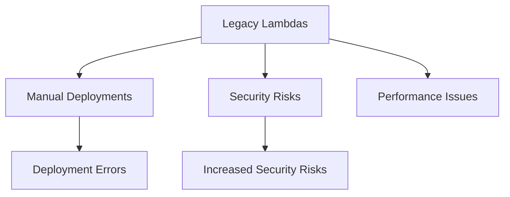
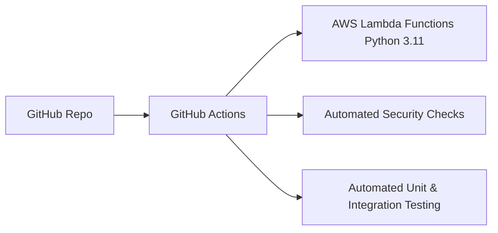

# AWS Lambda Migration & Security

## Project Overview

### 🚩 Situation
As part of infrastructure modernization efforts, I faced the challenge of migrating legacy AWS Lambda functions, which were:
- Running outdated Python versions (3.7)
- Deployed manually, leading to frequent inconsistencies
- Lacking standardized security measures



### 🎯 Task
- Migrate over 50 AWS Lambda functions to Python 3.11
- Standardize deployments using automated CI/CD pipelines
- Integrate best practices for security and automated testing

### 🛠️ Action

#### Infrastructure & CI/CD Setup


#### Implementation Steps
```bash
# Clone repository and switch to new branch
git clone https://github.com/username/lambda-functions.git
git checkout -b python311-upgrade

# Upgrade dependencies and runtime
sed -i 's/python3.7/python3.11/' template.yaml
pip install -r requirements.txt --upgrade

# Run automated tests
pytest tests/

# Commit and push changes
git commit -am "Upgrade Lambdas to Python 3.11"
git push origin python311-upgrade
```

### 🚀 Results

#### Performance Metrics
| Metric                    | Before        | After          |
|---------------------------|----------------|----------------|
| Deployment Method         | Manual        | Automated (CI/CD) |
| Lambda Python Version     | Python 3.7    | Python 3.11    |
| Security Compliance       | Partial       | Full           |
| Average Deployment Time   | 1-2 hours     | ~10 min        |
| Deployment Reliability    | 80%           | 99%            |

```mermaid
graph TB
    subgraph "Lambda Deployment Pipeline"
    A[Code Push] --> B[GitHub Actions]
    B -->|Tests Passed| C[Deploy Lambdas]
    B -->|Tests Failed| D[Notify & Rollback]
```

## 📚 Technical Details

### Repository Structure
```
lambda-migration-project/
├── lambda-functions/
│   ├── functionA/
│   │   ├── handler.py
│   │   ├── requirements.txt
│   │   └── tests/
│   └── functionB/
├── .github/workflows/
│   └── deploy-lambda.yml
└── security/
    └── iam-policies.json
```

### Example CI/CD Pipeline (`deploy.yml`)
```yaml
name: AWS Lambda Deployment
on:
  push:
    branches: [ main ]

jobs:
  build-and-deploy:
    runs-on: ubuntu-latest
    steps:
      - uses: actions/checkout@v3
      - uses: actions/setup-python@v4
        with:
          python-version: '3.11'

      - name: Install dependencies
        run: pip install -r lambda-functions/functionA/requirements.txt

      - name: Run automated tests
        run: pytest lambda-functions/functionA/tests/

      - name: Deploy to AWS Lambda
        run: |
          zip -r function.zip lambda-functions/functionA/
          aws lambda update-function-code \
              --function-name functionA \
              --zip-file fileb://functionA.zip
```

### Security Enhancements
- Applied IAM roles following the principle of least privilege.
- Integrated automated code scanning and dependency analysis.

### Rollback Procedure
```bash
# AWS CLI rollback command
aws lambda update-function-code \
  --function-name functionA \
  --s3-bucket lambda-backups \
  --s3-key functionA_previous_version.zip
```

### Best Practices Implemented
- Automated deployments with GitHub Actions
- Structured branching strategy for deployments
- Regular security audits integrated into pipeline
- Enhanced visibility through CloudWatch logging and alarms
