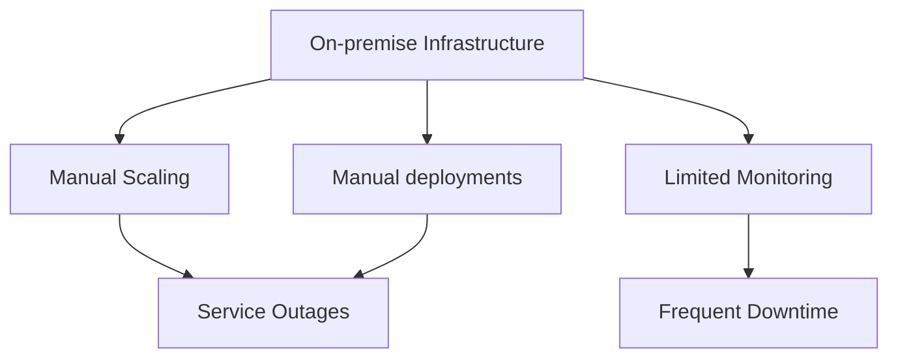
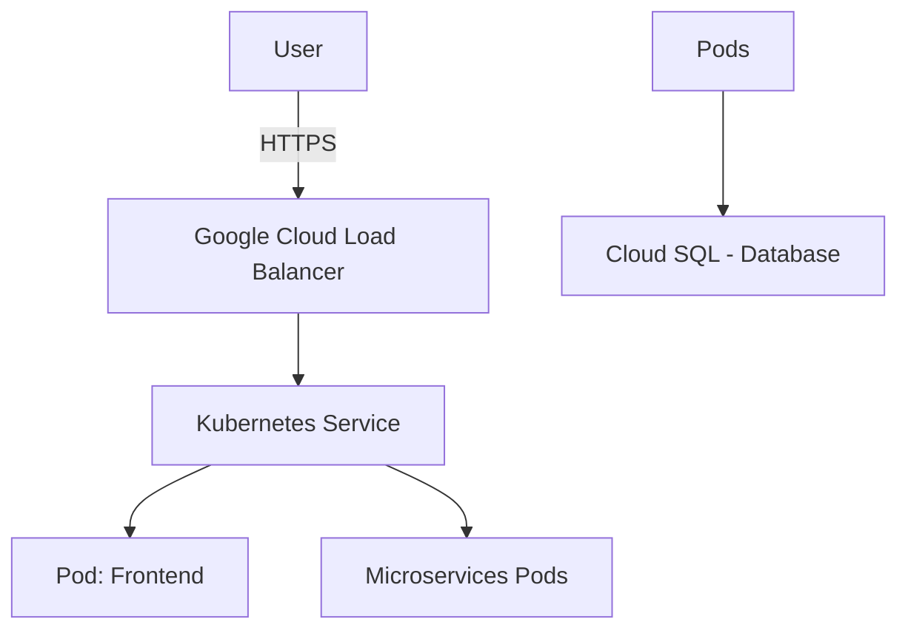
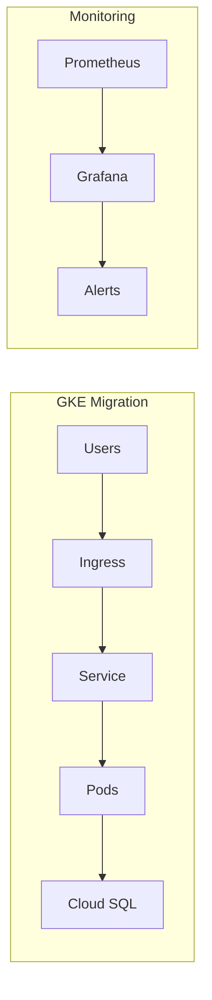

# E-commerce Platform Migration to GKE

## Project Overview

### 🚩 Situation
Existing e-commerce platform was hosted on-premise with several limitations:
- Lack of automatic scalability
- High infrastructure maintenance costs
- Poor monitoring and logging capabilities
- Unreliable deployments causing downtime



### 🎯 Task
Migrate platform to Google Kubernetes Engine to:
- Enable auto-scaling of services
- Improve observability (logging & monitoring)
- Reduce infrastructure maintenance costs
- Achieve high reliability with minimal downtime

### 🛠️ Action

#### Step 1: Infrastructure Setup


#### Step 2: Implementation Steps
```bash
# Create GKE Cluster
gcloud container clusters create ecommerce-cluster \
  --zone europe-west3-a \
  --release-channel regular \
  --num-nodes 3 \
  --enable-autoscaling \
  --min-nodes 2 \
  --max-nodes 6

# Configure Kubernetes deployments
kubectl apply -f frontend-deployment.yaml
kubectl apply -f backend-deployment.yaml

# Implement Stackdriver Monitoring & Logging
gcloud container clusters update ecommerce-cluster \
  --monitoring=SYSTEM,WORKLOAD \
  --logging=SYSTEM,WORKLOAD

# Setup Ingress and Load Balancing
kubectl apply -f ingress.yaml
```

### 🚀 Results

#### Performance Metrics
| Metric                  | Before          | After           |
|-------------------------|-----------------|-----------------|
| Response Time           | 2.8 sec         | 0.9 sec         |
| Deployment Time         | 1.5 hours       | 15 min          |
| Availability            | ~97%            | 99.9%           |
| Infrastructure Cost     | High (on-prem)  | Reduced by ~40% |
| Incident Detection Time | 45 min          | < 5 min         |



---

## Technical Details

### 📂 Repository Structure
```
ecommerce-gke-migration/
├── deployments/
│   ├── frontend.yaml
│   ├── backend.yaml
│   └── ingress.yaml
├── Dockerfile
├── cloudbuild.yaml
└── scripts/
    └── migrate.sh
```

### Kubernetes Deployment Example (`deployment.yaml`)
```yaml
apiVersion: apps/v1
kind: Deployment
metadata:
  name: frontend
spec:
  replicas: 3
  selector:
    matchLabels:
      app: frontend
  template:
    metadata:
      labels:
        app: frontend
    spec:
      containers:
      - name: frontend
        image: gcr.io/my-project/frontend:latest
        ports:
        - containerPort: 80
        resources:
          requests:
            cpu: "250m"
            memory: "512Mi"
```

### Rollback Procedures
```bash
# Rollback frontend deployment to previous revision
kubectl rollout undo deployment/frontend

# Check rollout history
kubectl rollout history deployment/frontend
```

### Monitoring & Logging Setup
Configured Google Cloud Operations Suite (Cloud Logging & Monitoring):
- Custom dashboards for real-time service health.
- Alerting configured via Cloud Operations Suite.

### 📝 Best Practices
- Regularly monitor resource usage and optimize resource requests/limits.
- Automate deployment process via CI/CD pipelines (Cloud Build/GitHub Actions).
- Ensure zero downtime deployments using rolling updates and readiness probes.
- Maintain structured and comprehensive documentation.
