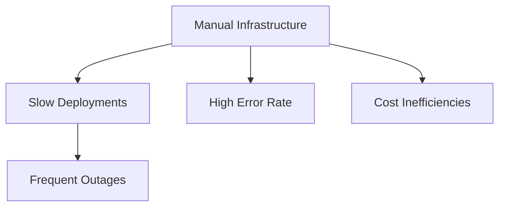
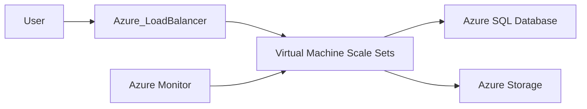
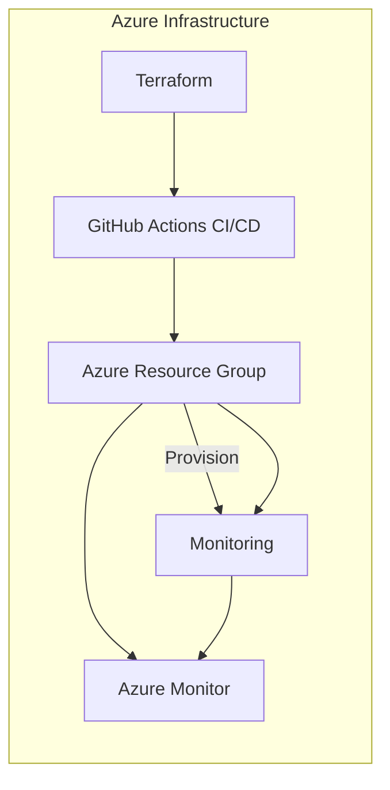

# Enterprise Azure Infrastructure

## Project Overview

### 🚩 Situation
The existing infrastructure suffered from:
- Manual deployments causing delays and frequent human errors.
- Limited disaster recovery and backup mechanisms.
- Lack of automated infrastructure management.
- Inefficient cost control on Azure resources.



### 🎯 Task
Implement an automated and reliable Azure infrastructure to:
- Automate infrastructure provisioning using Terraform.
- Ensure high availability and resiliency.
- Integrate effective cost optimization strategies.
- Establish comprehensive monitoring.

### 🛠️ Action

#### Infrastructure Overview


#### Implementation Steps
```bash
# Configure Terraform for Azure infrastructure
terraform init

# Plan infrastructure deployment
terraform plan -out azure-plan

# Deploy infrastructure
terraform apply azure-plan
```

### 🚀 Results

#### Performance Metrics
| Metric                  | Before   | After    |
|-------------------------|-----------|----------|
| Deployment time         | 3 hours   | 15 min   |
| Infrastructure Stability| 90%       | 99.9%    |
| Cost Savings            | -               | ~30% reduction |
| Availability            | 97%             | 99.95%   |



## Technical Details

### Repository Structure
```
azure-infrastructure/
├── terraform/
│   ├── main.tf
│   ├── variables.tf
│   └── outputs.tf
├── .github/workflows/
│   └── ci-cd.yml
└── scripts/
    └── deploy.sh
```

### Terraform Example (`main.tf`)
```hcl
provider "azurerm" {
  features {}
}

resource "azurerm_resource_group" "rg" {
  name     = "ecommerce-rg"
  location = var.region
}

resource "azurerm_kubernetes_cluster" "aks_cluster" {
  name                = "ecommerce-aks"
  location            = var.region
  resource_group_name = azurerm_resource_group.rg.name
  dns_prefix          = "aks-ecommerce"

  default_node_pool {
    name       = "default"
    node_count = 2
    vm_size    = "Standard_DS2_v2"
  }

  identity {
    type = "SystemAssigned"
  }
}
```

### Rollback Procedures
```bash
# Terraform rollback (destroy)
terraform destroy -auto-approve
```

### Monitoring and Alerts
- Azure Monitor and Alerts configured for proactive detection.
- Dashboard created for real-time visualization.

### Best Practices Implemented
- Infrastructure as Code (Terraform) versioned in Git.
- CI/CD pipelines with GitHub Actions.
- Monitoring & alerting for proactive issue resolution.