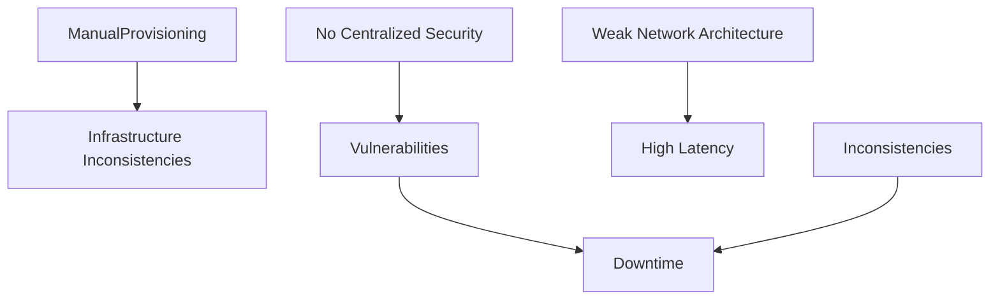
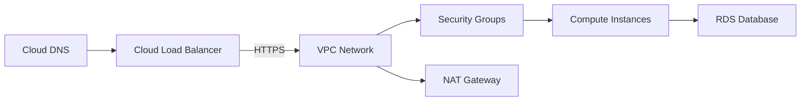
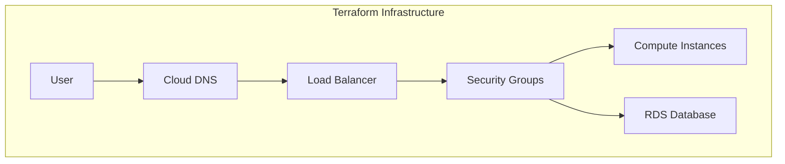

# IT Marathon Infrastructure (Terraform & Cloud Architecture)

## Project Overview

### 🚩 Situation
The existing IT Marathon project infrastructure suffered from several key issues:
- Manual infrastructure provisioning led to inconsistencies.
- Lack of centralized security management caused vulnerabilities.
- Poor network architecture resulted in frequent connectivity issues.



### 🎯 Task
Architect secure and highly available infrastructure using Terraform:
- Automate infrastructure deployment processes.
- Centralize security management (VPC, Security Groups).
- Ensure reliable and efficient DNS management.

### 🛠️ Action

#### Infrastructure Architecture


#### Implementation Steps
```bash
# Initialize Terraform
terraform init

# Preview infrastructure changes
terraform plan -var-file=production.tfvars -out=prod.plan

# Deploy infrastructure
terraform apply prod.plan
```

### 🚀 Results

#### Performance Metrics
| Metric                   | Before      | After      |
|--------------------------|-------------|------------|
| Provisioning Method      | Manual      | Terraform (Automated) |
| Infrastructure Consistency | ~70%      | 99.5%      |
| Deployment Speed         | 1 day       | ~20 min    |
| Security Posture         | Weak        | Robust     |
| Network Reliability      | Frequent Issues | Stable |



## Technical Details

### Repository Structure
```
it-marathon-infra/
├── terraform/
│   ├── main.tf
│   ├── variables.tf
│   ├── modules/
│   │   ├── network/
│   │   └── security/
│   └── production.tfvars
├── docs/
│   └── architecture.md
└── scripts/
    └── dns-update.sh
```

### Terraform Configuration Example (`main.tf`)
```hcl
provider "aws" {
  region = var.aws_region
}

module "vpc" {
  source = "./modules/network"
}

module "security" {
  source = "./security"
  vpc_id = module.vpc.vpc_id
}

resource "aws_instance" "web_server" {
  ami           = var.ami_id
  instance_type = "t3.medium"
  subnet_id     = module.vpc.public_subnet_id
  security_group_ids = [module.security.sg_web_id]
}
```

### Rollback Procedures
To revert infrastructure changes safely:
```bash
terraform plan -destroy -out=destroy.plan
terraform apply destroy.plan
```

### Security Implementations
- Centralized security management via Security Groups.
- Secure VPC with subnet isolation.
- IAM role assignment following least privilege principles.

### Monitoring and Logging
- Implemented CloudWatch for resource monitoring and alerting.
- Configured Route53 for efficient DNS management.
