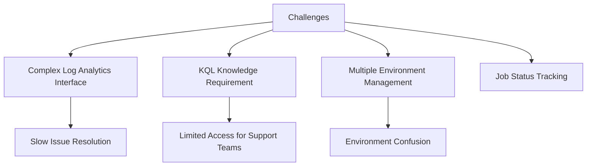
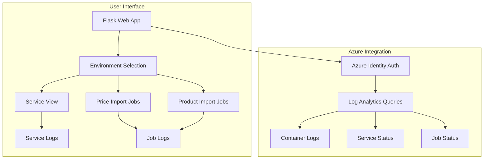
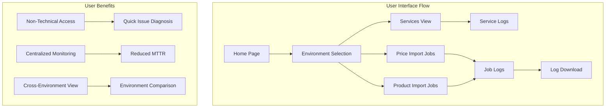

# eShop Logs Viewer Application

## Project Overview

### Situation
- Support and operations teams faced challenges accessing AKS cluster logs:
  - Limited knowledge of Azure Log Analytics and KQL query language
  - Complex process for retrieving logs from Kubernetes containers
  - Time-consuming navigation through the Azure portal
  - Need to track status of product and price import jobs
  - Difficulty identifying which services were running in each environment
  - Limited sharing capabilities for log data
  - Steep learning curve for new team members



### Task
Develop a user-friendly web application for log access:
- Create an intuitive interface for viewing AKS cluster logs
- Implement service and job status tracking
- Enable filtering and searching of log data
- Provide log download functionality for sharing
- Support multiple environments (dev, stage, pre-prod, prod)
- Make the application accessible both locally and via Docker
- Ensure secure authentication with Azure

### Action

#### 1. Application Architecture



#### 2. Python Flask Implementation

```python
import json
from flask import Flask, render_template, request, send_file
from azure.identity import DefaultAzureCredential
from azure.azure_data import AzureData
from urllib.parse import quote_plus
import tempfile

def load_config(config_file_path):
    with open(config_file_path, 'r') as file:
        config = json.load(file)
    return config

app = Flask(__name__)
app.config['environments'] = load_config('config.json')
app.jinja_env.filters['quote_plus'] = lambda x: quote_plus(str(x))


@app.route('/')
def main_page():
    return render_template('index.html', environments=app.config['environments'].keys())

@app.route('/services/<environment_name>')
def environment_view(environment_name):
    azure_data = AzureData(DefaultAzureCredential())
    logs_resource_id = app.config['environments'][environment_name]['logs_resource_id']
    namespace = app.config['environments'][environment_name]['namespace']
    services_table = azure_data.get_running_services(logs_resource_id, namespace)
    return render_template('services_view.html', environment_name=environment_name, services_table=services_table)

@app.route('/price-imports/<environment_name>')
def price_imports_view(environment_name):
    azure_data = AzureData(DefaultAzureCredential())
    logs_resource_id = app.config['environments'][environment_name]['logs_resource_id']
    namespace = app.config['environments'][environment_name]['namespace']
    price_import_jobs_table = azure_data.get_jobs(logs_resource_id, namespace, 'jsdl-price-import')
    return render_template('jobs_view.html', environment_name=environment_name, import_jobs_table=price_import_jobs_table, link='price-imports')

@app.route('/product-imports/<environment_name>')
def product_imports_view(environment_name):
    azure_data = AzureData(DefaultAzureCredential())
    logs_resource_id = app.config['environments'][environment_name]['logs_resource_id']
    namespace = app.config['environments'][environment_name]['namespace']
    product_import_jobs_table = azure_data.get_jobs(logs_resource_id, namespace, 'jsdl-product-import')
    return render_template('jobs_view.html', environment_name=environment_name, import_jobs_table=product_import_jobs_table, link='product-imports')

@app.route('/environment/<environment_name>/service/<service_name>/container/<container_id>', methods=['GET'])
def service_logs_view(environment_name, service_name, container_id):
    minutes = request.args.get('minutes', type=int)
    hours = request.args.get('hours', type=int)
    days = request.args.get('days', type=int)
    timespan = {}
    if minutes:
        timespan['minutes'] = minutes
    if hours:
        timespan['hours'] = hours
    if days:
        timespan['days'] = days
    azure_data = AzureData(DefaultAzureCredential())
    logs_resource_id = app.config['environments'][environment_name]['logs_resource_id']
    table = azure_data.get_container_logs(logs_resource_id, container_id, **timespan)
    return render_template('logs_view.html', environment_name=environment_name, service_name=service_name, table=table, link='services')

@app.route('/environment/<environment_name>/job/<job_name>/container/<container_id>/download', methods=['GET'])
def downloadFile(environment_name, job_name, container_id):
    azure_data = AzureData(DefaultAzureCredential())
    logs_resource_id = app.config['environments'][environment_name]['logs_resource_id']
    start_from = request.args.get('start_from')
    table = azure_data.get_container_logs(logs_resource_id, container_id, start_from=start_from)
    
    log_filename = ''
    with tempfile.NamedTemporaryFile(mode='w', delete=False) as fp:
        log_filename = fp.name
        fp.writelines(table)
        fp.close()
    
    return send_file(log_filename, as_attachment=True, download_name=f'{job_name}-{environment_name}.log')

@app.route('/environment/<environment_name>/job/<job_name>/container/<container_id>', methods=['GET'])
def job_logs_view(environment_name, job_name, container_id):
    minutes = request.args.get('minutes', type=int)
    hours = request.args.get('hours', type=int)
    days = request.args.get('days', type=int)
    start_from = request.args.get('start_from', type=str)
    timespan = {}
    if minutes:
        timespan['minutes'] = minutes
    if hours:
        timespan['hours'] = hours
    if days:
        timespan['days'] = days
    if start_from:
        timespan = {'start_from': start_from}
    azure_data = AzureData(DefaultAzureCredential())
    logs_resource_id = app.config['environments'][environment_name]['logs_resource_id']
    table = azure_data.get_container_logs(logs_resource_id, container_id, **timespan)
    if job_name.startswith('jsdl-price-import'):
        link = 'price-imports'
    elif job_name.startswith('jsdl-product-import'):
        link = 'product-imports'
    else:
        raise ValueError('Unknown job name:', job_name)
    return render_template('logs_view.html', environment_name=environment_name, service_name=job_name, table=table, link=link)

if __name__ == '__main__':
    app.run(host='0.0.0.0')
```

#### 3. Azure Data Module (Sample Implementation)

```python
# azure_data.py
from azure.monitor.query import LogsQueryClient
from datetime import timedelta
import pandas as pd

class AzureData:
    def __init__(self, credential):
        self.logs_client = LogsQueryClient(credential)
        
    def get_running_services(self, resource_id, namespace):
        """
        Get the list of running services in a Kubernetes namespace
        """
        query = f"""
        ContainerLog
        | where ResourceId == '{resource_id}'
        | where PodNamespace == '{namespace}'
        | summarize LastLog = max(TimeGenerated) by ContainerID, PodName, ContainerName
        | where LastLog > ago(1h)
        | project PodName, ContainerName, ContainerID, LastLog
        | order by LastLog desc
        """
        
        response = self.logs_client.query_workspace(
            resource_id,
            query,
            timespan=timedelta(days=1)
        )
        
        if response.tables and response.tables[0].rows:
            df = pd.DataFrame(response.tables[0].rows, columns=[col.name for col in response.tables[0].columns])
            return df
        return pd.DataFrame()
        
    def get_jobs(self, resource_id, namespace, job_name_prefix):
        """
        Get the list of import jobs with the given prefix
        """
        query = f"""
        ContainerLog
        | where ResourceId == '{resource_id}'
        | where PodNamespace == '{namespace}' and PodName startswith '{job_name_prefix}'
        | summarize FirstLog = min(TimeGenerated), LastLog = max(TimeGenerated) by ContainerID, PodName, ContainerName
        | order by LastLog desc
        | project PodName, ContainerName, ContainerID, FirstLog, LastLog
        """
        
        response = self.logs_client.query_workspace(
            resource_id,
            query,
            timespan=timedelta(days=30)
        )
        
        if response.tables and response.tables[0].rows:
            df = pd.DataFrame(response.tables[0].rows, columns=[col.name for col in response.tables[0].columns])
            return df
        return pd.DataFrame()
    
    def get_container_logs(self, resource_id, container_id, **timespan):
        """
        Get logs for a specific container
        Timespan can be specified as:
        - minutes: int
        - hours: int
        - days: int
        - start_from: str (ISO datetime)
        """
        time_filter = ""
        
        if 'start_from' in timespan and timespan['start_from']:
            time_filter = f"| where TimeGenerated >= datetime('{timespan['start_from']}')"
        else:
            if 'minutes' in timespan and timespan['minutes']:
                time_filter = f"| where TimeGenerated > ago({timespan['minutes']}m)"
            elif 'hours' in timespan and timespan['hours']:
                time_filter = f"| where TimeGenerated > ago({timespan['hours']}h)"
            elif 'days' in timespan and timespan['days']:
                time_filter = f"| where TimeGenerated > ago({timespan['days']}d)"
            else:
                # Default to last 1 hour
                time_filter = "| where TimeGenerated > ago(1h)"
        
        query = f"""
        ContainerLog
        | where ResourceId == '{resource_id}' and ContainerID == '{container_id}'
        {time_filter}
        | order by TimeGenerated asc
        | project TimeGenerated, LogMessage, PodName, ContainerName
        """
        
        response = self.logs_client.query_workspace(
            resource_id,
            query,
            timespan=timedelta(days=30)
        )
        
        if response.tables and response.tables[0].rows:
            logs = []
            for row in response.tables[0].rows:
                timestamp = row[0]
                message = row[1]
                logs.append(f"[{timestamp}] {message}\n")
            return logs
        return ["No logs found for the specified time period."]
```

#### 4. Docker Deployment Configuration

```dockerfile
# Dockerfile
FROM python:3.9-slim
RUN addgroup --system --gid 1001 python
RUN adduser --system --uid 1001 python --home /home/python
WORKDIR /app
RUN apt update && apt install -y curl && curl -sL https://aka.ms/InstallAzureCLIDeb | bash
COPY --chown=python:python . .
RUN pip install --no-cache-dir -r requirements.txt
USER python
EXPOSE 5000

CMD ["python", "app.py"]
```

```yaml
# docker-compose.yml
version: "3"

services:
  azclicredsproxy:
    image: workleap/azure-cli-credentials-proxy:latest
    ports:
      - "8080:8080"
    volumes:
      - "~/.azure:/app/.azure/"
  aks-logs:
    build: .
    depends_on:
      - azclicredsproxy
    ports:
      - "5000:5000"
    environment:
      - "IDENTITY_ENDPOINT=http://azclicredsproxy:8080/token"
      - "IMDS_ENDPOINT=dummy_required_value"
```

### Results

#### Performance Metrics
| Metric | Before | After |
|--------|---------|--------|
| Time to Access Logs | 5-10 minutes | 30-60 seconds |
| Technical Knowledge Required | High (KQL, Azure Portal) | Low (Simple Web UI) |
| Cross-Environment Visibility | Limited | Unified View |
| Log Sharing Capability | Complex (Export from Azure) | One-Click Download |
| Job Status Monitoring | Manual Process | Real-Time Dashboard |
| Team Adoption | Limited to Technical Staff | Widespread Across Teams |



## Technical Details

### Components Overview
1. **Flask Web Application**
   - Routing structure for different views
   - Template rendering with Jinja2
   - Parameter handling for log filtering
   - File downloading functionality

2. **Azure Integration**
   - Authentication via DefaultAzureCredential
   - Log Analytics queries for container logs
   - Service and job status tracking
   - Time-based filtering

3. **Docker Deployment**
   - Multi-container setup with credentials proxy
   - Volume mounting for Azure credentials
   - Security-focused container configuration
   - Non-root user execution

### Configuration Model
```json
// config.json example
{
  "dev": {
    "logs_resource_id": "/subscriptions/00000000-0000-0000-0000-000000000000/resourceGroups/example-rg/providers/Microsoft.OperationalInsights/workspaces/example-workspace",
    "namespace": "b2c-eshop-dev"
  },
  "stage": {
    "logs_resource_id": "/subscriptions/00000000-0000-0000-0000-000000000000/resourceGroups/example-rg/providers/Microsoft.OperationalInsights/workspaces/example-workspace",
    "namespace": "b2c-eshop-qas"
  },
  "pre-prod": {
    "logs_resource_id": "/subscriptions/00000000-0000-0000-0000-000000000000/resourceGroups/example-rg-prod/providers/Microsoft.OperationalInsights/workspaces/example-workspace-prod",
    "namespace": "b2c-eshop-preprod"
  },
  "prod": {
    "logs_resource_id": "/subscriptions/00000000-0000-0000-0000-000000000000/resourceGroups/example-rg-prod/providers/Microsoft.OperationalInsights/workspaces/example-workspace-prod",
    "namespace": "b2c-eshop-prod"
  }
}
```

### Security Implementation
1. **Authentication**
   - Azure DefaultAzureCredential for secure access
   - Azure CLI authentication flow
   - Identity proxying in Docker environment

2. **Container Security**
   - Non-root user execution
   - Read-only file system where possible
   - Minimal exposed ports
   - Separation of credential handling

3. **Data Access**
   - Read-only access to Azure Log Analytics
   - Environment-specific resource IDs
   - Namespace isolation between environments

### Log Query Optimization
1. **Performance Considerations**
   - Time filtering to reduce query scope
   - Limited return set for large log volumes
   - Pagination for extensive logs
   - Columnar data selection to minimize transfer

2. **Query Structure**
   ```
   ContainerLog
   | where ResourceId == '{resource_id}' and ContainerID == '{container_id}'
   | where TimeGenerated > ago(1h)  // Time-based filtering
   | order by TimeGenerated asc     // Chronological ordering
   | project TimeGenerated, LogMessage  // Select only needed columns
   ```

### Deployment Options
1. **Local Development**
   ```bash
   # Install dependencies
   pip install -r requirements.txt
   
   # Login to Azure
   az login --use-device-code
   
   # Run Flask application
   flask run
   ```

2. **Docker Deployment**
   ```bash
   # Login to Azure
   az login --use-device-code
   
   # Start with Docker Compose
   docker-compose up
   ```

### User Experience Workflow
1. **Environment Selection**
   - User selects target environment (dev, stage, pre-prod, prod)
   - Application loads appropriate resource IDs and namespaces

2. **View Selection**
   - Services view: Shows all running services
   - Price imports view: Shows price import jobs
   - Product imports view: Shows product import jobs

3. **Log Viewing**
   - Select container or job to view logs
   - Filter by time period (minutes, hours, days)
   - Download logs for sharing or offline analysis

### Lessons Learned
1. Prioritize user experience for non-technical users
2. Leverage existing authentication mechanisms
3. Optimize query performance for production environments
4. Provide multiple deployment options for flexibility
5. Consider security at every layer of the application
6. Use containerization for consistent deployment
7. Implement clear documentation for varied user expertise